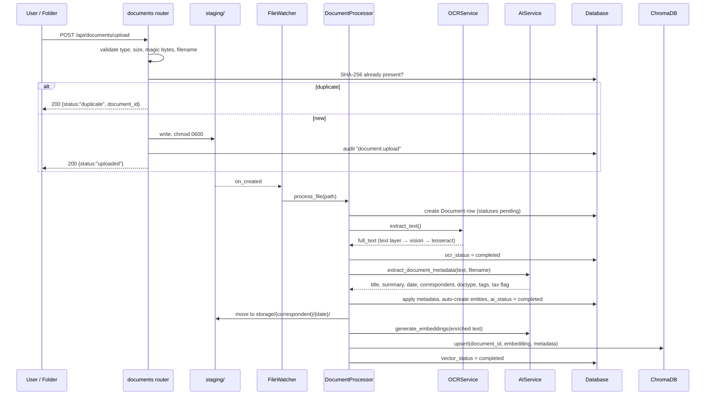
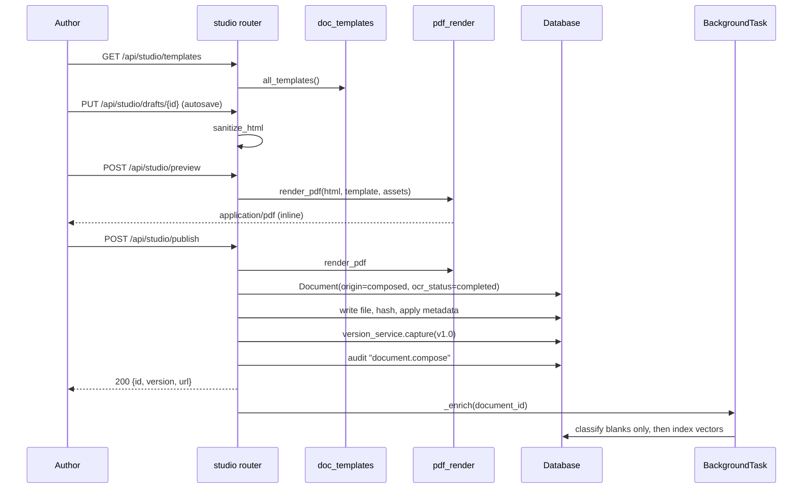
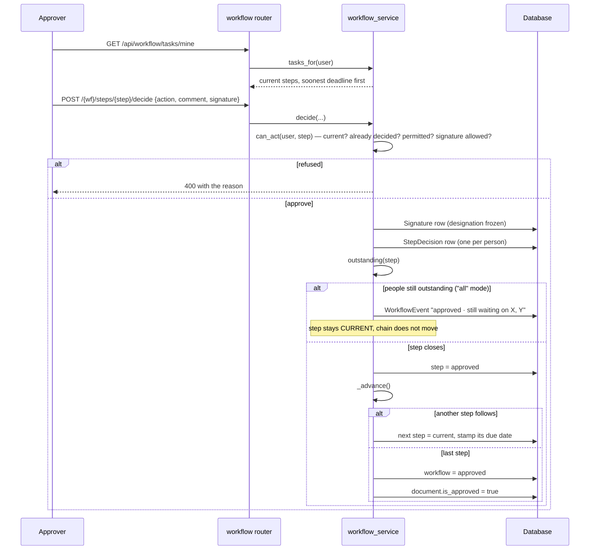
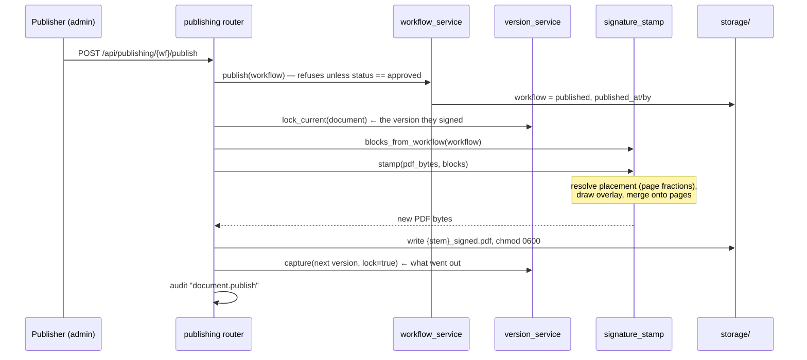
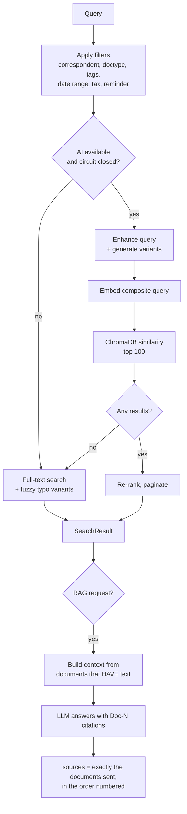
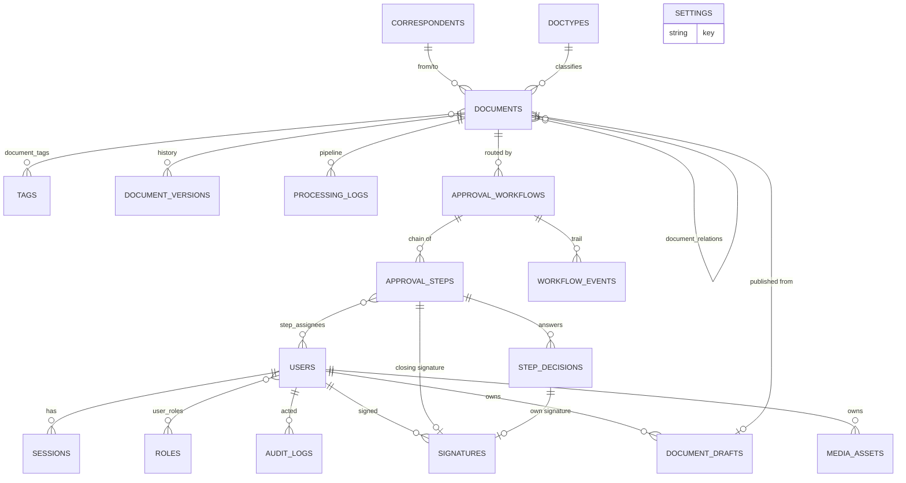

# HARMAN Document Management System
## Software Requirements & Design Specification

**Complete standalone technical documentation — requirements, high-level design and low-level design.**

| | |
|---|---|
| **Document** | DMS Project Documentation (SRS + HLD + LLD) |
| **Document version** | 1.0 |
| **Application version covered** | 1.1.0 (`app/main.py`) |
| **Verified against source** | 2026-08-07 |
| **Status** | Complete — describes the system **as built** |
| **Classification** | Internal |

---

> ## About this document
>
> This is the **authoritative, self-contained specification** for the HARMAN
> Document Management System. It is deliberately kept separate from the
> repository's `README.md`, which changes with day-to-day development. This
> document changes only when the system's requirements, architecture or design
> change — and it carries its own version and verification date above so you can
> always tell how current it is.
>
> **Where this document and `README.md` disagree, this document is correct.**
> Every statement in it was verified against the source tree on the date above.
>
> It is written so that a reader who has never seen the codebase can reach the
> level of detail they need — from a business sponsor deciding whether the
> system does what was asked, to a developer taking ownership of the code.

---

## How to read this

Pick your row. Everything above your row is context; everything below it is
detail you can reach for when you need it.

| If you are… | Read | Why |
|---|---|---|
| **Executive / sponsor** | Part 1 | The problem, the scope, the value, the boundaries |
| **Business analyst / process owner** | Parts 1–2 | Every behaviour the system promises, numbered and testable |
| **Project manager** | Part 1, Part 2 (traceability), Part 11 | Scope, coverage, known gaps, roadmap |
| **Solution architect** | Parts 4, 5, 9 | Components, boundaries, data, trust model |
| **Backend developer** | Parts 5, 6, 7 | Module-by-module internals and every endpoint |
| **Frontend developer** | Parts 8, 7 | Shell, screens, state, the contracts they call |
| **DevOps / SRE** | Parts 10, 9 | Install, configure, deploy, back up, monitor |
| **QA** | Parts 2, 3, 11 | What to test and what "correct" means |
| **Incoming development team** | All of it, then Part 11 §7 | Handover checklist |

---

## Contents

| Part | Title | Contents |
|---|---|---|
| **1** | [Introduction & Scope](#doc01) | Purpose, business context, stakeholders, scope in/out, glossary, assumptions |
| **2** | [Functional Requirements](#doc02) | FR-1…FR-14 by module, roles, business rules, traceability matrix |
| **3** | [Non-Functional Requirements](#doc03) | Performance, capacity, availability, usability, compliance, portability |
| **4** | [High-Level Design](#doc04) | Architecture, layers, component catalogue, runtime flows, deployment topology |
| **5** | [Data Model](#doc05) | ERD, all 22 tables field-by-field, lifecycle states, migrations, vector store |
| **6** | [Low-Level Design](#doc06) | Every module: responsibility, algorithm, error handling, extension points |
| **7** | [API Reference](#doc07) | All 167 route declarations: method, path, auth, payload, response, errors |
| **8** | [Frontend Design](#doc08) | Shell architecture, 16 screens, design system, state, editor internals |
| **9** | [Security Design](#doc09) | AuthN/AuthZ, session & CSRF, rate limiting, file safety, audit, threat notes |
| **10** | [Deployment & Operations](#doc10) | Install, config precedence, CLI, Docker, backup/restore, monitoring, runbooks |
| **11** | [Testing, Quality & Handover](#doc11) | Test strategy, coverage, known gaps and risks, roadmap, handover checklist |

---

## Executive summary

HARMAN DMS is a self-hosted document management system built on **FastAPI +
SQLAlchemy + SQLite/PostgreSQL**, with a **zero-build vanilla-JavaScript** front
end. It captures documents two ways — files dropped into a watched folder or
uploaded through the browser, and documents written in an in-app **Document
Studio** on letterhead templates. Captured text is extracted by a **vision model
or Tesseract OCR**, classified by an **LLM (Groq by default)**, and indexed into
**ChromaDB** for semantic search and retrieval-augmented question answering.
Each document can be routed through a **multi-step approval workflow** with
per-step signature requirements and any/all quorum rules; approved documents are
**published** with the collected signatures stamped onto the PDF, and every
version along the way is retained immutably.

The product is organised around five sequential steps, which are also its five
primary screens — the navigation *is* the process:

```
   1. Document Studio  →  2. Review  →  3. Approval  →  4. Status & Tracking  →  5. Publishing
      write it, or         confirm       choose who        watch it move           release it,
      bring a file in      the details   signs, in         through the chain       signatures
                           read from it  what order                                stamped on
```

### Headline findings a decision-maker should know

These are stated up front rather than buried, because they affect go-live
decisions. Each is expanded in the part named.

| Finding | Where |
|---|---|
| **There is no per-document access control.** Any user who can sign in and holds `documents.read` can read, download and search **every** document. There is no department, ownership or sensitivity scoping. | Part 9 §6.1 |
| **The activity log is readable through the API by any authenticated user**, although the audit *page* is administrator-only. | Part 9 §6.2 |
| **Retention, records management, integrations/webhooks, annotations, SSO and email notification are not implemented.** Retired screens redirect to the nearest working one. | Part 1 §3.2 |
| **Document text is transmitted to the configured AI provider.** A data-flow assessment is required before go-live; the system runs fully without an AI key, with AI features off. | Part 9 §7 |
| **The modules carrying the most business risk — the approval engine, signature stamping, versioning and publishing — have the least automated test coverage.** | Part 11 §3 |
| **Do not run multiple server workers yet.** Rate-limit counters, the AI capability cache and the embedded vector-store client are per-process state. | Part 4 §6.2, Part 10 §11 |

---

## Conventions used in this document

- `path/to/file.py:123` — a reference to a source location, clickable in a
  Markdown viewer that resolves relative paths.
- **FR-x.y** — a numbered functional requirement (Part 2).
- **NFR-x** — a numbered non-functional requirement (Part 3).
- **BR-x** — a business rule (Part 2, "Business rules digest").
- **AD-x** — an architectural decision (Part 4 §5).
- **D-x** — a technical-debt item (Part 11 §4.2).
- ⚠️ — a known gap, limitation or risk. These are stated plainly rather than
  omitted; Part 11 collects them all into one register.

---

## Document control

| Version | Date | Author | Change |
|---|---|---|---|
| 1.0 | 2026-08-07 | Generated from full source analysis | Initial complete specification, verified against application v1.1.0 |

**Review triggers** — this document must be revisited when any of the following
changes: the data model, the approval rules in `app/services/workflow_service.py`,
the authentication or authorisation model, the AI provider integration, the
public API surface, or the deployment topology.

**Related material** (not part of this document, and expected to change more
often):

| Item | Purpose |
|---|---|
| `docs/TECH-STACK.md` | Every technology, its pinned version, and why it was chosen — including the dependencies that are declared but unused |
| `README.md` | Repository overview and transformation narrative — **changes frequently** |
| `DEMO.md` | A 15-minute guided walkthrough exercising every feature in order |
| `docs/groq-setup.md` | AI provider, embedding and OCR configuration detail |
| `docs/ux-redesign-plan.md` | Why the interface is shaped the way it is |
| `docs/srs/` | This same specification split into eleven chapter files, for readers who prefer navigating by file |

---

<a id="doc01"></a>

## 01 · Introduction & Scope

> **Audience:** everyone. This is the only document a non-technical reader must
> finish. It explains what the system is for, who uses it, what it does and does
> not cover, and the vocabulary the rest of the set relies on.

---

### 1. Purpose of this document set

This is the Software Requirements Specification (SRS) and design record for the
**HARMAN Document Management System (DMS)**. It exists so that:

1. A business stakeholder can confirm the system does what was asked.
2. A development team that has never seen the code can take ownership of it,
   extend it, and be confident about what they will break.
3. Operations can install, configure, run, back up and recover it.
4. Auditors can trace a control (who approved what, when) to the mechanism that
   enforces it.

It documents the system **as built**, not as aspired to. Where a feature is
partial, planned, or was retired, it is marked as such.

---

### 2. Business context and problem statement

A manufacturing business generates documents continuously — supplier invoices,
contracts, delivery notes, quality reports, HR letters, statutory filings. In
most organisations these live in four incompatible places at once: a shared
drive, an email inbox, a filing cabinet, and someone's laptop. The consequences
are predictable and expensive:

| Problem | Cost |
|---|---|
| Nobody can find a document without knowing where it was filed | Hours per retrieval; duplicated work |
| Approvals happen over email | No reliable record of who agreed to what |
| A signed PDF and its editable source drift apart | Disputes cannot be settled from the record |
| Retention and audit are manual | Compliance exposure |
| Classification is typed by hand | Inconsistent metadata; search degrades over time |

**HARMAN DMS addresses this by making the document's whole life happen in one
place**: it is captured or written there, classified there, approved there,
signed there, published there, and searched there — with an append-only trail
behind every step.

#### 2.1 The product's spine

The entire product is organised around five sequential steps, which are also the
five primary screens. This is deliberate: the navigation is the process.

```
   1. Document Studio  →  2. Review  →  3. Approval  →  4. Status & Tracking  →  5. Publishing
      write it, or         confirm       choose who        watch it move           release it,
      bring a file in      the details   signs, in         through the chain       signatures
                           read from it  what order                                stamped on
```

Everything else in the product — search, the AI assistant, the repository, the
audit log, settings — exists to serve one of those five steps or to find
something that has already been through them.

#### 2.2 Stated business value targets

From the project charter (root `README.md`):

- **70%** faster document retrieval
- **60%** less manual approval time
- **100%** audit-ready trail
- Open, API-first architecture (no vendor lock-in on the AI provider)

---

### 3. System scope

#### 3.1 In scope — implemented and working

| Capability | Summary |
|---|---|
| **Document capture** | Browser upload, or drop a file into a watched staging folder; automatic deduplication by SHA-256 hash |
| **Text extraction (OCR)** | PDF embedded text layer → vision LLM → Tesseract, in that order, configurable |
| **AI classification** | Title, summary, document date, correspondent, document type, tags, tax relevance |
| **Document authoring** | In-app WYSIWYG editor on six letterhead templates, with AI writing assistance |
| **Approval workflows** | Ordered multi-step chains, named or department-addressed, any/all quorum, per-step SLA, signature requirement |
| **Digital signatures** | Drawn, typed or uploaded; stored per decision; positioned as page fractions; stamped onto the published PDF |
| **Version control** | Append-only version history; approved versions locked; restore is forward-only |
| **Publishing & export** | Publish gated on full approval; export as PDF / DOCX / TXT |
| **Search** | Semantic (vector) search with full-text and fuzzy fallback; faceted filters |
| **AI assistant (RAG)** | Natural-language questions answered across the repository with citations |
| **User & role management** | Users, departments, job titles, standard roles, separate approve/sign authority |
| **Audit trail** | Every significant action recorded with actor, target, IP and user agent |
| **Backup & restore** | On-demand and scheduled system backups, with restore |
| **Health & metrics** | Liveness, readiness, startup probes and system metrics endpoints |

#### 3.2 Out of scope — explicitly not built

These are named because the root `README.md` and some retired screens reference
them; a new team must not assume they exist.

| Not built | Current behaviour |
|---|---|
| **Retention policy engine** | A retention label can be stored on a workflow (`approval_workflows.retention_policy`) but **nothing acts on it**. `/retention` redirects to `/documents`. |
| **Records warehousing** | `/records` redirects to `/documents`. No physical-storage module. |
| **Integrations / connectors catalogue** | `/integrations` redirects to `/settings`. No connector framework, no webhooks. |
| **Visual workflow designer** | `/workflows` redirects to `/templates`. Routes are designed on the Approval screen, not on a canvas. |
| **Annotations** | No annotation model or endpoints. |
| **SSO / LDAP / SAML** | Local username + password only. |
| **Email or push notification** | The "remind" action writes a workflow event; **no email is sent**. |
| **Multi-tenancy** | Single organisation per deployment. |
| **Per-document access control** | Any user holding `documents.read` can read **every** document. Access is by role, not by document, department or ownership. See doc 09 §6. |

#### 3.3 Deliberately retired

The following screens existed and were removed because they had no working
module behind them. Their URLs still resolve (301 redirect) so no bookmark or
demo script breaks — see `app/main.py:264`.

`/upload`, `/capture`, `/compose`, `/editor` → `/studio` ·
`/approvals` → `/tasks` · `/workflows` → `/templates` ·
`/retention`, `/records` → `/documents` · `/integrations` → `/settings`

The old single-file interface lives in [legacy-ui/](../legacy-ui/) and is no
longer routed.

---

### 4. Stakeholders and user classes

#### 4.1 Human actors

| Actor | Description | What the product gives them |
|---|---|---|
| **Administrator** (`is_admin = true`) | Runs the system: sets up people, designs approval routes, configures AI, publishes | The full five-step spine, plus Approval Routes, People, Activity Log, Settings. Lands on `/studio`. |
| **Signatory** (`can_approve` + `can_sign`) | A department head or authorised officer who binds the company | My Tasks, Status & Tracking, repository, search, assistant. Lands on `/tasks`. |
| **Approver** (`can_approve` only) | A clerk or reviewer who verifies but may not sign | Same as signatory, but the system refuses to place them on a step requiring a signature |
| **Reader** | Can find and read, nothing else | Repository, search, assistant |
| **Auditor** | Reads the activity log | `/audit` (admin-gated today — see doc 09 §6) |

> **The central authority distinction.** `can_approve` and `can_sign` are two
> separate flags on `users`, not one. A clerk can verify an invoice without
> being permitted to bind the company; only a signatory does that. The workflow
> engine refuses at *design time* to place a non-signatory on a step that
> requires a signature (`app/services/workflow_service.py:186`), so an
> unworkable process cannot be created in the first place.

#### 4.2 System actors

| Actor | Role |
|---|---|
| **File watcher** | A background thread that notices files appearing in the staging folder and processes them |
| **Background enrichment task** | Classifies and indexes a document after the user's request has already returned |
| **Backup scheduler** | Optional timer that creates system backups |
| **AI provider** | Groq (default), OpenAI or Azure OpenAI — chat, analysis and vision models |
| **Vector store** | ChromaDB, embedded (persistent local) or remote HTTP |

---

### 5. Operating environment

| Aspect | Value |
|---|---|
| Server runtime | Python 3.12 |
| Web server | Uvicorn (ASGI), default `127.0.0.1:8000` |
| Database | SQLite (default, `data/documents.db`); PostgreSQL supported via `DATABASE_URL` |
| Vector store | ChromaDB persistent client at `data/chroma`, or remote HTTP |
| Browser | Any modern evergreen browser. No build step, no CDN, no framework. |
| Host OS | Linux (Docker image), Windows 10/11, macOS. All three are exercised — Windows-specific fallbacks exist for `libmagic`, Tesseract and Poppler discovery. |
| External services | The configured AI provider's HTTPS endpoint. Everything else is local. |
| Network | Runs fully offline except for AI calls; degrades gracefully when the AI provider is unreachable |

---

### 6. Glossary

| Term | Meaning in this system |
|---|---|
| **Document** | A filed artefact: a row in `documents` plus its bytes in the storage tree |
| **Origin** | How a document came to exist: `uploaded` (a file arrived) or `composed` (written in the Studio) |
| **Correspondent** | The counterparty — supplier, customer, authority. Doubles as the first level of the storage folder tree. |
| **DocType** | The kind of document: Invoice, Contract, Delivery note… Auto-created by the classifier when it meets a new one. |
| **Draft** | Unfinished Studio work, private to its author, not yet a Document |
| **Workflow** | One document's journey through an ordered chain of approval steps |
| **Step** | One link in that chain, addressed to named people or to a department/role |
| **Approval mode** | `any` (first decision closes the step) or `all` (every named person must approve) |
| **Decision** | One person's answer on one step: approve / reject / changes |
| **Signature** | A PNG mark plus the signatory's name and designation, frozen at the moment of signing |
| **Placement** | Where a signature sits on the page, held as a fraction of page width/height so it survives any paper size |
| **Version** | An immutable snapshot of a document's bytes. Append-only; approved versions are locked. |
| **Publishing** | Releasing a fully approved document, with its signatures stamped onto the PDF |
| **Staging** | The watched inbox folder (`data/staging`) — files land here and are pulled in automatically |
| **Storage** | The permanent tree (`data/storage/{correspondent}/{YYYY-MM-DD}/`) |
| **RAG** | Retrieval-Augmented Generation — the "Ask AI" feature: retrieve relevant documents, then answer from them with citations |
| **Template** | A letterhead *specification* (paper size, margins, header, side rail, watermark, footer). Describes the paper, never the words. |
| **IST** | Indian Standard Time. All dates are displayed as `DD-MM-YYYY` in IST; stored timestamps are UTC. |

---

### 7. Assumptions and dependencies

#### 7.1 Assumptions

1. **Trusted internal network.** The product has no per-document access control;
   everyone who can sign in and holds `documents.read` can read every document.
   The deployment is assumed to be inside an organisational boundary.
2. **One organisation per deployment.** There is no tenant discriminator.
3. **Modest concurrency.** SQLite is the default database; it serialises writes.
   Multi-worker or high-write deployments must move to PostgreSQL.
4. **AI is an accelerator, not a dependency.** Every AI-assisted path has a
   non-AI fallback. If the provider is down or out of quota, capture still
   works — the file is stored, text extracted (via Tesseract), and made
   searchable by full-text; only the AI-written title/summary are missing.
5. **Documents of record are PDFs.** DOCX and TXT exports are conveniences and
   are labelled as such on screen.

#### 7.2 External dependencies

| Dependency | Required? | Consequence if absent |
|---|---|---|
| Groq / OpenAI / Azure API key | No | Classification, summaries, semantic search and the assistant are disabled; the rest works |
| Tesseract binary | No | Image OCR falls back to the vision model; if both absent, no text is extracted from scans |
| Poppler (`pdftoppm`) | No | PDF pages cannot be rendered to images for vision OCR or thumbnails |
| `libmagic` | No | MIME detection falls back to file extension (`app/services/document_processor.py:243`) |
| ChromaDB | Bundled | Falls back to an in-memory collection if the persistent store cannot be opened |
| Internet access | Only for AI | — |

#### 7.3 Key third-party libraries

| Library | Used for | Note |
|---|---|---|
| `fastapi` 0.136.1 | HTTP framework | |
| `sqlalchemy` 2.0.23 | ORM | |
| `pydantic` / `pydantic-settings` | Validation, layered configuration | |
| `chromadb` 0.4.22 | Vector store | |
| `onnxruntime` + `tokenizers` | Local CPU embeddings (`all-MiniLM-L6-v2`, 384-dim) | Chosen because Groq has no embeddings endpoint |
| `openai` 1.59.6 | Client for all three providers (Groq via custom `base_url`) | |
| `reportlab` 4.2.5 | PDF generation and signature stamping | Pure-Python wheels — no system libraries |
| `pypdfium2` 5.12.1 | Rendering a PDF page to PNG for the placement editor | BSD/Apache — chosen deliberately over AGPL PyMuPDF |
| `PyPDF2` 3.0.1 | Reading page geometry, merging the signature overlay | |
| `bleach` + `tinycss2` | HTML sanitising, on input *and* at render time | |
| `passlib[bcrypt]` | Password hashing | |
| `python-jose` | JWT | |
| `watchdog` 4.0.0 | Staging folder observer | |

Full list: [requirements.txt](../requirements.txt).

---

### 8. Document history

| Version | Date | Author | Change |
|---|---|---|---|
| 1.0 | 2026-08-07 | Generated from source analysis | Initial complete specification, verified against application v1.1.0 |


---

<a id="doc02"></a>

## 02 · Functional Requirements

> **Audience:** business analysts, QA, project managers, developers.
> Every requirement is numbered, testable, and carries a pointer to the code
> that implements it. ⚠️ marks a gap or limitation.

---

### Requirement numbering

`FR-<module>.<n>` — for example **FR-3.4** is the fourth requirement of module 3
(Approval Workflow). The traceability matrix at the end maps every requirement
to its implementation and its test.

| Module | Area |
|---|---|
| FR-1 | Authentication, users and authorisation |
| FR-2 | Document capture and processing |
| FR-3 | Approval workflow |
| FR-4 | Digital signatures |
| FR-5 | Document Studio (authoring) |
| FR-6 | Publishing and export |
| FR-7 | Versioning |
| FR-8 | Search and retrieval |
| FR-9 | AI assistant (RAG) |
| FR-10 | Metadata management (correspondents, doctypes, tags) |
| FR-11 | Audit and activity log |
| FR-12 | Settings and configuration |
| FR-13 | Backup and restore |
| FR-14 | Health, monitoring and administration |

---

### FR-1 · Authentication, users and authorisation

#### FR-1.1 First-run setup
On a database with zero users, the system **shall** allow one unauthenticated
call to create the first administrator, and **shall** refuse every subsequent
attempt.
→ `app/routers/auth.py:381` · The check is `db.query(User).count() > 0`.

#### FR-1.2 Sign in
A user **shall** authenticate with **username or email** plus password. On
success the system issues:
- a **session cookie** (`session_token`, HttpOnly, 24-hour lifetime, `Secure` in production mode), and
- a **JWT bearer token** (30-minute lifetime) in the response body.

→ `app/routers/auth.py:54`, `app/services/auth_service.py:76`

#### FR-1.3 Dual authentication
Every protected API endpoint **shall** accept *either* a valid `Authorization:
Bearer <jwt>` header *or* a valid session cookie. JWT is tried first; the
session is the fallback.
→ `get_current_user_flexible`, `app/services/auth_service.py:318`

#### FR-1.4 Sign out
Signing out **shall** delete the server-side session row and clear the cookie.
→ `app/routers/auth.py:119`

#### FR-1.5 Password management
- Passwords **shall** be stored only as bcrypt hashes (`app/models.py:446`).
- A user **shall** be able to change their own password after presenting the current one.
- A `must_change_password` flag **shall** be honoured and cleared on change.
- An administrator **shall** be able to reset any password via the CLI (`cli.py reset-password`).
- ⚠️ There is **no self-service password reset by email**. `password_reset_token` / `password_reset_expires` columns exist but no endpoint uses them.

#### FR-1.6 User administration (admin only)
An administrator **shall** be able to create, list, read, update and delete
users, setting: username, email, full name, department, job title, `is_admin`,
`can_approve`, `can_sign`.
→ `app/routers/auth.py:206–370`

#### FR-1.7 Signature authority is granted, never inherited
- `can_sign` **shall** default to false for new users; an administrator always gets it (`user_data.can_sign or user_data.is_admin`, `app/routers/auth.py:238`).
- The schema migration that introduced these columns **shall** grant `can_approve` to existing users but **not** `can_sign` (`app/utils/schema_migrations.py:40`).

#### FR-1.8 Role assignment follows authority
When a user is created, or when `can_approve` / `can_sign` / `is_admin` changes,
the system **shall** assign the matching standard role:

| Authority | Role granted | Permissions |
|---|---|---|
| `can_sign` | `signatory` | contribute + `documents.approve` + `documents.sign` |
| `can_approve` only | `approver` | contribute + `documents.approve` |
| neither | `reader` | read-only |

Non-standard roles an administrator granted deliberately **shall not** be
removed. → `app/services/role_service.py:91`

#### FR-1.9 Role backfill on startup
Any active, non-admin user holding **no** role **shall** be given one at
startup, so nobody can sign in yet be unable to read anything.
→ `app/services/role_service.py:112`, called from `app/main.py:174`

#### FR-1.10 Self-deletion is refused
A user **shall not** be able to delete their own account.
→ `app/routers/auth.py:345`

#### FR-1.11 Server-side page gating
The screens `/templates`, `/organization`, `/audit`, `/settings`, `/publish`,
`/process` **shall** be reachable only by administrators. A non-admin requesting
one **shall** be redirected to `/tasks` — enforced on the server, not merely
hidden in the menu.
→ `ADMIN_ONLY_PAGES`, `app/main.py:312`

#### FR-1.12 Role-based landing
`/`, `/home` and `/dashboard` **shall** send an administrator to `/studio` and
everyone else to `/tasks`; an unauthenticated visitor **shall** go to `/login`.
→ `app/main.py:384`

---

### FR-2 · Document capture and processing

#### FR-2.1 Two capture paths, one pipeline
A document **shall** enter the system either by browser upload
(`POST /api/documents/upload`) or by a file appearing in the staging folder.
Both **shall** converge on the same `DocumentProcessor.process_file` pipeline.
→ `app/services/file_watcher.py`, `app/services/document_processor.py:58`

#### FR-2.2 Upload validation
An upload **shall** be rejected unless it passes:
1. Extension allow-list (default: `pdf, png, jpg, jpeg, tiff, bmp, txt, text, md, markdown`)
2. Size limit (default 100 MB)
3. Content/magic-byte validation and filename sanitisation
→ `app/utils/file_security.py`, called at `app/routers/documents.py:371`

#### FR-2.3 Duplicate detection at upload
Before writing to staging, the system **shall** compute the SHA-256 of the
content and, if a document with that hash already exists **and its file is still
present**, return status `duplicate` with the existing document's id — rather
than silently accepting an upload that will produce nothing.
→ `app/routers/documents.py:383`

#### FR-2.4 Duplicate, orphan and retry handling in the pipeline
On hash collision the processor **shall**:
- **File still present, processing succeeded** → treat as duplicate, move the new copy to `staging/duplicates/`, return the existing document.
- **File still present, any status is `failed`** → delete the failed record (and its vectors) and reprocess.
- **File missing** → delete the orphaned record and process as new.
→ `app/services/document_processor.py:89–142`

#### FR-2.5 Text extraction (OCR)
Text **shall** be extracted using a configurable engine chain:

| `ocr_engine` | PDFs | Images |
|---|---|---|
| `auto` (default) | embedded text layer → vision model → Tesseract | vision model → Tesseract |
| `vision` | vision model, Tesseract only as last resort | same |
| `tesseract` | Tesseract only; the vision model is never called | same |

A PDF text layer is considered usable above **100 non-whitespace characters**.
Plain-text and Markdown files are read directly.
→ `app/services/ocr_service.py`

#### FR-2.6 AI classification
When text is available and an AI service is configured, the system **shall**
extract: `title`, `summary`, `document_date`, `correspondent_name`,
`doctype_name`, `tag_names[]`, `is_tax_relevant`.
→ `AIService.extract_document_metadata`, `app/services/ai_service.py:524`

#### FR-2.7 Auto-creation of metadata entities
A correspondent, doctype or tag named by the classifier **shall** be created if
it does not exist, and reused if it does.
→ `app/services/document_processor.py:392–420`

#### FR-2.8 Storage layout
A processed file **shall** be moved to
`{storage_folder}/{correspondent}/{YYYY-MM-DD}/{document_id}_{filename}`,
falling back to `unknown_correspondent/{today}/` when the classifier found no
counterparty. Folder names are sanitised and capped at 50 characters; name
collisions get a numeric suffix.
→ `app/services/document_processor.py:291`

#### FR-2.9 Independent processing status
Each document **shall** carry three independent statuses — `ocr_status`,
`ai_status`, `vector_status` — each one of `pending | processing | completed |
failed | skipped`. A failure in one **shall not** abort the others.

#### FR-2.10 Semantic indexing
When text exists, the system **shall** build an enriched embedding string
(title ×2, filename, correspondent, doctype + synonyms, date in three forms,
tags individually, tax flag, summary, then up to 4 000–8 000 chars of body) and
store it in ChromaDB with metadata for filtering.
→ `app/services/document_processor.py:422`

#### FR-2.11 Reprocessing
An administrator **shall** be able to re-run OCR, AI extraction or vectorisation
independently, or all three.
→ `POST /api/documents/{id}/reprocess`, `/reprocess-ai`, `/reprocess-ocr`, `/reprocess-vector`

#### FR-2.12 Orphan cleanup
The system **shall** provide an operation that removes document records whose
physical file no longer exists, together with their vectors, processing logs and
tag links. → `POST /api/documents/cleanup/orphaned`

#### FR-2.13 Document retrieval and viewing
Users **shall** be able to list, filter, read, download, preview, view a
thumbnail of, and extract the text of any document; viewing **shall** increment
`view_count` and stamp `last_viewed`.

#### FR-2.14 Document relationships
A document **shall** be linkable to related documents (parent/child), and the
system **shall** offer "similar documents" computed from vector proximity.
→ `app/routers/documents.py:1286–1478`

---

### FR-3 · Approval workflow

> The rules live in exactly one module, `app/services/workflow_service.py`.
> Nothing else in the codebase moves a step from `current` to `approved`.

#### FR-3.1 The chain invariant
A workflow **shall** be an ordered chain of steps in which **exactly one step is
`current`** at any time. Every other step is `pending` ahead of it or decided
behind it. This single invariant answers *where is it, who has it, is it done,
may I act*.

#### FR-3.2 One live workflow per document
Creating a workflow for a document that already has a live one **shall** cancel
the existing one first. A document never has two competing chains.
→ `app/services/workflow_service.py:119`

#### FR-3.3 Step addressing
A step **shall** be addressed either to **named individuals** (`assignee_ids`)
or to a **department + role**. Named individuals take precedence.

#### FR-3.4 Approval mode (quorum)
Each step **shall** declare `approval_mode`:
- `any` — the first decision closes the step (**default**, and the default for every step created before this feature existed);
- `all` — every named assignee must approve before the chain advances.

`all` **shall** silently degrade to `any` when fewer than two individuals are
named, because a role has no roll to call.
→ `app/services/workflow_service.py:180`

#### FR-3.5 Signature requirement validated at design time
If a step requires a signature, the system **shall refuse to create it** with
any assignee who lacks `can_sign` (admins excepted), naming the blocked people
and offering the three ways out. An unworkable approval cannot be designed.
→ `_reject_unsignable`, `app/services/workflow_service.py:186`

#### FR-3.6 Who may act, and why not
`can_act(user, step)` **shall** return both a boolean and a human-readable
reason. It refuses when: the step is not current; the user has already decided
(admins included); the user lacks approve permission; the step is addressed to
other named people; the step is for another department; or the step needs a
signature the user may not give.
→ `app/services/workflow_service.py:270`

#### FR-3.7 Nobody decides twice
A user who has already recorded a decision on a step **shall not** be able to
record another — otherwise one signatory could close a three-person step.

#### FR-3.8 Decision outcomes
| Action | Effect |
|---|---|
| `approve` | Records a `StepDecision`. If people are still outstanding, the step **stays current** and the chain does not move. Otherwise the step closes and the next step becomes current, or the whole workflow becomes `approved`. |
| `reject` | **Requires a reason.** Ends the workflow immediately regardless of mode; all undecided steps become `skipped`. |
| `changes` | **Requires a comment.** Workflow → `changes_requested`; returns to the author. |

→ `app/services/workflow_service.py:306`

#### FR-3.9 Approval propagates to the document
When the final step approves, the system **shall** set `documents.is_approved`,
`approved_at` and `approved_by`, so lists and search need no join.
→ `_advance`, `app/services/workflow_service.py:441`

#### FR-3.10 Resubmission restarts from step 1
When an author resubmits after `changes_requested`, **every** step **shall** be
reset — status, decision, comment, reason and **all individual `StepDecision`
rows deleted**. An approver who signed version 1 has not seen version 2.
→ `app/services/workflow_service.py:467`

#### FR-3.11 SLA and deadlines
A step **may** carry an SLA (4h, 8h, 1/2/3/5/10 days). Its `due_date` is stamped
when it becomes current. The workflow's own due date defaults to the sum of all
step SLAs (24h each where unset). A current step past its due date **shall** be
reported as overdue.

#### FR-3.12 Task list
`GET /api/workflow/tasks/mine` **shall** return every current step waiting on
the caller, soonest deadline first, excluding steps they have already decided.
Administrators see everything, so a process can always be unblocked.
→ `tasks_for`, `app/services/workflow_service.py:557`

#### FR-3.13 Reminders
An administrator **shall** be able to send a reminder, which records a
`reminded` workflow event naming the outstanding people.
⚠️ **No email or notification is actually sent** — the event is the whole action.

#### FR-3.14 Cancellation
An active or draft workflow **shall** be cancellable; an `approved` or
`published` one **shall not** be.

#### FR-3.15 The trail
Every state change **shall** append a `WorkflowEvent` (started, approved,
rejected, changes, reminded, published, cancelled, restarted) written in
business language for the tracking screen — kept separate from the security
`audit_logs`.

#### FR-3.16 Consistent serialisation
Every workflow response **shall** be produced by `_workflow_json` /
`_step_json`, so Tracking, My Tasks and the document page can never disagree
about a document's state. Each step carries `can_act` and `blocked_reason`
resolved **server-side**, so a button and the API cannot diverge.
→ `app/routers/workflow.py:97–214`

---

### FR-4 · Digital signatures

#### FR-4.1 Capture methods
A signature **shall** be capturable by drawing on a canvas, typing a name
rendered in a script face, or uploading an image. Stored as a PNG data URL,
maximum 2 MB. → `signaturePad`, `frontend/ui/js/shell.js:1310`

#### FR-4.2 Immutability of the record
A signature **shall** be stored **per use**, not only on the user. A document
signed last March keeps exactly the mark that was applied then, even if the
person later draws a new one.

#### FR-4.3 Designation frozen at signing
The signatory's designation **shall** be copied into the signature row at the
moment of signing, never looked up later. Someone who signed as *Head of
Finance* must still read as Head of Finance after they move on.
→ `app/services/workflow_service.py:499`

#### FR-4.4 Resolution-independent placement
Placement **shall** be stored as fractions of the page (`x_pct`, `y_pct`,
`width_pct`, `page_number`), not millimetres, so a block sits in the same visual
place on A4, Letter or an arbitrarily sized scan. `NULL` means "let the
automatic layout decide".

#### FR-4.5 Automatic layout
Unplaced signatures **shall** be laid out in a band across the bottom of the
page, three per row, above the footer furniture. Beyond two rows they **shall**
be given their own page. Content-bottom detection ignores the bottom 80 pt as
page furniture. → `app/services/signature_stamp.py`

#### FR-4.6 Placement editor
An administrator **shall** be able to drag each signature to its exact position
over a rendered image of the real page, and reset to automatic.
→ `GET/PUT /api/signatures/{workflow_id}/layout`, `placeSignatures`, `frontend/ui/js/shell.js:2484`

#### FR-4.7 Stamping is non-destructive
Stamping **shall** draw an overlay and merge it onto the existing pages,
returning **new bytes**. It never edits in place, and it works on any PDF —
including a scan that was never composed in the Studio.

#### FR-4.8 Stamping failure must not block release
If stamping fails, the document **shall** be published unsigned and the error
logged. Publishing is the point of the exercise.
→ `app/routers/publishing.py:170`

---

### FR-5 · Document Studio (authoring)

#### FR-5.1 Two ways to begin, one screen
The Studio **shall** offer "start writing" (a blank page) and "drop files here"
(bring a file in) side by side, because choosing a file and checking you chose
the right one are one act.

#### FR-5.2 Templates
The system **shall** ship six letterhead templates — `blank`,
`harman-letterhead`, `maruti-suzuki`, `mahindra`, `tata`, `harman-quality` —
each specifying page size, margins, header, side rail, watermark and footer in
**millimetres**. → `app/services/doc_templates.py`

#### FR-5.3 One template definition, two renderers
The browser canvas and the PDF renderer **shall** read the **same** template
spec. Changing a colour once **shall** change both. This is what makes preview
the output rather than an impression of it.

#### FR-5.4 Image library
Users **shall** be able to place built-in brand marks or upload their own
images. Bodies reference assets **by id, never by path**, so a body can only
embed a file the server already knows about. Built-ins resolve to SVG for the
web (crisp at any zoom) and PNG for the PDF (ReportLab cannot read SVG).
→ `app/services/media_service.py`, `app/routers/studio.py:113`

#### FR-5.5 AI writing assistance
The Studio **shall** offer AI actions over the selection or the whole body:
summarise, rewrite, fix grammar, translate, and draft from an instruction.
→ `app/services/authoring_ai.py`, `POST /api/studio/ai`

#### FR-5.6 Drafts
Work in progress **shall** be saved as a private draft, autosaved, listed newest
first (30 most recent), and readable only by its owner or an administrator.
On publish the draft is marked `published` and keeps a pointer to the resulting
document.

#### FR-5.7 HTML sanitising, twice
Body HTML **shall** be sanitised with `bleach` + `tinycss2` **on input and again
at render time**, so a body stored before a rule changed cannot bypass it.
Maximum body size 900 000 characters.

#### FR-5.8 Preview without committing
`POST /api/studio/preview` **shall** render the exact PDF that publishing would
produce, without saving anything.

#### FR-5.9 Publishing a composed document
Publishing from the Studio **shall not** invent a second ingest path. It
renders the PDF, writes it into the same storage tree the watcher uses, creates
the same `Document` row (`origin = composed`, `ocr_status = completed` because
the body is authoritative), captures version 1.0, and hands classification and
indexing to a **background task** so the author is not left waiting on a model.
→ `app/routers/studio.py:479`

#### FR-5.10 The author's choices win
Background enrichment **shall** fill in only what the author left blank —
summary, doctype, correspondent, tags. The model saves typing; it does not
argue. → `_enrich`, `app/routers/studio.py:744`

#### FR-5.11 Editing an existing document
"Edit" **shall** return the original body for a composed document (lossless =
true). For an uploaded file there is no editable original, so the extracted text
is laid out as paragraphs and the response is flagged `lossless: false` with an
explicit notice. Saving creates a **new version**; the original file is
untouched. → `GET /api/studio/source/{id}`

---

### FR-6 · Publishing and export

#### FR-6.1 Publishing is earned
Only a workflow in status `approved` **shall** be publishable. Nothing can jump
the queue. → `app/services/workflow_service.py:601`

#### FR-6.2 Two versions, two meanings
On publish the system **shall**:
1. **Lock** the current version — this is what the approvers saw and agreed to;
2. Stamp the signatures onto the PDF, write it as a **new** version, and make
   that the current file.

Collapsing these would lose the ability to prove either.
→ `app/routers/publishing.py:111`

#### FR-6.3 Publish queue
`GET /api/publishing/queue` **shall** return both what is ready and what has
already gone out, in one call.

#### FR-6.4 Unpublish
A publication **shall** be withdrawable; the approval itself stands, only the
release is undone.

#### FR-6.5 Export formats
| Format | Behaviour |
|---|---|
| **PDF** | If a PDF exists on disk it is served **as-is** — the bytes that were approved are the bytes that go out. Otherwise re-rendered from the body. |
| **DOCX** | Generated from the body (or from extracted text). Letterhead is **not** carried over, and the UI says so. |
| **TXT** | Plain content, for another system to consume. |

#### FR-6.6 Honest format availability
`GET /api/publishing/formats/{id}` **shall** report which exports actually work
for this document and why not for the others, so the screen never offers a
button that will fail.

---

### FR-7 · Versioning

#### FR-7.1 Append-only
The version table **shall** be append-only. Nothing is ever updated in place.

#### FR-7.2 When a version is written
On capture, on every Studio save, and when an approval locks a version.

#### FR-7.3 Files are copied, not referenced
A version's bytes **shall** be copied into a per-document `versions/` folder,
because the live path is overwritten by the next save and a history pointing at
overwritten bytes is worse than no history.

#### FR-7.4 Locking
An approved version **shall** be locked: it can be superseded by a newer version
but never overwritten.

#### FR-7.5 Restore is forward-only
Restoring v1.1 **shall** write a *new* version whose content matches v1.1. It
never rewinds, so the restore itself is visible in the history.
→ `app/services/version_service.py:144`

#### FR-7.6 Version numbering
`next_version("1.3")` → `1.4`; major bump → `2.0`.

---

### FR-8 · Search and retrieval

#### FR-8.1 Semantic first, always a result
Search **shall** attempt vector search first and **shall** fall back to
full-text search when vector search returns nothing or the AI service is
unavailable. A search never returns an error page instead of results.
→ `app/services/search_service.py:377`

#### FR-8.2 Query enhancement and variants
The system **shall** enhance the query for semantic matching and generate
tolerant variants — accent folding (NFD normalisation), typo variants for words
over three characters — capped at 20 variants to prevent query explosion.

#### FR-8.3 Filters
Search **shall** support filtering by correspondent, doctype, tags, tax
relevance, reminder state (`has` / `overdue` / `none`), a custom date range, and
14 named ranges (today, yesterday, last 7/30/90 days, this/last week, month,
quarter, year, last 2 years).

#### FR-8.4 AI circuit breaker
After **3** consecutive AI failures the system **shall** disable AI-dependent
search paths for **300 seconds**, then retry. Search degrades to full-text
rather than hanging.

#### FR-8.5 Suggestions
`GET /api/search/suggestions` **shall** return matching correspondents, doctypes
and tags for a partial query, tolerant of accented characters.

#### FR-8.6 Similar documents
The system **shall** recommend documents similar to a given one, from vector
proximity.

#### FR-8.7 Re-indexing
`cli.py reindex-vectors [--force]` and `POST /api/search/rebuild-embeddings`
**shall** rebuild the vector store. `--force` is required after changing the
embedding model, because the dimension changes.

---

### FR-9 · AI assistant (RAG)

#### FR-9.1 Answer from the repository
The assistant **shall** answer a natural-language question by retrieving
relevant documents (semantic search, or an explicit document list) and
generating an answer grounded in their text.

#### FR-9.2 Citations must be correct
The model is told to cite as `[Doc1]`, `[Doc2]`, numbered by position in what it
was given. The returned `sources` array **shall** therefore contain exactly the
documents actually sent, in that order — not every match. A document with no
text is excluded from both, so `[DocN]` is always `sources[N-1]`.
→ `app/services/search_service.py:739`

#### FR-9.3 Rendered as a document
The answer **shall** be rendered with headings, tables and bullets, and every
`[Doc N]` marker **shall** be a link to the source file.

#### FR-9.4 Honest failure
When no AI service is configured the assistant **shall** say exactly which key
to set, rather than failing silently. When the circuit breaker is open it
**shall** say how many seconds remain.

#### FR-9.5 Confidence
A confidence score **shall** be returned as
`min(documents_used / max_documents, 1.0)`.

---

### FR-10 · Metadata management

#### FR-10.1 CRUD with counts
Correspondents, document types and tags **shall** each support create, read,
update, delete and list-with-document-count.

#### FR-10.2 Default document types
A standard set of document types **shall** be ensured at startup and on first
setup. → `app/services/doctype_manager.py`

#### FR-10.3 Referential safety
Deleting a metadata entity **shall not** orphan documents; the delete endpoints
check usage first.

#### FR-10.4 Tagging
A document **shall** accept tags one at a time or as a batch, and the response
**shall** return what was added, what was already present, and the document's
full tag list afterwards — so the caller needs no second round trip.
→ `TagAddResponse`, `app/schemas.py:88`

#### FR-10.5 Combobox behaviour
Selecting a correspondent **shall** list everyone on file, filter as the user
types, and offer *Add "…" as new* for a name that does not exist.

---

### FR-11 · Audit and activity log

#### FR-11.1 What is recorded
`login_success`, `login_failed`, `logout`, `password_changed`, `initial_setup`,
`user_created`, `user_updated`, `user_deleted`, `document.upload`,
`document.download`, `document.compose`, `document.revise`, `document.publish`,
`document.version.restore`, `workflow.approve`, `workflow.reject`,
`workflow.changes`.
→ `ACTIONS`, `app/routers/audit.py:27`

#### FR-11.2 What each entry carries
Actor, action, resource type, resource id, JSON details, IP address, user agent,
timestamp.

#### FR-11.3 Nothing is invented
An action that was not recorded **shall not** appear. The screen says the log is
empty rather than inventing a history.

#### FR-11.4 Filtering
The log **shall** be filterable by free text, action type and a window of 1–365
days, returning at most 1 000 entries.

#### FR-11.5 Auditing must never block the work
A failure to write an audit entry **shall** be logged and swallowed, never
propagated to the user's operation.
→ `app/routers/studio.py:740`

#### FR-11.6 Two trails, deliberately separate
`workflow_events` is the business trail shown to users on the tracking screen;
`audit_logs` is the security record. They are not merged.

---

### FR-12 · Settings and configuration

#### FR-12.1 Configuration precedence
Effective value = **code default < `config/models.json` < environment / `.env` <
database `settings` table**. → `app/config.py:120`

#### FR-12.2 Runtime reconfiguration
An administrator **shall** be able to change AI provider, API keys, models,
generation limits, file settings, OCR tool paths and folder paths through the
UI, persisted to the database, without restarting.

#### FR-12.3 Connection test
`POST /api/settings/test/ai` **shall** verify the configured provider actually
answers, and report what failed if not.

#### FR-12.4 Dual Groq keys with automatic failover
Two Groq keys **shall** be supported. On a quota error the next request goes out
on the second key automatically. Blank and **duplicate** keys are removed from
the list — two identical keys give one quota, and the code says so.
→ `AIClientFactory.groq_keys`, `app/services/ai_client_factory.py:36`

#### FR-12.5 Daily-cap awareness
A **per-day** cap **shall** be distinguished from a per-minute one. A per-minute
limit clears on its own and is worth waiting out; a daily cap will not clear
today, so the system stops retrying and logs exactly what to do.
→ `app/services/ai_service.py:315`

#### FR-12.6 Capability negotiation
When a model rejects a request parameter with HTTP 400, the system **shall**
remember that (provider, model) does not support it and stop sending it — for
`reasoning_effort`, `response_format`, `temperature`, `max_completion_tokens`,
`max_tokens`. → `app/services/ai_service.py:196`

#### FR-12.7 Reasoning-token headroom
For reasoning-capable models the completion budget **shall** be floored at
**512** tokens, because reasoning tokens are billed against it and a smaller
budget returns an empty message.

#### FR-12.8 Import / export of configuration
Configuration **shall** be exportable and importable as JSON.

---

### FR-13 · Backup and restore

#### FR-13.1 On-demand backup
An administrator **shall** be able to create a backup covering the database,
storage, configuration or all of them.

#### FR-13.2 Scheduled backup
A scheduler **shall** exist, configurable and **disabled by default**.
→ `app/main.py:133`

#### FR-13.3 List, restore, delete
Backups **shall** be listable, restorable and deletable, with path-traversal
protection on the filename. → `tests/test_backup_security.py`

#### FR-13.4 Recommendations and health
The system **shall** report backup health and recommendations.

---

### FR-14 · Health, monitoring and administration

#### FR-14.1 Probes
`/api/health/liveness`, `/readiness`, `/startup`, `/simple` **shall** be
provided for orchestration.

#### FR-14.2 Detailed health
`GET /api/health/` **shall** report database, vector store, AI provider, OCR
tooling, disk and folder status.

#### FR-14.3 Metrics
`GET /api/health/metrics` **shall** report CPU, memory, disk and document counts.

#### FR-14.4 Security posture
`GET /api/health/security` and the `/api/security/*` endpoints **shall** report
directory permissions, recent uploads and access logs, and allow quarantining a
document.

#### FR-14.5 CLI
The following commands **shall** be available:
`init`, `serve`, `process`, `status`, `setup-root`, `users`, `reset-password`,
`sync-model-config`, `check-ai`, `reindex-vectors [--force]`,
`db {create-indexes|analyze|optimize|size}`,
`backup {create|restore|list}`. → [cli.py](../cli.py)

---

### Business rules digest

The rules that would be expensive to rediscover, in one place:

| # | Rule | Enforced at |
|---|---|---|
| BR-1 | Exactly one step is `current` per workflow | `workflow_service.py` |
| BR-2 | A document has at most one live workflow | `create_workflow` |
| BR-3 | A signature step cannot be assigned to a non-signatory | `_reject_unsignable` (design time) |
| BR-4 | Nobody, including an admin, decides twice on a step | `can_act` |
| BR-5 | Rejection is decisive regardless of quorum mode | `decide` |
| BR-6 | Resubmission clears **all** prior decisions | `resubmit` |
| BR-7 | Only a fully approved workflow may be published | `publish` |
| BR-8 | The approved version is locked before signatures are stamped | `publishing.py` |
| BR-9 | Restore is forward-only | `version_service.restore` |
| BR-10 | A signature's designation is frozen at signing | `_store_signature` |
| BR-11 | Placement is a page fraction, never an absolute coordinate | `signature_stamp.py` |
| BR-12 | The author's metadata wins over the classifier's | `studio.py:_enrich` |
| BR-13 | Duplicate Groq keys collapse to one — no false headroom | `groq_keys` |
| BR-14 | Successful login clears that IP's failed-attempt budget | `rate_limit_middleware.py:226` |
| BR-15 | `all` mode degrades to `any` below two named assignees | `_build_step` |

---

### Traceability matrix

| Requirement | Implementation | Test |
|---|---|---|
| FR-1.1–1.5 | `routers/auth.py`, `services/auth_service.py` | `tests/test_end_to_end.py` |
| FR-1.6–1.10 | `routers/auth.py`, `services/role_service.py` | `tests/test_end_to_end.py` |
| FR-1.11–1.12 | `app/main.py:312,384` | ⚠️ none |
| FR-2.1–2.4 | `services/file_watcher.py`, `services/document_processor.py` | `tests/test_file_watcher.py` |
| FR-2.5 | `services/ocr_service.py`, `services/vision_ocr.py` | `tests/test_ocr_service.py`, `tests/test_vision_ocr.py` |
| FR-2.6–2.10 | `services/ai_service.py`, `services/document_processor.py` | `tests/test_groq_provider.py` |
| FR-3.* | `services/workflow_service.py`, `routers/workflow.py` | ⚠️ partial — `tests/test_end_to_end.py` |
| FR-4.* | `services/signature_stamp.py`, `routers/signatures.py` | ⚠️ none |
| FR-5.* | `routers/studio.py`, `services/doc_templates.py`, `pdf_render.py` | ⚠️ none |
| FR-6.* | `routers/publishing.py`, `services/docx_render.py` | ⚠️ none |
| FR-7.* | `services/version_service.py` | ⚠️ none |
| FR-8.* | `services/search_service.py`, `vector_db_service.py`, `fuzzy_search.py` | `tests/test_embedding_service.py` |
| FR-9.* | `services/search_service.py:681`, `ai_service.py:721` | `tests/test_reasoning_behaviour.py` |
| FR-10.* | `routers/{correspondents,doctypes,tags}.py` | `tests/test_end_to_end.py` |
| FR-11.* | `routers/audit.py`, `services/audit_service.py` | ⚠️ none |
| FR-12.* | `app/config.py`, `services/model_config.py`, `ai_client_factory.py` | `tests/test_model_config.py`, `tests/test_runtime_configuration.py`, `tests/test_sdk_compat.py` |
| FR-13.* | `routers/backup.py`, `utils/backup.py` | `tests/test_backup_security.py` |
| FR-14.* | `routers/health.py`, `routers/security.py`, `cli.py` | `tests/test_rate_limiting.py` |

⚠️ **Coverage gap:** the approval engine, signature stamping, the Studio,
publishing and versioning — the modules carrying the most business risk — have
the least automated coverage. See doc 11 §3.


---

<a id="doc03"></a>

## 03 · Non-Functional Requirements

> **Audience:** architects, QA, operations. These are the qualities the system
> must have, as opposed to the behaviours in doc 02. Each carries how it is
> achieved and how to verify it. ⚠️ marks a requirement that is aspirational or
> unverified rather than measured.

---

### NFR-1 · Performance

| # | Requirement | How it is achieved | Verify |
|---|---|---|---|
| NFR-1.1 | Server start-up **shall not** block on database, AI or OCR initialisation | Startup schedules `ensure_defaults()` after 2 s and the file watcher after 3 s as background asyncio tasks (`app/main.py:122`) | Server answers `/health` within ~1 s of launch |
| NFR-1.2 | An interactive page load **should** complete in under 2 s on a repository of ~10 000 documents | Indexed columns, pagination capped at 100, `joinedload` on workflow steps | Load `/documents` against a seeded set |
| NFR-1.3 | Document upload **shall** return before OCR/AI run | Upload writes to staging and returns; the watcher does the work | `POST /api/documents/upload` latency ≈ write time |
| NFR-1.4 | Studio publish **shall** return before classification and indexing | `BackgroundTasks.add_task(_enrich, …)` (`app/routers/studio.py:605`) | Publish latency = render + write |
| NFR-1.5 | An AI request **shall** time out at `ai_request_timeout` (default **60 s**) and retry at most `ai_max_retries` (default **2**) with exponential backoff capped at 8 s | `_make_ai_request_with_retry` (`app/services/ai_service.py:221`) | `tests/test_groq_provider.py` |
| NFR-1.6 | Semantic search **shall** abandon further strategies after **45 s** total | `max_search_time` (`app/services/search_service.py:567`) | — |
| NFR-1.7 | Repeated AI failure **shall not** degrade unrelated requests | Circuit breaker: 3 failures → 300 s open | `search_service.py:159` |
| NFR-1.8 | Expensive process-wide discovery **shall** be cached | Tesseract binary, Poppler path and the local ONNX embedder are resolved once per process and cached under a lock | `ocr_service.py:53`, `embedding_service.py:44` |
| NFR-1.9 | AI worker threads **shall not** leak | One shared `ThreadPoolExecutor(max_workers=8)` for the whole process, not one per `AIService` | `ai_service.py:28` |
| NFR-1.10 | Vector search **shall** retrieve up to 100 candidates then re-rank locally | `_semantic_search` | — |

⚠️ NFR-1.2 is a design intent, not a measured figure. No load test exists.

---

### NFR-2 · Capacity and scalability

| # | Requirement | Current position |
|---|---|---|
| NFR-2.1 | Maximum file size | **100 MB**, configurable (`max_file_size`) |
| NFR-2.2 | Maximum composed-document body | **900 000 characters** (`MAX_BODY_CHARS`) |
| NFR-2.3 | Maximum signature image | **2 MB** data URL |
| NFR-2.4 | Vision OCR page cap | **20 pages**, image cap 4 MB |
| NFR-2.5 | Workflow list cap | **500** per request |
| NFR-2.6 | Audit log query cap | **1 000** entries, 365-day window |
| NFR-2.7 | Search page size | 1–100, default 20 |
| NFR-2.8 | Database | SQLite is the default and **serialises writes**. PostgreSQL via `DATABASE_URL` is the path to concurrency. ⚠️ No Alembic migration chain exists for Postgres — `alembic` is a listed dependency but there is no `alembic/` directory; schema is created by `create_all` plus additive DDL. |
| NFR-2.9 | Horizontal scaling | ⚠️ **Not supported as-is.** Rate-limit counters, the AI capability cache and the ChromaDB persistent client are all per-process in-memory state. Multi-worker deployment needs shared stores first. |
| NFR-2.10 | Vector store | Embedded ChromaDB scales to the low hundreds of thousands of documents; a remote Chroma server is configurable via `chroma_host` / `chroma_port` |

---

### NFR-3 · Availability and resilience

| # | Requirement | Mechanism |
|---|---|---|
| NFR-3.1 | No single AI failure **shall** take the product down | Every AI path has a non-AI fallback: full-text search, Tesseract OCR, filename-derived titles |
| NFR-3.2 | Quota exhaustion **shall** trigger key failover, then stop | `_switch_key` then `_is_daily_cap` short-circuit |
| NFR-3.3 | ChromaDB failure **shall** degrade, not crash | Falls back to an in-memory collection (`vector_db_service.py:74`) |
| NFR-3.4 | Missing `libmagic` **shall** degrade, not crash | Extension-based MIME detection |
| NFR-3.5 | Missing Tesseract/Poppler **shall** be reported, not fatal | Logged with install instructions per OS |
| NFR-3.6 | A per-document processing failure **shall not** stop the batch | Each stage try/except, status recorded on the document |
| NFR-3.7 | Startup **shall** survive an uninitialised database | `init_db` failures are logged; the app still serves |
| NFR-3.8 | Signature stamping failure **shall not** block publication | Publishes unsigned, logs the error |
| NFR-3.9 | Audit write failure **shall not** fail the user's action | Wrapped and swallowed |
| NFR-3.10 | Graceful shutdown | File watcher and backup scheduler stopped on shutdown event |

---

### NFR-4 · Security

Fully specified in [doc 09](#doc09). Summary of the requirements:

| # | Requirement |
|---|---|
| NFR-4.1 | Passwords stored only as bcrypt hashes |
| NFR-4.2 | Sessions server-side, HttpOnly cookie, 24 h; JWT 30 min |
| NFR-4.3 | CSRF protection via signed double-submit cookie on all state-changing requests |
| NFR-4.4 | Rate limiting: 100 req/min default; **5 login attempts / 5 min**, counting failures only |
| NFR-4.5 | Uploaded files written `0600` (owner-only) — invoices and contracts must not be world-readable |
| NFR-4.6 | Path-traversal protection on every filename that reaches the filesystem |
| NFR-4.7 | HTML sanitised on input **and** at render |
| NFR-4.8 | CORS restricted to a configured origin list; `X-Forwarded-For` honoured **only** from trusted proxy IPs |
| NFR-4.9 | No static default secret key — a random per-process key when unset |
| NFR-4.10 | `X-Content-Type-Options: nosniff` on every file response |
| NFR-4.11 | Container runs as a non-root user (uid 1000) |

---

### NFR-5 · Usability

| # | Requirement | How |
|---|---|---|
| NFR-5.1 | The navigation **shall** be the process | Five numbered steps as the primary menu |
| NFR-5.2 | Each role **shall** see only what it can act on | Admin gets the full spine; an approver gets My Tasks first, and lands there |
| NFR-5.3 | The UI **shall not** offer an action the API will refuse | `can_act` / `blocked_reason` resolved server-side and returned with every step |
| NFR-5.4 | A refusal **shall** say what to do about it | e.g. "Grant signature authority, choose someone else, or turn the signature requirement off for this step." |
| NFR-5.5 | Dates **shall** be unambiguous | Displayed `DD-MM-YYYY` in IST, and every date field spells the chosen date out underneath, because a browser's own date picker follows its locale and `06-08` must never read as June |
| NFR-5.6 | Preview **shall** be the output, not an impression of it | One template spec, two renderers |
| NFR-5.7 | Nothing on screen **shall** be invented | Counts come from the server; an empty log says it is empty |
| NFR-5.8 | Browser storage **shall** be per-user | Keys namespaced by user; cleared on sign-out (`shell.js:629`) |
| NFR-5.9 | Retired URLs **shall** keep working | 301 redirects to the nearest real screen |
| NFR-5.10 | Accessibility | ⚠️ No formal WCAG conformance claim. Semantic HTML, focus states and keyboard navigation in the combobox/people-picker are present; a full audit has not been done. |

---

### NFR-6 · Maintainability

| # | Requirement | How |
|---|---|---|
| NFR-6.1 | Business rules **shall** live in exactly one place | `workflow_service.py` is the only module that changes workflow state; routers validate and serialise |
| NFR-6.2 | Responses **shall** be built by one serialiser per entity | `_workflow_json` / `_step_json` |
| NFR-6.3 | Configuration **shall** be declarative and layered | `config/models.json` + env + DB, precedence documented in code |
| NFR-6.4 | Schema evolution **shall** be additive and idempotent | `utils/schema_migrations.py` — add a column if missing, never drop or retype, so an older build still runs against a migrated database |
| NFR-6.5 | No build step on the front end | Vanilla JS, no bundler, no CDN, no framework upgrade treadmill |
| NFR-6.6 | Intent **shall** be recorded next to the code | The codebase carries unusually dense explanatory comments stating *why*, not *what* |
| NFR-6.7 | Provider differences **shall** be isolated | `ai_client_factory.py` + `sdk_compat.py` + `model_config.py` |
| NFR-6.8 | ⚠️ Dead/duplicated code | `middleware/auth_middleware.py` and `middleware/logging_middleware.py` are imported-then-disabled; `schemas_validated.py` partly duplicates `schemas.py`. See doc 11. |

---

### NFR-7 · Portability

| # | Requirement | How |
|---|---|---|
| NFR-7.1 | Runs on Linux, Windows and macOS | Tesseract/Poppler discovery probes OS-specific paths; `libmagic` optional |
| NFR-7.2 | No system libraries for document rendering | ReportLab and pypdfium2 ship as self-contained wheels |
| NFR-7.3 | Container-first deployment | Multi-stage Dockerfile, non-root, healthcheck, `config/` mountable to change models without rebuild |
| NFR-7.4 | Database portable | SQLAlchemy; switch with `DATABASE_URL` |
| NFR-7.5 | AI provider portable | Groq / OpenAI / Azure behind one factory; models named in `config/models.json` |
| NFR-7.6 | Licence hygiene | pypdfium2 (BSD/Apache) chosen deliberately over PyMuPDF (AGPL) |

---

### NFR-8 · Compliance and auditability

| # | Requirement | How |
|---|---|---|
| NFR-8.1 | Every significant action attributable to a person | `audit_logs`: actor, action, resource, IP, user agent, timestamp |
| NFR-8.2 | The approval trail **shall** be complete and ordered | `workflow_events` + `step_decisions` — one row per person per step |
| NFR-8.3 | An audit trail **shall not** mutate | Signatures stored per use; designations frozen; versions append-only |
| NFR-8.4 | "This is the version they signed" **shall** be provable | The approved version is locked before the signed rendition is written as a new version |
| NFR-8.5 | Timestamps stored UTC | Displayed in IST — correct if the server ever moves (`app/utils/ist.py`) |
| NFR-8.6 | ⚠️ Retention enforcement | **Not implemented.** A retention label can be stored; nothing acts on it. |
| NFR-8.7 | ⚠️ Legal hold | Not implemented. |
| NFR-8.8 | ⚠️ Audit log immutability | `audit_logs` rows are ordinary database rows. Anyone with database access can alter them. Append-only storage or signing would be needed for a hard guarantee. |

---

### NFR-9 · Observability

| # | Requirement | How |
|---|---|---|
| NFR-9.1 | Structured application logging | `loguru`, configured in `utils/logging_config.py`; files under `data/logs/` |
| NFR-9.2 | Security events logged separately | `log_security_event` for login outcomes |
| NFR-9.3 | Per-document processing log | `processing_logs` table: operation, status, message, duration |
| NFR-9.4 | Orchestration probes | liveness / readiness / startup |
| NFR-9.5 | System metrics | CPU, memory, disk, document counts via `psutil` |
| NFR-9.6 | Log download | `GET /api/settings/logs/download` |
| NFR-9.7 | ⚠️ No metrics export | No Prometheus endpoint, no tracing, no alerting integration |

---

### NFR-10 · Data integrity

| # | Requirement | How |
|---|---|---|
| NFR-10.1 | No duplicate content | `documents.file_hash` unique, SHA-256, checked at upload and in the pipeline |
| NFR-10.2 | Cascading deletes where correct | Workflow → steps → decisions, and → events, use `cascade="all, delete-orphan"` |
| NFR-10.3 | Version files never overwritten | Copied into `versions/` on capture |
| NFR-10.4 | Vector store kept in step | Deletes remove vectors; `upsert` keeps re-indexing idempotent |
| NFR-10.5 | Embedding dimension mismatch detected and explained | The error names the fix: `python cli.py reindex-vectors --force` |
| NFR-10.6 | ⚠️ No foreign-key enforcement in SQLite by default | SQLite does not enforce FKs unless `PRAGMA foreign_keys=ON` is set per connection; it is not set here. Referential integrity relies on application code. |

---

### Acceptance thresholds summary

For a QA sign-off, these are the numbers that matter:

| Metric | Target |
|---|---|
| Server responds to `/health` after launch | < 2 s |
| Upload API response (100 MB file excluded) | < 1 s |
| Studio publish response | < 3 s |
| Search response with AI available | < 10 s |
| Search response with AI unavailable (full-text) | < 2 s |
| AI request hard timeout | 60 s |
| Login attempts before lockout | 5 per 5 min per IP |
| Default request budget | 100 per minute per IP |
| Session lifetime | 24 h |
| JWT lifetime | 30 min |


---

<a id="doc04"></a>

## 04 · High-Level Design

> **Audience:** architects, senior developers, technical leads. This is the
> system's shape: its layers, its components, how a request travels, and how it
> is deployed. Detail below the component level is in [doc 06](#doc06).

---

### 1. Architectural style

A **modular monolith**: one deployable FastAPI process, internally divided into
strict layers with one-way dependencies.

```
        ┌──────────────────────────────────────────────────────────┐
        │  Browser — vanilla JS, no build step, no CDN             │
        │  16 HTML pages · shell.js · studio.js · viewer.js        │
        └───────────────────────────┬──────────────────────────────┘
                                    │ HTTPS · JSON + multipart
                                    │ session cookie or JWT · X-CSRF-Token
        ┌───────────────────────────▼──────────────────────────────┐
        │  MIDDLEWARE            CORS → CSRF → RateLimit → Errors   │
        ├──────────────────────────────────────────────────────────┤
        │  ROUTERS (16)          validate · authorise · serialise   │
        │  auth documents studio workflow publishing signatures     │
        │  search audit settings tags doctypes correspondents       │
        │  backup health security admin_fix                         │
        ├──────────────────────────────────────────────────────────┤
        │  SERVICES (24)         ALL business rules live here       │
        │  workflow · document_processor · ai · ocr · vision_ocr    │
        │  search · embedding · vector_db · pdf_render · docx_render│
        │  signature_stamp · version · role · media · doc_templates │
        │  authoring_ai · auth · audit · file_watcher · thumbnails  │
        │  backup_scheduler · doctype_manager · fuzzy · model_config│
        ├──────────────────────────────────────────────────────────┤
        │  DATA ACCESS           SQLAlchemy ORM · Pydantic schemas  │
        └───┬──────────────┬──────────────┬───────────────┬────────┘
            │              │              │               │
     ┌──────▼─────┐ ┌──────▼──────┐ ┌─────▼──────┐ ┌──────▼───────┐
     │  SQLite /  │ │  ChromaDB   │ │ Filesystem │ │  AI provider │
     │ PostgreSQL │ │  vectors    │ │ storage/   │ │  Groq/OpenAI │
     │ 22 tables  │ │  384-dim    │ │ staging/   │ │  /Azure      │
     └────────────┘ └─────────────┘ └────────────┘ └──────────────┘
```

#### 1.1 Layer rules

| Layer | May depend on | Must never |
|---|---|---|
| Routers | Services, schemas, models | Contain a business rule |
| Services | Models, other services, config | Import a router, or touch `Request`/`Response` |
| Models | `database.Base` only | Contain business logic beyond password hashing and permission lookup |
| Middleware | Config | Import a service |

**The rule that matters most:** *routers validate input and shape output; the
rules live in the services, once.* Nothing outside
`app/services/workflow_service.py` moves an approval step.

#### 1.2 Why a monolith

- One process, one database, one deployment — a team of any size can run it.
- The five-step spine is a single transactional story; splitting it across
  services would buy distributed-transaction problems and no benefit at this
  scale.
- Every seam that would become a service boundary (AI provider, vector store,
  storage) is already behind an interface, so extraction later is mechanical.

---

### 2. Component catalogue

#### 2.1 Routers — `app/routers/` (16 modules)

| Router | Prefix | Owns |
|---|---|---|
| `auth` | `/api/auth` | Login, logout, session check, users CRUD, first-run setup, CSRF token |
| `documents` | `/api/documents` | Upload, list, read, update, delete, download, preview, thumbnail, text, versions, tags, relations, similar, reprocess, stats |
| `studio` | `/api/studio` | Templates, assets, AI actions, drafts, editable source, preview, publish |
| `workflow` | `/api/workflow` | Create, list, stats, my tasks, by-document, decide, resubmit, remind, cancel, approvers |
| `publishing` | `/api/publishing` | Publish queue, publish, unpublish, export, available formats |
| `signatures` | `/api/signatures` | Placement layout get/put/reset, designation, preview, page image |
| `search` | `/api/search` | Search, suggestions, RAG, vector stats, rebuild embeddings |
| `audit` | `/api/audit` | Activity log, summary |
| `settings` | `/api/settings` | All runtime configuration, AI provider status/test/switch, export/import, backup, logs |
| `tags`, `doctypes`, `correspondents` | `/api/…` | Metadata CRUD with counts |
| `backup` | `/api/backup` | Status, configure, start/stop, create, list, restore, delete, health |
| `health` | `/api/health` | Full health, simple, metrics, readiness, liveness, startup, security |
| `security` | `/api/security` | Directory scan, permission check, recent uploads, access logs, quarantine |
| `admin_fix` | `/api/admin` | Permission repair utilities (admin-gated) |

#### 2.2 Services — `app/services/` (24 modules)

Grouped by concern:

**Approval and lifecycle**
| Module | Responsibility |
|---|---|
| `workflow_service.py` | **The approval engine.** Every state change, `can_act`, quorum, advance, resubmit, publish gate |
| `version_service.py` | Append-only version history, lock, forward-only restore |
| `signature_stamp.py` | Page geometry, block layout resolution, PDF overlay merge, page→PNG rendering |
| `role_service.py` | Standard roles kept in step with approve/sign authority |

**Capture and understanding**
| Module | Responsibility |
|---|---|
| `document_processor.py` | The capture pipeline: validate → dedupe → OCR → classify → store → index |
| `file_watcher.py` | Watchdog observer on the staging folder + recovery scan |
| `ocr_service.py` | Engine chain: text layer → vision → Tesseract |
| `vision_ocr.py` | Vision-model transcription, page and byte caps |
| `ai_service.py` | Chat/analysis calls, capability negotiation, key failover, extraction, RAG answers |
| `ai_client_factory.py` | Builds the provider client; owns the Groq key list |
| `embedding_service.py` | Local ONNX MiniLM (default) or hosted embeddings |
| `vector_db_service.py` | ChromaDB singleton: upsert, delete, similarity query, stats, reset |
| `doctype_manager.py` | Default document types, fallback type |

**Authoring and rendering**
| Module | Responsibility |
|---|---|
| `doc_templates.py` | The single template specification both renderers read |
| `pdf_render.py` | Sanitised HTML → letterheaded PDF (ReportLab), plus `sanitize_html`, `html_to_text`, `page_estimate` |
| `docx_render.py` | The same HTML → `.docx` via stdlib `zipfile`, plus `html_to_plain` |
| `authoring_ai.py` | The "Edit with AI" action set and its HTML normalisation |
| `media_service.py` | Image library: built-ins, uploads, id-based resolution |
| `thumbnails.py` | Cached first-page thumbnails |

**Retrieval**
| Module | Responsibility |
|---|---|
| `search_service.py` | Search orchestration, filters, date ranges, circuit breaker, RAG |
| `fuzzy_search.py` | Typo variant generation |

**Platform**
| Module | Responsibility |
|---|---|
| `auth_service.py` | JWT, sessions, authentication, audit events, role defaults |
| `audit_service.py` | `log_audit_event` |
| `model_config.py` | Reads `config/models.json`, exposes settings overrides |
| `sdk_compat.py` | Adapts parameters across OpenAI SDK versions; strips reasoning blocks |
| `backup_scheduler.py` | Optional scheduled backups |
| `folder_setup.py` | Creates the folder tree |

#### 2.3 Middleware — `app/middleware/`

| Order | Middleware | Active? | Purpose |
|---|---|---|---|
| 1 | `CORSMiddleware` | ✅ | Origin allow-list, credentialed, restricted methods and headers |
| 2 | `CSRFMiddleware` | ✅ | Signed double-submit cookie |
| 3 | `RateLimitMiddleware` | ✅ | Sliding-window per IP per endpoint |
| — | `ErrorHandler` | ✅ | Exception handlers (not middleware) — JSON for API, HTML page otherwise |
| — | `AuthMiddleware` | ❌ disabled | Authentication is done per-endpoint via `Depends` |
| — | `LoggingMiddleware` | ❌ disabled | Commented out for startup speed |

> ⚠️ Starlette applies middleware in reverse registration order, so the
> *outermost* is the last added (`RateLimit`), then `CSRF`, then `CORS`.
> Practical effect: rate limiting runs before CSRF validation.

#### 2.4 Utilities — `app/utils/`

`backup.py` · `database_optimization.py` · `file_security.py` ·
`init_settings.py` · `ist.py` (IST formatting) · `logging_config.py` ·
`schema_migrations.py` (additive DDL) · `validators.py`

---

### 3. Runtime flows

#### 3.1 Capture — a file arrives



**Note:** the upload endpoint deliberately does *not* kick off a sweep — the
watcher's `on_created` already has the file, and a second worker racing it
produces a rolled-back transaction (`app/routers/documents.py:445`).

#### 3.2 Authoring — a document is written



#### 3.3 Approval — a decision is made



#### 3.4 Publishing — release with signatures



#### 3.5 Search and RAG



---

### 4. Data architecture

Four stores, each with a distinct job. Full detail in [doc 05](#doc05).

| Store | Holds | Consistency |
|---|---|---|
| **Relational DB** (SQLite/PostgreSQL) | 22 tables (18 entity + 4 association): documents, workflows, users, versions, audit… | Source of truth |
| **ChromaDB** | One 384-dimension embedding per document, plus filter metadata | Derived — rebuildable with `reindex-vectors` |
| **Filesystem** | `staging/` (inbox) · `storage/{correspondent}/{date}/` (permanent) · `versions/` · `thumbnails/` · `assets/` · `logs/` · `backups/` | Source of truth for bytes |
| **In-process memory** | Rate-limit counters, AI capability cache, embedder, Chroma client | Ephemeral — the reason multi-worker needs work first |

#### 4.1 Storage tree

```
data/
├── documents.db                  relational database
├── chroma/                       vector store
├── staging/                      watched inbox
│   └── duplicates/               quarantined duplicate copies
├── storage/
│   └── {Correspondent}/
│       └── {YYYY-MM-DD}/
│           ├── {doc_id}_{name}.pdf
│           ├── {doc_id}_{name}_signed.pdf
│           └── versions/
│               └── {doc_id}_v1.2.pdf
├── thumbnails/
├── assets/                       Studio image library
├── logs/
└── backups/
```

---

### 5. Key architectural decisions

| # | Decision | Rationale | Consequence |
|---|---|---|---|
| AD-1 | Modular monolith, not microservices | One transactional story; a team of any size can run it | Horizontal scaling needs shared state first |
| AD-2 | SQLite by default | Zero-setup; runs from a folder | Write serialisation; Postgres for production concurrency |
| AD-3 | Local ONNX embeddings by default | Groq has **no** embeddings endpoint; forcing OpenAI would make semantic search require a second vendor | 384 dimensions, CPU-bound; changing the model requires a forced re-index |
| AD-4 | OpenAI SDK for all three providers | Groq and Azure are OpenAI-compatible; one client, one code path | Differences handled in `sdk_compat` + capability negotiation |
| AD-5 | Vanilla JS, no build step | No bundler, no CDN, no framework churn; the whole UI is readable in a browser | Manual DOM work; discipline instead of a framework |
| AD-6 | ReportLab for PDF | Pure-Python wheels — no wkhtmltopdf, no headless Chrome, no system libraries | HTML support is what the renderer implements, not full CSS |
| AD-7 | pypdfium2 over PyMuPDF | PyMuPDF is AGPL; this is a commercial deployment | — |
| AD-8 | Signature placement as page fractions | Survives A4, Letter and arbitrary scans | Callers must convert to points at render time |
| AD-9 | Append-only versions, forward-only restore | A history that can be rewritten is not a history | Storage grows; no compaction exists yet |
| AD-10 | `can_approve` and `can_sign` as separate flags | Verifying an invoice ≠ binding the company | Two checks everywhere, validated at design time |
| AD-11 | Signature-step validation at **design** time | Prevents an unworkable process, rather than discovering it three days later | The route designer must know assignees up front |
| AD-12 | Additive-only schema migrations | An older build must still run against a migrated database | No column is ever dropped or retyped; cruft accumulates |
| AD-13 | Two trails: `workflow_events` (business) and `audit_logs` (security) | They have different readers and different languages | Two tables to query for a full picture |
| AD-14 | Enrichment in a background task | The author must not wait on a model call | A just-published document may briefly show no summary |
| AD-15 | Retired screens redirect rather than 404 | No bookmark, demo script or shared link breaks | The redirect table must be maintained |

---

### 6. Deployment topology

#### 6.1 Single-node (current, and what the Dockerfile builds)

```
┌──────────────────────── Host / Container ────────────────────────┐
│                                                                  │
│  uvicorn ─ app.main:app ─ :8000                                  │
│    ├── FastAPI (routers + services)                              │
│    ├── FileWatcher thread        → data/staging                  │
│    ├── BackgroundTasks           → enrichment                    │
│    ├── ThreadPoolExecutor(8)     → AI requests                   │
│    ├── BackupScheduler (off)                                     │
│    └── ChromaDB persistent client → data/chroma                  │
│                                                                  │
│  Volume: /app/data  (db, storage, staging, logs, backups, cache) │
│  Volume: /app/config (models.json — change models, no rebuild)   │
└──────────────────────────────────┬───────────────────────────────┘
                                   │ HTTPS
                         ┌─────────▼─────────┐
                         │  AI provider API  │
                         └───────────────────┘
```

#### 6.2 Enterprise target (not yet built)

```
        ┌─────────────┐
        │  TLS proxy  │  ← set TRUSTED_PROXY_IPS to this host
        └──────┬──────┘
               │
      ┌────────▼────────┐   ┌──────────────┐
      │  App × N        │──▶│  PostgreSQL  │
      │  (stateless)    │   └──────────────┘
      └────┬───────┬────┘   ┌──────────────┐
           │       └───────▶│ Chroma server│
           │                └──────────────┘
      ┌────▼──────────┐     ┌──────────────┐
      │ Shared storage│     │ Redis        │  ← rate limits, sessions, cache
      │ (NFS / S3)    │     └──────────────┘
      └───────────────┘
```

**Prerequisites for that topology** (all currently missing — see doc 11):
1. Move rate-limit counters to Redis.
2. Move the AI capability cache to a shared store, or accept per-process caching.
3. Point ChromaDB at a server rather than the embedded client.
4. Introduce a proper migration chain (Alembic) for PostgreSQL.
5. Replace the local filesystem storage adapter with shared or object storage.

---

### 7. Startup and shutdown sequence

**Startup** — `app/main.py:122`

| t | Action |
|---|---|
| 0 s | FastAPI app object built; middleware and routers registered; static mount |
| 0 s | Backup scheduler configured **disabled** |
| 0 s | Two asyncio tasks scheduled; **the server is already answering requests** |
| +2 s | `init_db()` → `create_all` → additive migrations → default settings → default doctypes |
| +2 s | `setup_folders` → `ensure_default_document_types` → `media_service.seed_builtins` → `ensure_standard_roles` → `role_service.backfill` |
| +3 s | FileWatcher started on a worker thread (`asyncio.to_thread`, because the initial scan can be CPU-heavy) and recovers any files already sitting in staging |

**Shutdown** — file watcher stopped and joined (5 s timeout); backup scheduler
stopped.

> ⚠️ The deferred initialisation means a request arriving in the first ~2 seconds
> can hit an uninitialised database. Acceptable for a single-node deployment;
> a readiness probe (`/api/health/readiness`) exists precisely to gate traffic.

---

### 8. Cross-cutting concerns

| Concern | Where it lives | Note |
|---|---|---|
| **Configuration** | `app/config.py` + `services/model_config.py` | Four-layer precedence; `get_settings(db)` builds a fresh instance per request when a session is supplied |
| **Error handling** | `middleware/error_handler.py` | Four handlers: `HTTPException`, `RequestValidationError`, Starlette, generic. API paths → JSON; others → an HTML error page |
| **Logging** | `utils/logging_config.py` (loguru) | Application, security and per-document processing logs |
| **Auditing** | `services/audit_service.py` | Called from routers; never allowed to fail an operation |
| **Time** | `utils/ist.py` | Store UTC, display IST `DD-MM-YYYY` |
| **Sanitising** | `services/pdf_render.sanitize_html` | Applied on input and again at render |
| **File safety** | `utils/file_security.py` | Path traversal, magic bytes, `0600` permissions, hashing |
| **Serialisation** | `app/schemas.py` + per-router `_*_json` helpers | One shape per entity, everywhere |


---

<a id="doc05"></a>

## 05 · Data Model

> **Audience:** developers, DBAs, architects.
> Source of truth: [app/models.py](../app/models.py).
> **22 tables** — 18 entity tables and 4 association tables.

---

### 1. Conventions

| Convention | Detail |
|---|---|
| Primary keys | `String`, a UUID4 generated in Python (`default=lambda: str(uuid4())`) — not a database sequence |
| Timestamps | `DateTime(timezone=True)`; `created_at` uses `server_default=func.now()`, `updated_at` uses `onupdate=func.now()` |
| Time zone | **Stored UTC, displayed IST.** Correct even if the server moves. |
| Deletes | Mostly hard deletes. Cascades are declared only on workflow → steps → decisions/events. |
| Enumerations | Plain strings, not database enums, so a new value needs no migration |
| Foreign keys | Declared in SQLAlchemy. ⚠️ SQLite does **not** enforce them unless `PRAGMA foreign_keys=ON`, which is not set — integrity relies on application code. |

---

### 2. Entity–relationship overview



#### 2.1 The three clusters

| Cluster | Tables | Purpose |
|---|---|---|
| **Content** | `documents`, `correspondents`, `doctypes`, `tags`, `document_tags`, `document_relations`, `document_versions`, `document_drafts`, `media_assets`, `processing_logs` | What is filed and what is known about it |
| **Process** | `approval_workflows`, `approval_steps`, `step_assignees`, `step_decisions`, `signatures`, `workflow_events` | How it gets approved |
| **Platform** | `users`, `roles`, `user_roles`, `sessions`, `audit_logs`, `settings` | Who may do it and how the system is configured |

---

### 3. Content cluster

#### 3.1 `documents` — the central table

| Column | Type | Notes |
|---|---|---|
| `id` | String PK | UUID |
| `filename` | String NOT NULL | Name in storage |
| `original_filename` | String NOT NULL | Name as supplied |
| `file_hash` | String **UNIQUE** NOT NULL, indexed | SHA-256 — the deduplication key |
| `file_path` | String NOT NULL | Absolute path in the storage tree |
| `file_size` | Integer NOT NULL | Bytes |
| `mime_type` | String NOT NULL | From libmagic, else extension |
| `title` | String | AI-extracted or author-supplied |
| `summary` | Text | AI-extracted |
| `full_text` | Text | OCR / extracted text — the RAG and full-text corpus |
| `document_date` | DateTime | The date **on** the document, not the upload date. Also the storage folder. |
| `is_tax_relevant` | Boolean NOT NULL | AI signal |
| `reminder_date` | DateTime | Used by the reminder filter |
| `notes` | Text | Free-text; Studio writes department/sensitivity here |
| `origin` | String | `uploaded` \| `composed` |
| `template_id` | String | Letterhead id, composed documents only |
| `source_html` | Text | The sanitised editable body — **the reason re-opening a composed document is lossless** |
| `version` | String | `"1.0"`, `"1.1"`, `"2.0"` |
| `revision_of` | String | `documents.id` of the document this revises |
| `created_by` | String | `users.id` |
| `view_count` | Integer NOT NULL | Incremented by `POST /{id}/view` |
| `last_viewed` | DateTime | |
| `correspondent_id` | FK → `correspondents.id` | |
| `doctype_id` | FK → `doctypes.id` | |
| `created_at` / `updated_at` / `processed_at` | DateTime | |
| `ocr_status` | String | `pending\|processing\|completed\|failed\|skipped` |
| `ai_status` | String | same set |
| `vector_status` | String | same set |
| `is_approved` | Boolean NOT NULL | Denormalised from the workflow **on purpose** — lists and search then need no join |
| `approved_at` | DateTime | |
| `approved_by` | FK → `users.id` | |

**Relationships:** `correspondent`, `doctype`, `tags` (M2M), `approved_by_user`,
`children` / `parents` (self-referential M2M through `document_relations`).

> **Why three independent statuses.** A scan whose OCR succeeded but whose
> classification failed is a real, useful state: the text is searchable, only the
> title is missing. One combined status would have to lie about it.

> ⚠️ `source_html` is deliberately **absent** from the `Document` response schema
> (`app/schemas.py:151`) — it can be large and only the Studio needs it, via
> `GET /api/studio/source/{id}`.

#### 3.2 `correspondents`

`id` · `name` (UNIQUE, indexed) · `email` · `address` · `created_at` · `updated_at`

Doubles as the first level of the storage folder tree. Auto-created by the
classifier and by Studio publish when a new name is typed.

#### 3.3 `doctypes`

`id` · `name` (UNIQUE, indexed) · `description` · timestamps.
A default set is ensured at startup; unknown types met by the classifier are
created.

#### 3.4 `tags`

`id` · `name` (UNIQUE, indexed) · `color` (hex, for the UI) · timestamps.

#### 3.5 `document_tags` (association)

`document_id` PK/FK · `tag_id` PK/FK

#### 3.6 `document_relations` (association, self-referential)

`parent_document_id` PK/FK · `child_document_id` PK/FK
Used for main/sub document links and for revision chains.

#### 3.7 `document_versions`

| Column | Type | Notes |
|---|---|---|
| `id` | String PK | |
| `document_id` | FK, indexed | |
| `version` | String NOT NULL | `"1.0"` |
| `file_path` | String NOT NULL | Points into `…/versions/` — **a copy**, so the live file being overwritten cannot destroy history |
| `file_size`, `mime_type`, `file_hash` | | As at capture |
| `source_html` | Text | The editable body at that version |
| `template_id` | String | |
| `note` | String | "Initial capture", "Reviewer edits", "Published with 3 signatures stamped on" |
| `is_current` | Boolean NOT NULL | Exactly one true per document |
| `is_locked` | Boolean NOT NULL | Approved: may be superseded, never overwritten |
| `created_by` | FK → users | |
| `created_at` | DateTime | |

**Append-only.** Restoring an old version writes a *new* row.

#### 3.8 `document_drafts`

`id` · `owner_id` (FK, indexed) · `title` · `template_id` · `html` ·
`meta` (JSON string: doctype, correspondent, department, tags) ·
`document_id` (FK, set on publish) · `source_document_id` (when editing an
existing document) · `status` (`draft` \| `published`) · timestamps.

Private to its owner (admins excepted). The autosave target.

#### 3.9 `media_assets`

`id` · `key` (UNIQUE, set for built-ins) · `name` · `kind`
(`logo\|stamp\|signature\|image`) · `file_path` · `mime_type` · `file_size` ·
`is_builtin` · `is_shared` · `owner_id` (FK) · `created_at`

> **Bodies reference assets by id, never by path.** The PDF renderer resolves
> the id against this table, so a body can only ever embed a file the server
> already knows about — a body cannot be crafted to read an arbitrary path.

#### 3.10 `processing_logs`

`id` · `document_id` (FK) · `operation` (`ocr`, `ai_extraction`, `embeddings`,
`reprocess`, `duplicate_check`, `cleanup`…) · `status` (`success\|error\|info`) ·
`message` · `execution_time` (ms) · `created_at`

---

### 4. Process cluster

#### 4.1 `approval_workflows`

| Column | Notes |
|---|---|
| `id` | PK |
| `document_id` | FK, indexed |
| `name` | Default `"Approval"` |
| `template_id` | The route it was built from |
| `status` | `draft \| active \| approved \| rejected \| changes_requested \| cancelled \| published`, indexed |
| `priority` | `low \| normal \| high \| urgent` |
| `created_by` | FK → users |
| `created_at`, `started_at`, `completed_at`, `due_date` | |
| `department` | |
| `retention_policy` | ⚠️ Stored, **never acted upon** |
| `after_approval` | ⚠️ Stored, never acted upon |
| `notes` | |
| `published_at`, `published_by` | |

**Cascades:** `steps` and `events` are `all, delete-orphan`, ordered by
`order_index` and `created_at` respectively.

#### 4.2 `approval_steps`

| Column | Notes |
|---|---|
| `id` | PK |
| `workflow_id` | FK, indexed |
| `order_index` | Integer, 0-based; the chain order |
| `name` | e.g. "Legal review" |
| `department`, `role` | The standing address when nobody is named |
| `requires_signature` | Boolean NOT NULL |
| `approval_mode` | `any` (default) \| `all` |
| `sla_hours` | |
| `due_date` | Stamped when the step becomes current |
| `status` | `pending \| current \| approved \| rejected \| changes_requested \| skipped` |
| `decided_at`, `decided_by`, `comment`, `reason` | The decision that **closed** the step |
| `signature_id` | FK → signatures — the closing signature |

**Relationships:** `assignees` (M2M via `step_assignees`), `decisions`
(one row per person), `decider`, `signature`.

> **Why `approval_mode` defaults to `any`.** Steps created before this feature
> existed — including approvals already in flight — must keep behaving exactly as
> the people on them were told they would. A migration must never change what
> somebody already agreed to (`app/utils/schema_migrations.py:49`).

#### 4.3 `step_assignees` (association)

`step_id` PK/FK · `user_id` PK/FK. Empty means "whoever holds the role".

#### 4.4 `step_decisions`

`id` · `step_id` (FK, indexed) · `user_id` (FK) · `action`
(`approved\|rejected\|changes`) · `comment` · `reason` · `signature_id` (FK) ·
`decided_at`

> **Why this table exists.** The step's own `decided_by` / `signature_id` hold
> the decision that *closed* it — enough when one person decides. A step that
> requires everybody needs **one row per person**: three approvers means three
> comments and three signatures, and a single set of columns cannot hold them.
> A row is written for *every* decision, including on `any` steps, so the trail
> has one shape everywhere.

#### 4.5 `signatures`

| Column | Notes |
|---|---|
| `id` | PK |
| `user_id` | FK → users |
| `name` | As it should appear |
| `designation` | **Frozen at signing** — not read from the user later |
| `method` | `draw \| type \| upload` |
| `data_url` | Text — PNG data URL, ≤ 2 MB |
| `signed_at` | |
| `ip_address` | |
| `page_number` | 1-based; NULL = automatic layout |
| `x_pct`, `y_pct`, `width_pct` | Float 0..1 — **fractions of the page**, not millimetres |
| `placed_by`, `placed_at` | Who moved it and when |

> **Stored per use, not per user.** A document approved last March keeps exactly
> the mark applied then, even if the person later draws a new one. An audit trail
> that mutates is not an audit trail.

#### 4.6 `workflow_events`

`id` · `workflow_id` (FK, indexed) · `step_id` (FK) · `actor_id` (FK) ·
`kind` (`started \| approved \| rejected \| changes \| reminded \| published \|
cancelled \| restarted`) · `summary` (≤400 chars, business language) ·
`detail` · `created_at`

Deliberately separate from `audit_logs`: this one is shown to users and written
in their language; the audit log is the security record and is written in the
system's.

---

### 5. Platform cluster

#### 5.1 `users`

| Column | Notes |
|---|---|
| `id` | PK |
| `username` | UNIQUE, indexed |
| `email` | UNIQUE, indexed |
| `full_name` | |
| `hashed_password` | bcrypt |
| `is_active` | Inactive users cannot sign in |
| `is_admin` | Full authority |
| `must_change_password` | Honoured at login, cleared on change |
| `department`, `job_title` | So a step addressed to "AP Manager in Finance" finds them without a second directory |
| `can_approve` | May act on an approval step at all |
| `can_sign` | May apply a signature to that approval |
| `last_login` | |
| `password_reset_token`, `password_reset_expires` | ⚠️ Columns exist; **no endpoint uses them** |
| `created_at`, `updated_at` | |

**Methods:** `set_password`, `verify_password`, `has_permission(perm)` —
admins short-circuit to true; otherwise the JSON permission lists of the user's
roles are searched.

#### 5.2 `roles` and `user_roles`

`roles`: `id` · `name` (UNIQUE, indexed) · `description` · `permissions`
(a JSON array stored as text) · timestamps.

Two sets of roles exist, from two eras:

| Set | Names | Created by |
|---|---|---|
| **Standard** (current) | `reader`, `contributor`, `approver`, `signatory` | `role_service.ensure_standard_roles`, at startup |
| **Legacy** | `admin`, `editor`, `viewer` | `auth_service.create_default_roles`, at first-run setup, and `admin_fix` |

⚠️ Both sets coexist in a live database. `apply_role` only ever swaps between
the **standard** four and deliberately leaves anything else alone. See doc 11.

**Permission strings:** `documents.read/create/update/delete/approve/sign`,
`correspondents.*`, `doctypes.*`, `tags.*`, `settings.read`, `search.read`,
and `*` (admin).

#### 5.3 `sessions`

`id` · `user_id` (FK) · `session_token` (UNIQUE, indexed, 32-byte URL-safe
random) · `expires_at` · `ip_address` · `user_agent` · `created_at`

24-hour lifetime. Deleted on logout. `cleanup_expired_sessions` exists but is
⚠️ **not scheduled** — expired rows accumulate (they are inert, since every
lookup filters on `expires_at > now`).

#### 5.4 `audit_logs`

`id` · `user_id` (FK, nullable — a failed login has no user) · `action` ·
`resource_type` · `resource_id` · `details` (JSON string) · `ip_address` ·
`user_agent` · `created_at`

#### 5.5 `settings`

`id` · `key` (UNIQUE, indexed) · `value` (Text) · `description` · timestamps.

A simple key/value store. **The highest-precedence configuration layer** — a
value here overrides `.env`, which overrides `config/models.json`, which
overrides the code default. Keys mirror `Settings` field names in
`app/config.py`; type is preserved by inspecting the current attribute's type
(`app/config.py:222`).

---

### 6. Lifecycle state machines

#### 6.1 Document processing

```
             ┌──────────┐
  created →  │ pending  │  (ocr / ai / vector, independently)
             └────┬─────┘
                  ▼
            ┌────────────┐        ┌──────────┐
            │ processing │───────▶│  failed  │──┐
            └─────┬──────┘        └──────────┘  │ reprocess
                  ▼                             │
            ┌───────────┐                       │
            │ completed │◀──────────────────────┘
            └───────────┘
      (or `skipped` when the stage does not apply —
       e.g. ai_status when no AI service is configured)
```

#### 6.2 Approval workflow

```
                    create
                      │
                      ▼
                  ┌───────┐   start()   ┌────────┐
                  │ draft │────────────▶│ active │
                  └───────┘             └───┬────┘
                                            │
        ┌─────────────────┬─────────────────┼──────────────────┐
        │ last step        │ any step        │ any step         │ admin
        │ approves         │ rejects         │ requests changes │ cancels
        ▼                  ▼                 ▼                  ▼
   ┌──────────┐      ┌──────────┐   ┌────────────────────┐ ┌───────────┐
   │ approved │      │ rejected │   │ changes_requested  │ │ cancelled │
   └────┬─────┘      └──────────┘   └─────────┬──────────┘ └───────────┘
        │ publish()     terminal              │ resubmit() — ALL decisions cleared
        ▼                                     └──────────▶ draft → active
   ┌───────────┐   unpublish()
   │ published │──────────────▶ approved
   └───────────┘
```

#### 6.3 Approval step

```
   pending ──(becomes head of chain)──▶ current
                                          │
          ┌───────────────┬───────────────┼──────────────┐
          │ approve, all  │ approve, none │ reject       │ changes
          │ satisfied     │ outstanding   │              │
          ▼               ▼               ▼              ▼
     (stays current)   approved       rejected     changes_requested
                                          │
                       workflow cancelled/ended → skipped
```

#### 6.4 Document version

```
   capture ──▶ is_current = true (previous rows set false)
                      │
        approval ─────┴──▶ is_locked = true   (may be superseded, never overwritten)
                      │
        restore  ─────┴──▶ writes a NEW row; the old one stays exactly where it is
```

---

### 7. Schema evolution

There is **no Alembic migration chain**, despite `alembic` being a listed
dependency. Schema management is two mechanisms:

1. **`Base.metadata.create_all`** — creates missing *tables*. It never adds a
   *column* to a table that already exists.
2. **`app/utils/schema_migrations.py`** — additive, idempotent DDL run
   immediately after `create_all` (`app/database.py:46`).

#### 7.1 Current additive migrations

| Table | Columns added | Default chosen because |
|---|---|---|
| `documents` | `origin`, `template_id`, `source_html`, `version`, `revision_of`, `created_by` | Existing documents are `uploaded`, `v1.0` |
| `signatures` | `designation`, `page_number`, `x_pct`, `y_pct`, `width_pct`, `placed_by`, `placed_at` | NULL = "let the automatic layout decide", which is what every existing signature wants |
| `users` | `department`, `job_title`, `can_approve DEFAULT 1`, `can_sign DEFAULT 0` | Existing users keep approval; **signature authority is granted, never inherited by a migration** |
| `approval_steps` | `approval_mode DEFAULT 'any'` | In-flight approvals must keep behaving as their participants were told |

#### 7.2 Rules for adding a migration

1. **Additive only.** Never drop, rename or retype a column — an older build
   must still run against a migrated database.
2. **Choose the default that preserves existing behaviour**, not the one that
   looks tidiest.
3. A failure is logged and skipped, never fatal — a parallel worker may have
   won the race.

⚠️ **Consequence:** this works for SQLite and simple additions, but it cannot
express a data migration, a constraint change, or a rename. Moving to
PostgreSQL at scale needs a real migration chain. See doc 11.

---

### 8. Indexing

#### 8.1 Declared in the model

`documents.file_hash` · `correspondents.name` · `doctypes.name` · `tags.name` ·
`users.username` · `users.email` · `roles.name` · `sessions.session_token` ·
`settings.key` · `approval_workflows.document_id` ·
`approval_workflows.status` · `approval_steps.workflow_id` ·
`step_decisions.step_id` · `workflow_events.workflow_id` ·
`document_versions.document_id` · `document_drafts.owner_id` ·
`media_assets.key`

#### 8.2 Added operationally

`python cli.py db create-indexes` adds performance indexes
(`app/utils/database_optimization.py`), and `db analyze` / `db optimize` run
`ANALYZE`, `VACUUM` and `REINDEX`.

---

### 9. Vector store schema (ChromaDB)

| Aspect | Value |
|---|---|
| Collection | `documents` (configurable, `chroma_collection_name`) |
| Distance | Cosine (`hnsw:space: cosine`) |
| Id | `documents.id` — one vector per document |
| Dimensions | **384** with the default local `all-MiniLM-L6-v2`; **1536** with OpenAI `text-embedding-3-small` |
| Document text | The enriched embedding string, not the raw body |
| Metadata | `document_id`, `title`, `is_tax_relevant`, `created_at`, and `correspondent` / `doctype` when present |
| Write | `upsert` — keeps re-indexing idempotent |
| Score | `similarity = max(0, 1 − distance/2)` |

#### 9.1 The enriched embedding string

Built by `DocumentProcessor._store_embeddings` (`app/services/document_processor.py:422`):

```
Title: {title}
Document: {title}                 ← repeated deliberately, to weight it
Filename: {filename}
Correspondent: {name}
From/To: {name}
Document type: {doctype}
{doctype synonyms — invoice → "bill statement billing", etc.}
Date: 2026-03-14 March 2026       ← three forms, for temporal queries
Tags: a, b, c
Topic: a
Topic: b
Tax-relevant taxes tax office     ← only when flagged
Summary: {summary}
Content: {first 4 000 chars}      ← 8 000 when there is no summary
```

> ⚠️ **Changing the embedding provider or model changes the dimension.** The
> mismatch is detected and the error names the fix:
> `python cli.py reindex-vectors --force`.

---

### 10. Filesystem as a data store

| Path | Contents | Written by |
|---|---|---|
| `data/staging/` | The watched inbox | Upload endpoint, or a person/script dropping a file |
| `data/staging/duplicates/` | Quarantined duplicate copies | `DocumentProcessor._handle_duplicate_file` |
| `data/storage/{Correspondent}/{YYYY-MM-DD}/` | Permanent document files, `0600` | Processor, Studio publish |
| `…/{stem}_signed.pdf` | The signed rendition | Publishing |
| `…/versions/{doc_id}_v{n}.{ext}` | Immutable version copies | `version_service.capture` |
| `data/thumbnails/` | Cached first-page thumbnails | `thumbnails.py` |
| `data/assets/` | Studio image library uploads | `media_service.store_upload` |
| `data/chroma/` | Vector store | ChromaDB |
| `data/logs/` | Application, security and access logs | loguru |
| `data/backups/` | Backup archives | `utils/backup.py` |
| `data/.cache/` | ONNX embedding model (`HF_HOME`) | Downloaded once |

---

### 11. Referential-integrity notes for a new team

Things that will surprise you if nobody says them:

1. **`documents.is_approved` is denormalised** from the workflow. It is written
   in `_advance` and nowhere else. If you add another path to approval, write it
   there too.
2. **Deleting a user does not cascade.** `signatures.user_id`,
   `documents.approved_by`, `audit_logs.user_id` become dangling. The demo reset
   script deletes signatures explicitly before deleting people
   (`scripts/seed_demo_data.py:676`).
3. **Deleting a document does not remove its vectors automatically** in every
   path — the delete endpoint and the cleanup routine call
   `vector_db.delete_document` explicitly. Any new delete path must too.
4. **`document_versions.file_path` points to a copy.** Deleting a document's
   live file does not affect its history; deleting the `versions/` folder does.
5. **Exactly one `is_current` version per document** is maintained by an UPDATE
   that clears the flag on all rows before inserting the new one — not by a
   constraint.
6. **`settings` overrides everything.** A value written there by the UI will
   silently win over `.env`. This is the single most common cause of "I changed
   the config and nothing happened".


---

<a id="doc06"></a>

## 06 · Low-Level Design

> **Audience:** developers. Module by module: what it is responsible for, how it
> works internally, what it assumes, how it fails, and where to extend it.
> Read [doc 04](#doc04) first for the shape; this is the inside.

---

### Contents

1. [Configuration subsystem](#1-configuration-subsystem)
2. [Database and migrations](#2-database-and-migrations)
3. [Authentication and authorisation](#3-authentication-and-authorisation)
4. [Middleware](#4-middleware)
5. [Capture pipeline](#5-capture-pipeline)
6. [OCR subsystem](#6-ocr-subsystem)
7. [AI subsystem](#7-ai-subsystem)
8. [Embeddings and vector store](#8-embeddings-and-vector-store)
9. [Search and RAG](#9-search-and-rag)
10. [Approval engine](#10-approval-engine)
11. [Signature subsystem](#11-signature-subsystem)
12. [Versioning](#12-versioning)
13. [Document Studio](#13-document-studio)
14. [Rendering: PDF and DOCX](#14-rendering-pdf-and-docx)
15. [Publishing and export](#15-publishing-and-export)
16. [Audit](#16-audit)
17. [Backup](#17-backup)
18. [File security](#18-file-security)
19. [CLI](#19-cli)
20. [Extension recipes](#20-extension-recipes)

---

### 1. Configuration subsystem

**Files:** [app/config.py](../app/config.py) ·
[app/services/model_config.py](../app/services/model_config.py) ·
[config/models.json](../config/models.json)

#### 1.1 Precedence

```
code defaults  <  config/models.json  <  environment / .env  <  database settings table
```

Implemented in two places:

- `Settings.model_post_init` (`app/config.py:120`) overlays `models.json` onto
  fields **not** explicitly set. `self.model_fields_set` is the discriminator —
  an env var or constructor kwarg always wins over the file.
- `DatabaseSettings._load_from_database` (`app/config.py:212`) then overrides
  everything from the `settings` table, coercing to the current attribute's
  type (bool / int / float / str). Empty strings are ignored for `*_api_key`
  fields so a blank row cannot wipe a working key.

#### 1.2 Access pattern

```python
get_settings()        # cached process-wide singleton, no DB layer
get_settings(db)      # ALWAYS a fresh DatabaseSettings — picks up live changes
reset_settings()      # drops the cache AND the models.json cache
```

> **The trap.** `get_settings(db)` constructs a new `DatabaseSettings` on every
> call, which means a database round-trip per call. Services take `db` in their
> constructor and resolve settings **once**, not per operation.

#### 1.3 Secret key

`secret_key` defaults to `secrets.token_urlsafe(32)` generated **per process**.
There is deliberately no static default — anything signed with a well-known key
would be forgeable by anyone who read the source. For a stable value across
restarts and workers, set it in the database settings table.

CSRF tokens are signed with `app_settings.secret_key` for exactly this reason
(`app/main.py:63`): a per-process random key would invalidate every browser's
cookie on restart.

#### 1.4 Extension point

Add a field to `Settings`, and (optionally) a mapping in
`model_config.as_settings_overrides()` if it should be configurable from
`models.json`. Nothing else is needed — the DB layer picks it up by name.

---

### 2. Database and migrations

**Files:** [app/database.py](../app/database.py) ·
[app/utils/schema_migrations.py](../app/utils/schema_migrations.py)

#### 2.1 Engine

```python
engine = create_engine(
    DATABASE_URL,
    connect_args={"check_same_thread": False} if sqlite else {}
)
SessionLocal = sessionmaker(autocommit=False, autoflush=False, bind=engine)
```

`check_same_thread=False` is required because the file watcher and background
tasks run on other threads.

#### 2.2 Session lifecycle

- **Request scope:** `Depends(get_db)` — yield/close.
- **Background scope:** `SessionLocal()` explicitly, in a `try/finally`, or
  `with SessionLocal() as db:`.

> ⚠️ **Never pass a request-scoped session into a background task.** FastAPI
> closes it when the response is sent. `_enrich` in the Studio router opens its
> own (`app/routers/studio.py:751`) — follow that pattern.

#### 2.3 `init_db()`

1. Import `models` so every table is registered on the metadata.
2. `Base.metadata.create_all(bind=engine)`.
3. `apply_migrations(engine)` — additive DDL.
4. `initialize_default_settings(db)`.
5. `ensure_default_document_types(db)`.

Failures at steps 4–5 roll back and log, but do not prevent start-up.

#### 2.4 `apply_migrations`

For each `(table, column, ddl)` in `ADDITIONS`: skip if the table does not exist
(`create_all` will build it complete), skip if the column already exists,
otherwise `ALTER TABLE … ADD COLUMN …`. Failures are logged as warnings — a
parallel worker may have won the race.

---

### 3. Authentication and authorisation

**File:** [app/services/auth_service.py](../app/services/auth_service.py)

#### 3.1 Two credentials, one resolution

| Credential | Lifetime | Storage | Used by |
|---|---|---|---|
| Session token | 24 h | `sessions` row + HttpOnly cookie | The browser UI, and every server-rendered page route |
| JWT | 30 min | Stateless, HS256 | API clients, scripts |

`get_current_user_flexible` tries the bearer token first, then falls back to the
session cookie, then raises 401.

#### 3.2 The JWT secret

`get_secret_key(db)` reads `jwt_secret_key` from settings. **If unset it
generates one and writes it to the database**, so it survives restarts. This is
a side effect inside a getter — surprising, but deliberate: a JWT secret that
changes on restart invalidates every issued token.

#### 3.3 Dependency ladder

```
get_current_user            JWT only, raises 401
get_current_user_from_session   session only, returns None (no raise)
get_user_from_session_token     non-dependency version, used by page routes
get_current_user_flexible   JWT or session, raises 401       ← the default
require_permission(p)       JWT + permission
require_permission_flexible(p)  either + permission          ← the default
require_admin / require_admin_flexible
```

#### 3.4 Permission resolution

`User.has_permission(perm)` (`app/models.py:514`):

```
if is_admin: return True
for role in roles:
    perms = json.loads(role.permissions)
    if perm in perms: return True
return False
```

⚠️ The `"*"` permission held by the legacy `admin` role is **not** special-cased
here — it only matches a literal `"*"` request. Admin authority comes from
`is_admin`, not from the role.

#### 3.5 Page-route authorisation

Page routes do not use `Depends`; `_make_page_route` (`app/main.py:317`) calls
`get_user_from_session_token` directly, redirects to `/login` when absent, and
redirects non-admins away from `ADMIN_ONLY_PAGES`. A redirect is a rule; a
hidden link is only a courtesy.

---

### 4. Middleware

#### 4.1 CSRF — `app/middleware/csrf_middleware.py`

Signed double-submit cookie:

1. Cookie `csrf_token` = `<token>.<HMAC-SHA256(token, secret)>`, `httponly=False`
   so JavaScript can read it, `samesite=strict`, 24 h.
2. On a state-changing request the middleware compares the `X-CSRF-Token` header
   (or a `csrf_token` field in a JSON body) against the verified cookie token.
3. `request.state.csrf_token` carries the resolved token so
   `GET /api/csrf-token` hands back **exactly** what the cookie will carry —
   minting a fresh one there would race the middleware's own `Set-Cookie` and
   fail every subsequent POST with 403.

**Excluded paths** (`app/main.py:65`): login, logout, check-session, setup
endpoints, `/api/health`, `/api/settings/test/ai`, `/docs`, `/openapi.json`,
`/redoc`, `/api/csrf-token`.

> ⚠️ Exclusion matching is `path in exclude_paths` **or**
> `path.startswith(excluded)` (`csrf_middleware.py:131`). Prefix matching means
> `/api/health` also excludes `/api/health/anything`. Keep exclusions specific.

#### 4.2 Rate limiting — `app/middleware/rate_limit_middleware.py`

Sliding window per `(ip, path)`, held in an in-process dict under a `Lock`,
with a cleanup coroutine every 300 s.

| Path | Limit |
|---|---|
| default | 100 / 60 s |
| `/api/auth/login`, `/api/auth/setup/initial-user` | 5 / 300 s |
| `/api/documents/upload` | 20 / 60 s |
| `/api/ai/chat` | 30 / 60 s |
| `/api/ai/extract` | 20 / 60 s |

**Two behaviours worth knowing:**

1. **Auth endpoints count failures only.** The limit exists to stop password
   guessing; charging successful sign-ins locks legitimate users out of their
   own account after five logins. The check runs *before* the request, the
   charge *after*, based on the status code (401/403/422).
2. **A successful sign-in clears that IP's failures**, so a user who mistyped a
   few times is not locked out afterwards (`rate_limit_middleware.py:226`).

**Proxy handling:** `X-Forwarded-For` / `X-Real-IP` are honoured **only** when
the direct peer is in `trusted_proxy_ips`. Otherwise a client could choose its
own rate-limit bucket.

⚠️ State is per-process — see doc 11 for the multi-worker implication.

#### 4.3 Error handling — `app/middleware/error_handler.py`

Four handlers registered on the app. API paths (`/api/…`) get JSON; everything
else gets a styled HTML error page (`ErrorHandler.create_error_page`). The
catch-all route `GET /{path:path}` is registered **last** so it cannot shadow a
real route.

---

### 5. Capture pipeline

**Files:** [app/services/document_processor.py](../app/services/document_processor.py) ·
[app/services/file_watcher.py](../app/services/file_watcher.py)

#### 5.1 `FileWatcher`

- `watchdog` `Observer` on `data/staging`, **non-recursive**.
- `FileWatcherHandler.on_created` and `on_moved` trigger processing.
- `start()` also runs `_process_existing_files()` — a recovery scan for anything
  that arrived while the process was down. This is why `main.py` starts it with
  `asyncio.to_thread`: the scan can be CPU-heavy and must stay off the loop.
- Each file gets its **own** `SessionLocal()`.

#### 5.2 `DocumentProcessor.process_file` — the eight steps

| Step | Action | On failure |
|---|---|---|
| 0 | File still exists? | Return `None` |
| 1 | `_validate_file` — extension allow-list, size limit | Return `None` |
| 2 | SHA-256 → duplicate/orphan/retry decision (see FR-2.4) | — |
| 3 | `get_file_info`, `_get_mime_type` (libmagic → extension map → `mimetypes`) | Falls back |
| 4 | Create the `Document` row with `file_path=""` | Raise |
| 5 | **OCR** — `ocr_status = processing → completed/failed` | `ocr_status = failed`, continue |
| 6 | **AI classification** → `_apply_extracted_metadata` | `ai_status = failed`, continue. No AI service → `skipped` |
| 7 | **Move to storage** — done *after* classification, because the folder path needs the correspondent and the document date | Raise |
| 8 | **Embeddings** → ChromaDB, `vector_status` | `vector_status = failed`, continue |

> **Why step 7 is where it is.** The storage path is
> `{correspondent}/{document_date}/`. Both come from the classifier. Moving the
> file first would file every document under `unknown_correspondent`.

#### 5.3 `reprocess_existing`

Same stages, but only for statuses in `("pending", "failed")`, with no duplicate
check. OCR failure short-circuits — AI and vectorisation have nothing to work on.

#### 5.4 `cleanup_orphaned_documents`

Walks every document; where `file_path` no longer exists, removes the vectors,
the processing logs, the tag links, and the row.

---

### 6. OCR subsystem

**Files:** [app/services/ocr_service.py](../app/services/ocr_service.py) ·
[app/services/vision_ocr.py](../app/services/vision_ocr.py)

#### 6.1 Engine chain

| `ocr_engine` | PDF | Image |
|---|---|---|
| `auto` | text layer → vision → tesseract | vision → tesseract |
| `vision` | vision → tesseract (hard failure only) | same |
| `tesseract` | tesseract only | tesseract only |

Text/Markdown files are read directly, never OCR'd.

#### 6.2 The text-layer threshold

`MIN_TEXT_LAYER_CHARS = 100` non-whitespace characters. Below that the PDF is
treated as a scan. This single constant is what stops a scanned PDF with a
stray "Page 1 of 4" text layer being accepted as machine-readable.

#### 6.3 Binary discovery, cached

`_resolve_tesseract` probes, in order: the configured path (unless it is the
Linux default), Homebrew, `/usr/local`, `/usr/bin`, both Windows Program Files
locations, then bare `tesseract` on `PATH`. Each candidate is validated by
running `--version` with a 5-second timeout. **The answer is cached
process-wide under a lock**, because constructing an `OCRService` per request
must stay cheap. `reset_tesseract_cache()` / `reset_poppler_cache()` force
re-detection after a settings change.

#### 6.4 Vision OCR

Renders PDF pages to images via `pdf2image` (Poppler), caps at
`vision_max_pages` (20) and `vision_max_image_bytes` (4 MB), and sends them as
OpenAI-style vision content blocks.

> ⚠️ `ai_max_tokens_vision` is **2048**, deliberately low. Groq counts
> `prompt + max_tokens` against the per-minute token limit, and the vision
> model's free-tier TPM is 8 000 — 8192 made every vision request fail with
> HTTP 413.

---

### 7. AI subsystem

**Files:** [app/services/ai_service.py](../app/services/ai_service.py) ·
[ai_client_factory.py](../app/services/ai_client_factory.py) ·
[sdk_compat.py](../app/services/sdk_compat.py) ·
[model_config.py](../app/services/model_config.py)

#### 7.1 `AIClientFactory`

- `groq_keys(db)` → the ordered key list with blanks **and duplicates** removed.
  Two identical keys are one quota; collapsing them means the code never
  pretends to have headroom it does not have.
- `create_client(db, key_index=0)` builds an `OpenAI` (Groq uses a custom
  `base_url`) or `AzureOpenAI` client, with an `httpx` client carrying explicit
  timeouts (connect 10 s, read = `ai_request_timeout`, write 30 s for base64
  image uploads) and connection limits.
- `get_capabilities(settings)` returns the provider's declared capabilities from
  `config/models.json` — `token_param`, `supports_json_schema`,
  `supports_temperature`, `supports_reasoning_effort`.

#### 7.2 Capability negotiation — the retry ladder

`_execute(params)` (`ai_service.py:196`) runs one completion and, on an HTTP 400
that names a parameter, **remembers** that `(provider, model)` rejects it,
removes it, and retries — up to `len(_OPTIONAL_PARAMS)+1` times. The memory is
process-wide (`_unsupported_params`, guarded by a lock), so the second request
to the same model never sends the bad parameter again.

Negotiable parameters: `reasoning_effort`, `response_format`, `temperature`,
`max_completion_tokens`, `max_tokens`.

When `response_format` is dropped the service logs that it is *"falling back to
prompt-guided JSON (no structured outputs)"* and relies on `_extract_json` to
recover the object from the text.

#### 7.3 Retry, timeout and key failover

`_make_ai_request_with_retry` (`ai_service.py:221`):

```
enforce ≥100 ms between requests
for attempt in 0..max_retries:
    submit to the SHARED ThreadPoolExecutor(8)
    wait ai_request_timeout (60 s)
      timeout      → retry
      fatal (401/403) → break immediately, retrying will never help
      quota (429 / "rate limit" / "quota" / "tokens per day")
            → _switch_key(); if it worked, retry NOW with no backoff
            → else if it is a DAILY cap, break and log exactly what to do
      other        → backoff min(2**attempt, 8) s
```

> **Why the daily-cap distinction matters.** A per-minute limit clears on its
> own and is worth waiting out. A per-day cap will not clear before tomorrow, so
> backing off 1 s, 2 s, 4 s only makes every upload take eight seconds longer to
> fail.

`_switch_key` also rebuilds `self.embeddings`' client — otherwise embeddings
would carry on hammering the exhausted key.

#### 7.4 Reasoning-token headroom

`MIN_REASONING_COMPLETION_TOKENS = 512`. Reasoning models spend part of the
completion budget on hidden reasoning tokens before emitting visible content
(~9 tokens at `low`, ~38 at `medium` for a trivial prompt on
`openai/gpt-oss-120b`). A budget below this floor returns an empty message with
`finish_reason='length'`, so the floor is enforced in `_build_completion_params`.
`_is_starved_by_reasoning(response)` detects it happening anyway.

#### 7.5 `extract_document_metadata`

Prompts with the **existing** doctypes and correspondents from the database, so
the model reuses vocabulary rather than inventing a near-duplicate. Returns an
`AIExtractedData`. `_validate_and_fix_title` guards against a title that is
merely the filename or is empty.

#### 7.6 `answer_question` (RAG)

Given the question, the context documents, their titles and their ids, it
instructs the model to cite as `[Doc1]`, `[Doc2]` **numbered by position in what
it was given**. `_log_rag_prompt` records the prompt for debugging.

#### 7.7 `sdk_compat`

`adapt_params(client, params)` reshapes arguments for the installed OpenAI SDK
version; `strip_reasoning_blocks(text)` removes reasoning scaffolding some models
emit around the answer.

---

### 8. Embeddings and vector store

**Files:** [embedding_service.py](../app/services/embedding_service.py) ·
[vector_db_service.py](../app/services/vector_db_service.py)

#### 8.1 `EmbeddingService`

Three providers: `local` (default), `openai`, `azure`.

- **local** — `_LocalEmbedder`, a process-wide singleton wrapping an ONNX
  `all-MiniLM-L6-v2` (384 dimensions, CPU). Loaded lazily on first use and
  cached under `HF_HOME` inside the data volume so it downloads once.
- **hosted** — reuses the chat client only when the embedding provider equals
  the chat provider; otherwise builds a dedicated `OpenAI` / `AzureOpenAI`
  client. The error message when a key is missing names the escape hatch:
  *set `embeddings.provider` to `local`*.

Inputs are trimmed to 8 000 characters. Hosted responses are re-sorted by
`index` to preserve request order explicitly.

> **Why local is the default.** Groq — the default chat provider — has **no**
> embeddings endpoint. Defaulting to OpenAI embeddings would make semantic
> search require a second vendor and a second key.

#### 8.2 `VectorDBService`

A **singleton** (`__new__` returns the same instance). Persistent client at
`data/chroma`, or an HTTP client when `chroma_host`/`chroma_port` differ from
the defaults. If neither can be opened it falls back to an **in-memory**
collection — degraded but alive.

- `add_document` uses `upsert`, so re-indexing is idempotent.
- `search_similar` converts cosine distance to a score:
  `score = max(0, 1 − distance/2)`.
- Dimension mismatches are detected (`_is_dimension_error`) and re-raised as a
  `RuntimeError` whose message names the fix.

---

### 9. Search and RAG

**File:** [app/services/search_service.py](../app/services/search_service.py)

#### 9.1 `search_documents` decision tree

```
apply filters to the base query
if no text query   → newest first, paginate, return
semantic_search(query, filters, max(limit, 20))
if results         → fetch those documents, order by semantic rank, paginate
else               → _full_text_search (SQL ILIKE over title/summary/full_text/filename,
                      with up to 20 fuzzy variants OR-ed together)
```

A search **always** returns a `SearchResult`; there is no error path that shows
the user nothing.

#### 9.2 `_semantic_search` strategies

1. **Composite** — enhanced query plus the top 5 tolerant variants, embedded
   once, queried against ChromaDB with `limit=100` and **no** metadata filters
   (filters are applied afterwards in SQL, to maximise recall).
2. **Original query only** — if the composite returned nothing.

A `max_search_time` of 45 s gates whether later strategies are attempted at all
(60 % and 80 % thresholds).

#### 9.3 Tolerant matching

- `_normalize_text_for_search` — lowercase, NFD normalise, fold accents to ASCII
  so a query typed on an English keyboard matches text scanned from any document.
- `FuzzyMatcher.generate_typo_variants` — for words longer than three
  characters, capped at 5 variants per word and 20 in total, "to prevent query
  explosion".

#### 9.4 Circuit breaker

3 consecutive AI failures → open for 300 s. While open, `_semantic_search`
returns `[]` immediately (so search silently degrades to full-text) and
`rag_query` returns a message saying how many seconds remain.

#### 9.5 `rag_query` — the citation invariant

The critical loop (`search_service.py:751`):

```python
for doc in search_result.documents:
    context_text = doc.full_text or doc.summary or ""
    if context_text:                 # ← documents with NO text are skipped
        context_documents.append(context_text)
        document_titles.append(...)
        document_ids.append(...)
        used_documents.append(doc)   # ← kept in lockstep
...
return RAGResponse(answer=answer, sources=used_documents, confidence=...)
```

`sources` is `used_documents`, **not** `search_result.documents`. Returning
every match would break `[DocN] → sources[N-1]` the moment one document had no
text: every citation after it would point at the wrong file.

---

### 10. Approval engine

**File:** [app/services/workflow_service.py](../app/services/workflow_service.py)
— **the single source of truth for approval state.**

#### 10.1 Vocabulary

```python
DRAFT, ACTIVE, APPROVED, REJECTED, CHANGES, CANCELLED, PUBLISHED
PENDING, CURRENT
ANY_OF, ALL_OF = "any", "all"
TERMINAL = {APPROVED, REJECTED, CANCELLED, PUBLISHED}
PRIORITIES = ["low", "normal", "high", "urgent"]
SLA_CHOICES = {"4 hours": 4, "8 hours": 8, "1 day": 24, "2 days": 48,
               "3 days": 72, "5 days": 120, "10 days": 240}
```

Naming them once means a typo cannot invent a new status.

#### 10.2 `create_workflow`

1. Reject an empty step list.
2. Normalise an unknown priority to `normal`.
3. **Cancel any existing live workflow** for the document.
4. Build steps via `_build_step`, then commit, then `start_workflow` unless
   `start=False`.

#### 10.3 `_build_step`

- Normalises `approval_mode`; anything unrecognised becomes `any`.
- Resolves `assignee_ids` to **active** users only.
- `_reject_unsignable` raises if the step requires a signature and any assignee
  lacks `can_sign` (admins excepted) — **at design time**.
- Degrades `all` → `any` when fewer than two individuals are named.

#### 10.4 `can_act(user, step)` → `(bool, reason)`

Ordered checks, first failure wins:

1. Step is not `current`.
2. `has_decided(step, user)` — **nobody answers twice, admins included.** On an
   `all` step a second approval from the same person would count towards the
   total and let one signatory close a step meant for three.
3. `user.is_admin` → allowed.
4. `can_approve` or the `documents.approve` permission.
5. If the step names people, the user must be among them; otherwise if the step
   names a department, it must match the user's.
6. If the step requires a signature, `can_sign`.

Returning a *reason* rather than a bare `False` is what lets the interface say
what is wrong instead of just disabling a button.

#### 10.5 `decide` — the whole algorithm

```
workflow must be ACTIVE
can_act(user, step) or raise WorkflowError(reason)
action ∈ {approve, reject, changes}
reject  requires a reason
changes requires a comment

stamp step.decided_at / decided_by / comment / reason

APPROVE:
    if step.requires_signature:
        signature payload required, and user must be able to sign
    if signature supplied: _store_signature() → step.signature_id
    _record(StepDecision)          ← flushed, so outstanding() sees it
    still = outstanding(step)
    if still:
        event "approved · still waiting on X, Y"
        RETURN — the step stays CURRENT and the chain does not move
    step.status = APPROVED; event; _advance()

REJECT:
    _record; step + workflow = REJECTED; all undecided steps = skipped
    (decisive regardless of mode — waiting for two more people to agree with
     a "no" that has already stopped the document changes nothing)

CHANGES:
    _record; step = CHANGES; workflow = CHANGES; undecided steps back to PENDING
```

`_record` **flushes** before returning; without it the last approver of three
would still be reported as outstanding.

#### 10.6 `_advance`

Next `PENDING` step with a higher `order_index` becomes `current` and gets its
due date. If there is none: workflow → `approved`, `completed_at` stamped, and
the **document** gets `is_approved`, `approved_at`, `approved_by`.

#### 10.7 `resubmit`

Resets every step: status, `decided_*`, comment, reason, `signature_id`, and
`step.decisions.clear()`. Then `DRAFT` → `start_workflow`.

> Clearing `decisions` is the part that is easy to miss. An approver who signed
> version 1 has not seen version 2; leaving their row would count them towards
> the new round and let a step close without them ever looking at it.

#### 10.8 `tasks_for(user)`

Queries every `CURRENT` step on an `ACTIVE` workflow, then filters in Python:
skip anything the user has already decided; admins see all; otherwise require
approve authority and either membership in `assignees`, or a department match,
or a step addressed to nobody in particular. Sorted by due date, `datetime.max`
for unset.

⚠️ This filters in Python rather than SQL. Fine at hundreds of live steps;
revisit at tens of thousands.

---

### 11. Signature subsystem

**Files:** [signature_stamp.py](../app/services/signature_stamp.py) ·
[app/routers/signatures.py](../app/routers/signatures.py)

#### 11.1 The `Block`

```python
@dataclass
class Block:
    signature_id, name, designation, data_url, signed_at, step_name, order
    page_number, x_pct, y_pct, width_pct     # None = automatic layout
    resolved: dict                           # always concrete after resolve()
```

Geometry constants (points): block width 158, image height 30, total height
≈ 61, side margin 46, band bottom 88, 3 columns, gaps 18 × 12, max 2 automatic
rows, footer zone 80.

#### 11.2 `content_bottom` and the footer zone

To decide whether the last page has room, the renderer must know where the body
actually ends. Anything wholly inside the bottom **80 points** is treated as page
furniture — a running footer, an address line, a page number — not content.
Counting it would make every letterheaded page look full to the bottom edge, and
no document would ever qualify for signatures on its last page.

#### 11.3 `resolve(blocks, geometry, …)`

Converts fractional placement to absolute points against each page's real
mediabox; unplaced blocks are laid out in the automatic band; beyond
`MAX_AUTO_ROWS` they are moved to a dedicated signature page with its own
header.

#### 11.4 `stamp(pdf_bytes, blocks, title)`

1. Read geometry with `PyPDF2`.
2. `resolve` the blocks.
3. For each affected page, draw an overlay canvas with ReportLab
   (`_overlay` → `_draw_block`: image, rule, name, designation, signed-at meta,
   with `_fit` truncating text to the block width).
4. `merge_page` the overlay onto the original page.
5. Return **new bytes** — never an in-place edit.

Works on any PDF, including a scan that was never composed in the Studio.

#### 11.5 `render_page_png`

`pypdfium2` renders one page at a scale (default 1.6) so the placement editor
shows the real page behind the draggable blocks.

---

### 12. Versioning

**File:** [app/services/version_service.py](../app/services/version_service.py)

| Function | Behaviour |
|---|---|
| `next_version("1.3")` | `"1.4"`; `major=True` → `"2.0"`; unparseable → `"1.1"` |
| `capture(...)` | Idempotent per `(document, version)` — the same label twice returns the existing row. Copies the file into `…/versions/`, clears `is_current` on all rows, inserts the new one. |
| `history` | Newest first |
| `lock_current` | Sets `is_locked` on the current row, or captures a locked one if none exists |
| `restore` | Copies the snapshot over the live file, bumps the version, recomputes the hash, then **captures a new version** — forward-only |

---

### 13. Document Studio

**Files:** [app/routers/studio.py](../app/routers/studio.py) ·
[doc_templates.py](../app/services/doc_templates.py) ·
[media_service.py](../app/services/media_service.py) ·
[authoring_ai.py](../app/services/authoring_ai.py)

#### 13.1 Templates

Six templates (`blank`, `harman-letterhead`, `maruti-suzuki`, `mahindra`,
`tata`, `harman-quality`). A template spec describes **the paper, never the
words**: page size and margins in millimetres, header kind, side rail,
watermark, footer, accent and ink colours, and a `starter` body offered on a
blank page.

`_logo(key)` resolves a mark for both renderers: SVG for the web where one
exists (crisp at any zoom), PNG for ReportLab (which cannot read SVG at all).
Checking the file rather than hard-coding the extension means dropping in new
artwork needs no code change.

#### 13.2 Media assets

`store_upload` validates and writes to `data/assets`. `resolver(db, user)`
returns a closure the PDF renderer uses to turn an asset **id** into a file
path. Bodies never carry paths.

#### 13.3 `authoring_ai`

11 actions: `summarize`, `regenerate`, `grammar`, `formal`, `concise`, `expand`,
`bullets`, `continue`, `translate`, `draft`, `custom`. Each declares `replaces`
(does the result replace the selection?), and the action list drives the UI menu
so it can never drift from the API.

Two guardrails matter:

- **`_FORMAT_RULE`** restricts the model to `<h2> <h3> <p> <ul> <ol> <li>
  <strong> <em> <br>` and forbids preamble, explanation and closing remarks —
  otherwise the editor pastes the model's manners into the letter.
- **`_NO_NEW_STRUCTURE`** is added to correction-shaped actions
  (`keep_structure: true`). A proofread that silently grows a heading is not a
  proofread, and the author has to notice and undo it.

Output is run through the **same sanitiser the PDF renderer uses**, so a
prompt-injected `<script>` in a source document cannot come back as markup the
browser would run. Input is capped at 24 000 characters.

#### 13.4 Publish

See [doc 04 §3.2](#doc04).
The two design points: it reuses the *same* storage tree and `Document` shape as
the watcher (a composed document is a first-class document from the moment it is
saved), and enrichment runs in a `BackgroundTask` filling in **only blanks**.

---

### 14. Rendering: PDF and DOCX

#### 14.1 `pdf_render.py`

- `sanitize_html(html)` — `bleach` with an allow-list, plus `tinycss2` for
  inline CSS. Filtering style rather than discarding the `style` attribute is
  how alignment and colour survive from the editor into the PDF.
- `_HTMLToFlowables` (an `HTMLParser` subclass) converts the body into ReportLab
  flowables: headings, paragraphs, lists, tables, images, signature blocks —
  translating CSS points, legacy `<font size>`, and alignment.
- `_load_image(src)` resolves an asset **id** through the resolver; nothing else
  is loadable.
- `_paint_chrome(canvas, doc, spec, title)` paints the letterhead: header,
  side rail, watermark, footer, page numbers.
- `render_pdf(html, template_id, title, author, asset_resolver)` → `bytes`.
- `page_estimate(html)` → a cheap page count for the UI.
- `RenderError` is raised for anything unrenderable; routers map it to 400.

#### 14.2 `docx_render.py`

Builds a `.docx` with the **standard library's `zipfile`** — no `python-docx`
dependency. `render_docx(html, title, author, subtitle)` and
`html_to_plain(html, title)`. The letterhead is deliberately not carried over,
and the UI says so.

---

### 15. Publishing and export

**File:** [app/routers/publishing.py](../app/routers/publishing.py)

#### 15.1 `publish`

```
wf.publish(db, workflow, user)        # refuses unless status == approved
version_service.lock_current(...)     # ← the version the approvers saw
_apply_signatures(...)                # ← what actually goes out
audit "document.publish"
```

`_apply_signatures` returns **0** — a normal outcome, not a failure — when there
are no signatures, the file is missing, or it is not a PDF. On `StampError` it
logs and returns 0: publishing is the point of the exercise and a stamping
failure must not undo it.

On success it writes `{stem}_signed.pdf`, sets `0600`, repoints the document,
recomputes the hash, bumps the version and captures it **locked**.

#### 15.2 `export_document`

An existing PDF on disk is served **as-is** — the bytes that were approved are
the bytes that go out. Only DOCX and TXT are generated, and only when there is a
body or extracted text to generate from. A scan with no body falls back to the
original file rather than inventing a PDF that is not the document.

---

### 16. Audit

**Files:** [audit_service.py](../app/services/audit_service.py) ·
[app/routers/audit.py](../app/routers/audit.py)

`log_audit_event(db, user_id, action, resource_type, resource_id, details)`
serialises `details` to JSON. Callers wrap it in `try/except` — **auditing must
never block the save** (`app/routers/studio.py:740`).

The router maps each action to `(label, icon, tone)` via the `ACTIONS` table.
An unknown action falls back to its raw name, dressed only by replacing `_` and
`.` — never dressed up as something it is not.

---

### 17. Backup

**Files:** [app/utils/backup.py](../app/utils/backup.py) ·
[backup_scheduler.py](../app/services/backup_scheduler.py) ·
[app/routers/backup.py](../app/routers/backup.py)

Backup types: `database`, `storage`, `config`, `full`. Restore validates the
filename against path traversal — see `tests/test_backup_security.py`. The
scheduler is built on `schedule` and is **configured disabled at startup**.

---

### 18. File security

**File:** [app/utils/file_security.py](../app/utils/file_security.py)

| Function | Purpose |
|---|---|
| `validate_file_upload(filename, content, user, max_size)` | Extension allow-list, size, magic-byte/content check, filename sanitisation → `(safe_filename, mime_type)` |
| `secure_file_path(base, filename)` | Resolves and asserts the result stays under `base` — path-traversal defence |
| `set_secure_permissions(path, is_private=True)` | `0600` for documents. Uploaded documents frequently contain invoices, contracts and tax data; owner-only is the correct default, not `0644`. |
| `calculate_file_hash(path)` | SHA-256 |

Exceptions: `FileTypeNotAllowedError`, `FileSecurityError` → HTTP 400.

---

### 19. CLI

**File:** [cli.py](../cli.py)

| Command | Does |
|---|---|
| `init` | Initialise the database and folder structure |
| `serve` | Start uvicorn |
| `process` | Process everything sitting in staging |
| `status` | System status report |
| `setup-root` | Set up the root folder |
| `users` | List accounts with their authority |
| `reset-password <username> [--password]` | Reset a password |
| `sync-model-config` | Push `config/models.json` into the DB settings table, so it beats stale rows |
| `check-ai` | Verify the AI provider actually answers |
| `reindex-vectors [--force]` | Rebuild the vector store; `--force` after an embedding-model change |
| `db create-indexes \| analyze \| optimize \| size` | Database maintenance |
| `backup create \| restore \| list` | Backup management |

---

### 20. Extension recipes

#### 20.1 Add an API endpoint

1. Add the handler to the right router with
   `Depends(require_permission_flexible("…"))`.
2. Put any rule in a **service**, not in the router.
3. Add request/response models to `app/schemas.py`.
4. If it is state-changing and called from the browser, ensure the front end
   sends `X-CSRF-Token` (the `api()` helper in `shell.js` does this).
5. Document it in [doc 07](#doc07).

#### 20.2 Add a database column

1. Add it to the model in `app/models.py`.
2. Add it to `ADDITIONS` in `app/utils/schema_migrations.py` with a default that
   **preserves existing behaviour**.
3. Add it to the Pydantic schema if it should be exposed.
4. Never drop, rename or retype.

#### 20.3 Add an approval rule

Change `workflow_service.py` and nothing else. If you find yourself adding a
state check in a router, the rule is in the wrong place.

#### 20.4 Add a letterhead template

Append a spec to `TEMPLATES` in `doc_templates.py`. Both renderers pick it up.
Drop the artwork into `frontend/ui/assets/brand/` as `{key}.svg` and
`{key}.png`.

#### 20.5 Add an AI authoring action

Add an entry to `ACTIONS` in `authoring_ai.py`. The Studio menu is generated
from `available_actions()`, so it cannot drift.

#### 20.6 Add an AI provider

1. Add a block to `providers` in `config/models.json` declaring `base_url`,
   `api_key_env`, `token_param` and the three `supports_*` flags.
2. Add the branch to `AIClientFactory.create_client`.
3. Add the key field to `Settings`.
4. If the SDK shape differs, extend `sdk_compat.adapt_params`.

#### 20.7 Add a front-end screen

1. Create `frontend/ui/<name>.html`.
2. Register it in `UI_PAGES` in `app/main.py`; add it to `ADMIN_ONLY_PAGES` if
   it is administrative.
3. Add a nav entry in `shell.js` (`NAV_ADMIN` / `NAV_MEMBER`).
4. Use `DMS.api()`, `DMS.toast()`, `DMS.mount()` from the shell.


---

<a id="doc07"></a>

## 07 · API Reference

> **Audience:** developers and integrators.
> Live interactive documentation is served at **`/docs`** (Swagger) and
> **`/redoc`**; the OpenAPI schema is at **`/openapi.json`**. This document adds
> the intent, the authorisation rules and the failure behaviour that the
> generated schema cannot express.

---

### 1. Conventions

#### 1.1 Base

All API routes are under `/api`. UI page routes are documented in
[doc 08](#doc08).

#### 1.2 Authentication

Every protected endpoint accepts **either**:

```
Authorization: Bearer <jwt>          # 30-minute lifetime
```
**or**
```
Cookie: session_token=<token>        # 24-hour lifetime, HttpOnly
```

JWT is tried first, the session is the fallback.

#### 1.3 CSRF

Every `POST` / `PUT` / `DELETE` / `PATCH` from a browser must send:

```
X-CSRF-Token: <token from GET /api/csrf-token>
```

Excluded: login, logout, check-session, both setup endpoints, `/api/health`,
`/api/settings/test/ai`, `/docs`, `/openapi.json`, `/redoc`, `/api/csrf-token`.

#### 1.4 Authorisation legend

| Symbol | Meaning |
|---|---|
| 🔓 | No authentication |
| 🔑 | Any authenticated user |
| 📖 | `documents.read` (roles: reader, contributor, approver, signatory) |
| ✏️ | `documents.create` / `documents.update` (contributor and above) |
| 🗑️ | `documents.delete` — ⚠️ **not granted by any standard role; admin only in practice** |
| ✅ | `documents.approve` (approver, signatory) |
| 👑 | Administrator (`is_admin`) |

#### 1.5 Common status codes

| Code | Meaning |
|---|---|
| 400 | Validation failed, or a business rule refused the request (the message says which) |
| 401 | Not authenticated |
| 403 | Authenticated but not permitted, or CSRF validation failed |
| 404 | Not found |
| 413 | Payload too large (body > 900 000 chars, file > `max_file_size`) |
| 422 | Request body failed Pydantic validation |
| 429 | Rate limited — see `Retry-After`, `X-RateLimit-*` headers |
| 500 | Unhandled error (logged with a traceback) |

---

### 2. Authentication — `/api/auth`

| Method | Path | Auth | Purpose |
|---|---|---|---|
| GET | `/csrf-token` | 🔓 | Read the CSRF token from the cookie |
| POST | `/login` | 🔓 | Sign in with **username or email** + password |
| POST | `/logout` | 🔑 | Delete the session, clear the cookie |
| GET | `/me` | 🔑 | Current user (`UserResponse`) |
| POST | `/change-password` | 🔑 | Requires the current password |
| GET | `/check-session` | 🔑 | `{valid, user{…}}`; 401 when expired |
| GET | `/setup/check` | 🔓 | `{setup_complete, user_count}` |
| POST | `/setup/initial-user` | 🔓 | **Only when zero users exist.** Creates the first admin, the default roles and the default doctypes |
| POST | `/users` | 👑 | Create a user |
| GET | `/users` | 👑 | List users |
| GET | `/users/{user_id}` | 👑 | Read a user |
| PUT | `/users/{user_id}` | 👑 | Update; re-applies the standard role if authority changed |
| DELETE | `/users/{user_id}` | 👑 | Delete; **refuses self-deletion** |

**`POST /login`**
```jsonc
// request
{ "username": "s.iyer", "password": "…" }
// response 200
{ "access_token": "eyJ…", "token_type": "bearer", "must_change_password": false }
// + Set-Cookie: session_token=…; HttpOnly; SameSite=Lax
```
Failures are recorded as `login_failed` audit events and count against the
5-per-5-minute budget; a success clears that IP's failures.

**`POST /users`** accepts `username`, `email`, `password`, `full_name`,
`is_admin`, `department`, `job_title`, `can_approve`, `can_sign`.
`can_sign` is forced true for an administrator.

---

### 3. Documents — `/api/documents`

#### 3.1 Listing and reading

| Method | Path | Auth | Purpose |
|---|---|---|---|
| GET | `/filter-options` | 📖 | Correspondents, doctypes, tags and date ranges for the filter UI |
| GET | `/` | 📖 | List with filters and pagination |
| GET | `/{id}` | 📖 | One document |
| GET | `/{id}/text` | 📖 | Extracted text |
| GET | `/{id}/file` | 📖 | Inline file stream |
| GET | `/{id}/download` | 📖 | Attachment download (audited) |
| GET | `/{id}/preview-info` | 📖 | What the viewer needs: page count, renderability, mime |
| GET | `/{id}/thumbnail` | 📖 | Cached first-page PNG |
| POST | `/{id}/view` | 📖 | Increment `view_count`, stamp `last_viewed` |
| GET | `/stats/overview` | 📖 | Counts by status, type, correspondent |

#### 3.2 Mutation

| Method | Path | Auth | Purpose |
|---|---|---|---|
| POST | `/upload` | ✏️ | Multipart upload → staging. Returns `status: uploaded` or `duplicate` |
| PUT | `/{id}` | ✏️ | Update metadata (title, summary, date, correspondent, doctype, tags, notes, reminder, tax flag) |
| DELETE | `/{id}` | 🗑️ | Delete the record, the file and the vectors |
| PUT | `/{id}/notes` · GET `/{id}/notes` | ✏️ / 📖 | Free-text notes |

**`POST /upload`** — `multipart/form-data`, field `file`.
```jsonc
// new
{ "message": "File uploaded successfully to staging: invoice.pdf",
  "status": "uploaded", "filename": "invoice.pdf" }
// already present
{ "message": "This file is already in the repository as “Invoice 4471”.",
  "status": "duplicate", "document_id": "…", "filename": "invoice.pdf" }
```
Processing is asynchronous — the watcher picks the file up. Poll
`GET /{id}/status`.

#### 3.3 Processing

| Method | Path | Auth | Purpose |
|---|---|---|---|
| GET | `/staging/files` | 📖 | What is sitting in staging |
| POST | `/process-staging` | ✏️ | Force a staging sweep |
| GET | `/{id}/status` | 📖 | `ocr_status`, `ai_status`, extracted data |
| GET | `/{id}/logs` | 📖 | Per-document processing log |
| POST | `/{id}/reprocess` | ✏️ | Re-run everything |
| POST | `/{id}/reprocess-ai` | ✏️ | Classification only |
| POST | `/{id}/reprocess-ocr` | ✏️ | Text extraction only |
| POST | `/{id}/reprocess-vector` | ✏️ | Re-index only |
| POST | `/cleanup/orphaned` | 🗑️ | Remove records whose file is gone |

#### 3.4 Versions

| Method | Path | Auth | Purpose |
|---|---|---|---|
| GET | `/{id}/versions` | 📖 | History, newest first |
| GET | `/{id}/versions/{version_id}/file` | 📖 | That version's bytes |
| POST | `/{id}/versions/{version_id}/restore` | ✏️ | **Forward-only** restore; writes a new version |

#### 3.5 Tags and relations

| Method | Path | Auth | Purpose |
|---|---|---|---|
| POST | `/{id}/tags` | ✏️ | Add one (`tag_name`) or many (`tag_names[]`); returns added / already present / the full list |
| POST | `/{id}/tags/{tag_id}` | ✏️ | Attach an existing tag |
| DELETE | `/{id}/tags/{tag_id}` | ✏️ | Detach |
| GET | `/{id}/relations` | 📖 | Linked documents |
| POST | `/{id}/relations/{other_id}` | ✏️ | Link |
| DELETE | `/{id}/relations/{other_id}` | ✏️ | Unlink |
| GET | `/{id}/similar` | 📖 | Vector-proximity recommendations |

#### 3.6 Approval shortcuts

| Method | Path | Auth | Purpose |
|---|---|---|---|
| POST | `/{id}/approve` | ✅ | Simple approval flag (distinct from the workflow engine) |
| GET | `/{id}/approval-status` | 📖 | Current approval state |

---

### 4. Document Studio — `/api/studio`

| Method | Path | Auth | Purpose |
|---|---|---|---|
| GET | `/templates` | 📖 | All letterhead specs + the default id |
| GET | `/templates/{id}/starter` | 📖 | The first draft for a blank page on that template |
| GET | `/assets?kind=` | 📖 | Image library (built-ins + this user's uploads) |
| GET | `/assets/{id}/file` | 📖 | Serve one image |
| POST | `/assets` | ✏️ | Upload an image (multipart: `file`, `name`, `kind`) |
| DELETE | `/assets/{id}` | ✏️ | Delete — owner or admin only |
| GET | `/ai/actions` | 📖 | The action menu, so it cannot drift from the API |
| POST | `/ai` | 📖 | Run one action |
| GET | `/drafts` | 📖 | This user's 30 most recent drafts |
| POST | `/drafts` | ✏️ | Create |
| GET | `/drafts/{id}` | 📖 | Read — owner or admin only |
| PUT | `/drafts/{id}` | ✏️ | **Autosave target** |
| DELETE | `/drafts/{id}` | ✏️ | Discard |
| GET | `/source/{document_id}` | 📖 | What to load when "Edit" is pressed |
| POST | `/preview` | 📖 | Render the PDF without saving |
| POST | `/publish` | ✏️ | File it in the repository |

**`POST /api/studio/ai`**
```jsonc
{ "action": "grammar",          // summarize|regenerate|grammar|formal|concise|
                                // expand|bullets|continue|translate|draft|custom
  "text": "<p>…</p>",
  "instruction": "…",           // required for custom and draft
  "target": "German",           // required for translate
  "title": "…" }
→ { "html": "<p>…</p>", "text": "…", "replaces": true, "action": "grammar" }
```

**`GET /api/studio/source/{id}`** — `lossless: true` for a composed document
(the original body comes back exactly); `lossless: false` for an uploaded file,
with a `notice` explaining that the extracted text has been laid out for editing
and that saving creates a new version.

**`POST /api/studio/publish`**
```jsonc
{ "title": "Supply agreement", "template_id": "harman-letterhead",
  "html": "<h2>…</h2>", "draft_id": "…", "source_document_id": null,
  "meta": { "doctype_id": "", "doctype_name": "Contract",
            "correspondent_id": "", "correspondent_name": "Acme Ltd",
            "document_date": "2026-08-07", "department": "Legal",
            "sensitivity": "internal", "tags": ["supply","2026"] } }
→ { "id": "…", "title": "…", "version": "1.0", "revision_of": null,
    "pages": 3, "file_size": 84213,
    "url": "/documents/detail?id=…",
    "message": "Document saved to the repository" }
```
Classification and indexing continue in the background after this returns.

---

### 5. Approval workflow — `/api/workflow`

| Method | Path | Auth | Purpose |
|---|---|---|---|
| POST | `/` (and `""`) | ✏️ | Build a workflow and start it |
| GET | `/` (and `""`) | 📖 | List, filterable; max 500 |
| GET | `/stats` | 📖 | Counts by status, overdue, by priority |
| GET | `/tasks/mine` | 🔑 | Steps waiting on the caller, soonest deadline first |
| GET | `/by-document/{document_id}` | 📖 | The live workflow for a document |
| GET | `/{workflow_id}` | 📖 | Full workflow with steps, signatures and events |
| POST | `/{workflow_id}/steps/{step_id}/decide` | 🔑 | Approve / reject / request changes |
| POST | `/{workflow_id}/resubmit` | ✏️ | After changes were requested — restarts from step 1 |
| POST | `/{workflow_id}/remind` | ✏️ | Records a reminder event ⚠️ *no email is sent* |
| POST | `/{workflow_id}/cancel` | ✏️ | Cancel (refused once approved or published) |
| GET | `/people/approvers` | 📖 | People who may be assigned, with their sign authority |

**`POST /api/workflow`**
```jsonc
{ "document_id": "…", "name": "Contract approval",
  "priority": "high",                 // low|normal|high|urgent
  "department": "Legal", "due_date": "2026-08-20",
  "retention_policy": "7 years", "after_approval": "publish", "notes": "",
  "start": true,
  "steps": [
    { "name": "Legal review", "assignee_ids": ["u1","u2","u3"],
      "requires_signature": true, "approval_mode": "all", "sla": "2 days" },
    { "name": "Final sign-off", "department": "Legal", "role": "Head of Legal",
      "requires_signature": true, "approval_mode": "any", "sla": "1 day" }
  ] }
```
**400** if a step requires a signature and any named assignee lacks `can_sign` —
the message names them and offers the three ways out.

**`POST /{wf}/steps/{step}/decide`**
```jsonc
{ "action": "approve",              // approve | reject | changes
  "comment": "Terms are acceptable.",
  "reason": "",                     // REQUIRED for reject
  "signature": { "dataUrl": "data:image/png;base64,…",
                 "name": "Sudha Iyer", "designation": "Head of Finance",
                 "method": "draw" } }
```
**400** with a human-readable reason when refused: not the current step, already
decided, not permitted, assigned to someone else, wrong department, signature
required but not permitted, or signature required but not supplied.

**Workflow response shape** (from `_workflow_json`) — every step carries
`can_act` and `blocked_reason` resolved server-side, plus `approved_by[]` and
`outstanding[]` for `all`-mode steps.

---

### 6. Signatures — `/api/signatures`

| Method | Path | Auth | Purpose |
|---|---|---|---|
| GET | `/{workflow_id}/layout` | 📖 | Blocks with resolved placement + page geometry |
| PUT | `/{workflow_id}/layout` | ✏️ | Save dragged placement (page fractions) |
| POST | `/{workflow_id}/layout/reset` | ✏️ | Back to automatic layout |
| PUT | `/{workflow_id}/designation` | ✏️ | Correct a signatory's designation |
| GET | `/{workflow_id}/preview` | 📖 | The stamped PDF, without publishing |
| GET | `/{workflow_id}/page/{page_number}` | 📖 | That page rendered as a PNG, for the editor |

---

### 7. Publishing — `/api/publishing`

| Method | Path | Auth | Purpose |
|---|---|---|---|
| GET | `/queue?q=` | 📖 | `{ready[], published[], ready_count, published_count}` |
| POST | `/{workflow_id}/publish` | ✏️ | Release; locks the approved version, stamps signatures, captures the signed version |
| POST | `/{workflow_id}/unpublish` | ✏️ | Withdraw the release; the approval stands |
| GET | `/export/{document_id}?format=pdf\|docx\|txt&version_id=` | 📖 | Export |
| GET | `/formats/{document_id}` | 📖 | Which exports work for this document, and why not for the others |

---

### 8. Search — `/api/search`

| Method | Path | Auth | Purpose |
|---|---|---|---|
| POST | `/` | 📖 | Search |
| GET | `/suggestions?q=` | 📖 | Correspondent / doctype / tag suggestions |
| POST | `/rag` | 📖 | Ask a question across the repository |
| GET | `/test-semantic` · `/test-fulltext` | 📖 | Diagnostics |
| GET | `/vector-stats` | 📖 | Collection size and name |
| POST | `/rebuild-embeddings` | ✏️ | Re-index |

**`POST /api/search`**
```jsonc
{ "query": "payment terms",
  "limit": 20, "offset": 0, "use_semantic_search": true,
  "filters": {
    "correspondent_ids": [], "doctype_ids": [], "tag_ids": [],
    "date_range": "last_30_days",   // or date_from / date_to
    "is_tax_relevant": null,
    "reminder_filter": null          // has | overdue | none
  } }
→ { "documents": [ … ], "total_count": 42, "query": "…", "filters": { … } }
```
Named date ranges: `today`, `yesterday`, `last_7_days`, `last_30_days`,
`last_90_days`, `this_week`, `last_week`, `this_month`, `last_month`,
`this_quarter`, `last_quarter`, `this_year`, `last_year`, `last_2_years`.

**`POST /api/search/rag`**
```jsonc
{ "question": "What are our standard payment terms with Indian suppliers?",
  "max_documents": 5, "document_ids": [], "filters": { … } }
→ { "answer": "…text with [Doc1] markers…",
    "sources": [ /* exactly the documents sent, in the order numbered */ ],
    "confidence": 0.8 }
```

---

### 9. Metadata

#### Correspondents — `/api/correspondents`
`GET /` (with counts) · `GET /{id}` · `POST /` · `PUT /{id}` ·
`DELETE /{id}` ⚠️ requires `correspondents.delete` — **admin only in practice** ·
`GET /{id}/documents`

#### Document types — `/api/doctypes`
Same shape, `doctypes.*` permissions.

#### Tags — `/api/tags`
Same shape, plus `GET /popular/`.

---

### 10. Audit — `/api/audit`

| Method | Path | Auth | Purpose |
|---|---|---|---|
| GET | `/` (and `""`) | 📖 | `?q=&action=&days=1..365&limit=≤1000` |
| GET | `/summary` | 📖 | Counts by action over the window |

> ⚠️ The activity log requires only `documents.read`, so **any signed-in user can
> read it via the API** — even though the `/audit` **page** is admin-gated. See
> doc 09 §6.

---

### 11. Settings — `/api/settings` (👑 throughout)

| Method | Path | Purpose |
|---|---|---|
| GET | `/health/` | Settings subsystem health |
| GET | `/` | Current settings |
| GET | `/extended` · PUT/POST `/extended` | Full settings read/write |
| GET | `/setup-config` · POST `/save-config` | Setup wizard |
| GET | `/models` | Available models per provider |
| POST | `/config/groq` · `/config/openai` | Provider credentials |
| POST | `/config/ai-limits` | Token, temperature and timeout budgets |
| POST | `/config/file-settings` | Max size, allowed extensions |
| POST | `/config/ocr-tools` | Tesseract and Poppler paths |
| POST | `/config/folders` | Staging, storage, data, logs, backups |
| GET | `/ai-provider/status` | Which provider is live and whether it answers |
| POST | `/ai-provider/switch` | Change provider |
| POST | `/test/ai` | Connection test (CSRF-exempt) |
| GET | `/export` · POST `/import` | Configuration as JSON |
| POST | `/backup` · GET `/backup/{id}` | Settings backup |
| GET | `/logs/download` | Download logs |
| POST | `/initialize-defaults` | Re-seed default settings |
| GET | `/debug/azure` | Azure diagnostics |

---

### 12. Backup — `/api/backup` (👑 throughout)

`GET /status` · `POST /configure` · `POST /start` · `POST /stop` ·
`POST /create` · `GET /list` · `POST /restore/{backup_filename}` ·
`DELETE /delete/{backup_filename}` · `GET /recommendations` · `GET /health`

Filenames are validated against path traversal.

---

### 13. Health — `/api/health`

| Method | Path | Auth | Purpose |
|---|---|---|---|
| GET | `/` | 🔓 | Full health: DB, vectors, AI, OCR, disk, folders |
| GET | `/simple` | 🔓 | `{status: healthy}` |
| GET | `/liveness` | 🔓 | Process alive |
| GET | `/readiness` | 🔓 | Ready to serve — **use this to gate traffic during the ~2 s deferred start-up** |
| GET | `/startup` | 🔓 | Start-up progress |
| GET | `/metrics` | 👑 | CPU, memory, disk, document counts |
| GET | `/security` | 👑 | Security posture |

Also `GET /health` and `GET /api/health` at the app root return a simple
`{status: healthy}`.

---

### 14. Security — `/api/security`

| Method | Path | Auth | Purpose |
|---|---|---|---|
| GET | `/scan/directories` | 👑 | Directory permission scan |
| GET | `/permissions/check` | 📖 | The caller's effective permissions |
| GET | `/audit/recent-uploads` | 👑 | Recent uploads |
| GET | `/audit/access-logs` | 👑 | Access logs |
| POST | `/quarantine/{document_id}` | 👑 | Quarantine a document |

---

### 15. Admin utilities — `/api/admin` (👑 throughout)

`POST /fix-permissions/{username}` · `GET /check-permissions/{username}` ·
`POST /make-admin/{username}`

> ⚠️ These are repair tools from an earlier era. `fix-permissions` grants the
> **legacy `editor` role**, which is outside the standard four and is therefore
> never removed by `apply_role`. Prefer the standard role model. See doc 11.

---

### 16. Integration examples

```bash
# 1 · Sign in and keep the cookie jar
curl -c jar.txt -X POST http://localhost:8000/api/auth/login \
     -H 'Content-Type: application/json' \
     -d '{"username":"Aryan","password":"…"}'

# 2 · CSRF token for state-changing calls
TOKEN=$(curl -b jar.txt -c jar.txt -s http://localhost:8000/api/csrf-token | jq -r .csrf_token)

# 3 · Upload
curl -b jar.txt -H "X-CSRF-Token: $TOKEN" \
     -F 'file=@invoice.pdf' http://localhost:8000/api/documents/upload

# 4 · Semantic search
curl -b jar.txt -H "X-CSRF-Token: $TOKEN" -H 'Content-Type: application/json' \
     -d '{"query":"payment terms","limit":10}' \
     http://localhost:8000/api/search/

# 5 · Ask a question
curl -b jar.txt -H "X-CSRF-Token: $TOKEN" -H 'Content-Type: application/json' \
     -d '{"question":"Which contracts expire this quarter?","max_documents":5}' \
     http://localhost:8000/api/search/rag

# 6 · Start an approval
curl -b jar.txt -H "X-CSRF-Token: $TOKEN" -H 'Content-Type: application/json' \
     -d '{"document_id":"…","steps":[{"name":"Approve","assignee_ids":["…"],
          "requires_signature":true,"approval_mode":"all","sla":"2 days"}]}' \
     http://localhost:8000/api/workflow

# Script clients can use the JWT instead of the cookie + CSRF pair:
curl -H "Authorization: Bearer $JWT" http://localhost:8000/api/documents/
```


---

<a id="doc08"></a>

## 08 · Frontend Design

> **Audience:** front-end developers, UX, QA.
> The interface is **vanilla JavaScript with no build step, no bundler, no CDN
> and no framework**. Everything in `frontend/ui/` is served as-is. What you
> read in the browser's Sources panel is what is in the repository.

---

### 1. Why no framework

| Decision | Reason |
|---|---|
| No bundler | Nothing to install, nothing to compile, nothing to go stale. Edit a file, reload. |
| No CDN | The product runs on an air-gapped network without changing anything |
| No framework | No upgrade treadmill, no version pinning across a five-year retention product |
| A shared shell instead | One 2 800-line `shell.js` supplies navigation, the API client, toasts, modals, the signature pad, the decision bar and the date system to all 16 pages |

The cost is manual DOM work and discipline. The benefit is that a developer who
has never seen the project can open `tasks.html`, read it top to bottom, and
understand the whole screen.

---

### 2. File layout

```
frontend/ui/
├── css/
│   ├── dms.css        design system — palette, type scale, components
│   └── studio.css     the editor: ribbon, paper, letterhead chrome
├── js/
│   ├── shell.js       the application shell  (2 780 lines)
│   ├── studio.js      the WYSIWYG editor     (1 723 lines)
│   └── viewer.js      document rendering, shared by detail + full screen
├── assets/brand/      HARMAN and vendor marks — SVG for web, PNG for PDF
├── login.html
├── studio.html · review.html · process.html · track.html · publish.html   ← the five steps
├── tasks.html · documents.html · document.html · viewer.html · search.html · assistant.html
└── templates.html · organization.html · audit.html · settings.html
```

---

### 3. Page routing

Declared in `UI_PAGES` (`app/main.py:234`). Every route except `/login` requires
a session; six are admin-only.

| Route | File | Step | Admin only |
|---|---|---|---|
| `/studio` | `studio.html` | 1 | |
| `/review` | `review.html` | 2 | |
| `/process` | `process.html` | 3 | ✔ |
| `/track` | `track.html` | 4 | |
| `/publish` | `publish.html` | 5 | ✔ |
| `/tasks` | `tasks.html` | | |
| `/documents` | `documents.html` | | |
| `/documents/detail` | `document.html` | | |
| `/documents/view` | `viewer.html` | | |
| `/search` | `search.html` | | |
| `/assistant` | `assistant.html` | | |
| `/templates` | `templates.html` | | ✔ |
| `/organization` | `organization.html` | | ✔ |
| `/audit` | `audit.html` | | ✔ |
| `/settings` | `settings.html` | | ✔ |
| `/login` | `login.html` | | 🔓 |

Pages are served with `Cache-Control: no-cache, must-revalidate` so a redeploy
is picked up immediately.

---

### 4. The shell — `js/shell.js`

An IIFE that exposes one global, `window.DMS`.

#### 4.1 Public surface

```js
window.DMS = {
  workflow, placeSignatures, isAdmin, ready, combobox, markdown, designation,
  refreshDates, icon, api, toast, fmt, escapeHtml, confirmDanger,
  openOverlay, closeOverlays, initials, NAV, JOURNEY,
  flow, signaturePad, signatureMark, decide, renderJourney,
  templates, dir, peoplePicker, DEPARTMENTS, SLA_OPTIONS,
  get TEMPLATES() { … },
};
```

#### 4.2 Page contract

A page declares itself with `data-` attributes on `<body>`, and the shell reads
them in `mount()`:

```html
<body data-page="track" data-title="Status & Tracking"
      data-crumb="Workflow" data-crumb-href="/process" data-step="4">
  <aside id="sidebar"></aside>
  <header id="topbar"></header>
  <div id="topbar-actions"> … page-specific buttons … </div>
  <div data-journey></div>
  <main> … </main>
</body>
```

`mount()` then:
1. Renders the sidebar for the active page.
2. Renders the topbar, and **moves** the page's own action nodes into it —
   moving rather than copying markup, so any handler or reference the page
   attached to them keeps working.
3. Renders the journey stepper when `data-step` is present, and marks the step
   reached.
4. Replaces every `<i data-icon="name">` with an inline SVG.
5. Wires the date system.
6. Loads the current user and the live badge counts.

`mount()` runs on `DOMContentLoaded`, or immediately if the document is already
parsed.

#### 4.3 Icons

~90 inline SVG paths in an `ICONS` map. Every generated icon carries the `.ic`
class for a sane default size; component rules (`.btn svg`, `.tile-icon svg`,
`.badge svg`) are more specific and win, so an icon is never unsized wherever it
is dropped.

#### 4.4 Navigation

Two menus, chosen by who signed in.

**`NAV_ADMIN`** — three groups, thirteen destinations:
- *Workflow*: the five journey steps
- *Find & do*: My Tasks (with a live count), All Documents, Search, Ask AI
- *Set up*: Approval Routes, People, Activity Log

Settings is deliberately **not** listed — it is reached by pressing your own
name at the foot of the menu, which is where an account's own preferences belong
and where people look for them.

**`NAV_MEMBER`** — what an approver sees:
- *My work*: My Tasks, Status & Tracking
- *Find*: All Documents, Search, Ask AI

> The default before the server answers is `NAV_MEMBER`. Growing a menu once
> identity is known reads as the product waking up; shrinking one reads as
> something being taken away.

#### 4.5 The API client

`DMS.api` wraps `fetch` with four behaviours that matter:

1. **JSON by default.** A non-`FormData` body is stringified and gets
   `Content-Type: application/json`.
2. **CSRF, correctly.** The `csrf_token` cookie carries a **signed** token
   (`<token>.<hmac>`), but the server compares the header against the
   **unsigned** token. `csrfFromCookie()` strips the signature — sending the
   cookie value verbatim fails every write with 403. The freshest value from the
   `X-CSRF-Token` **response** header is kept for the next call.
3. **401 → `/login`**, except when already on `/login` (never bounce the login
   page back to itself).
4. **403 + "csrf" in the body → refresh the token and retry once.** A rotated
   token is recoverable and should not surface to the user.

Responses are parsed as JSON when the content type says so, otherwise as text.

#### 4.6 Per-user browser storage

```js
function userKey(base)      // namespaces localStorage by the signed-in user
function clearUserStorage() // called on sign-out
```

Two people sharing a machine never see each other's drafts, filters or flow
state.

#### 4.7 Dates — the IST contract

- Stored UTC, displayed **`DD-MM-YYYY` in IST**.
- `wireDates()` / `refreshDates()` / `istParts()` / `parseTime()` handle
  conversion and re-rendering.
- **Every date input spells the chosen date out underneath in day-month-year.**
  The one thing no web page can control is the little calendar box a browser
  draws for a date field — that follows the browser's own language setting — so
  `06-08` must never be left to read as June.

#### 4.8 Shared components

| Component | Purpose |
|---|---|
| `toast(title, message, variant)` | Transient feedback |
| `openOverlay` / `closeOverlays` / `scrim()` | Modals and drawers |
| `confirmDanger(opts)` | Typed confirmation for destructive actions |
| `signaturePad(userName, userRole)` | Draw / type / upload, on a DPI-aware canvas; `typedToDataUrl` renders a typed name as an image |
| `signatureMark(sig, subtitle)` | Renders a stored signature with its name and designation |
| `decide(action, opts)` | The approve / reject / request-changes bar, including the signature step |
| `confirmReuse(sig)` | Offers a previously drawn signature rather than making the user redraw |
| `combobox(input, opts)` | Filter-as-you-type with keyboard navigation and *Add "…" as new* |
| `peoplePicker(host, opts)` | Multi-select assignees with department grouping and sign-authority awareness |
| `placeSignatures(workflowId)` | The drag-to-place editor over a rendered page image |
| `markdown(src, opts)` | Renders the assistant's answer — headings, tables, lists, inline code — and turns `[Doc N]` markers into links |
| `flow` | Journey progress state, persisted per user |
| `templates` | Approval-route templates, with `validate(tpl)` returning a list of problems |
| `dir` / `DEPARTMENTS` / `SLA_OPTIONS` | The organisation directory used to fill department, role and SLA options consistently everywhere |

#### 4.9 Approval-route validation

`templates.validate(tpl)` returns the problems, empty when sound:

- a name, an owning department, at least one step;
- every step needs a name, a department, a role and a deadline;
- **at least one step must capture a signature, otherwise nothing is signed off.**

---

### 5. The five journey screens

| # | Screen | What it does |
|---|---|---|
| 1 | **Document Studio** (`studio.html`) | Start writing on a template, **or** drop files in. Recent tiles show the file's own first page, with Review · Edit · Open · Replace · Discard. Landing page for administrators. |
| 2 | **Review** (`review.html`) | Document on the left, what the AI read underneath, details on the right. Edit supplier (combobox with *add new*), document date (defaults to today in IST, spelled out), tags (Enter adds one, a comma adds several). Ends with **Confirm & set up approval**. |
| 3 | **Approval** (`process.html`) | Add steps, choose people, pick *Everyone must approve* or *Any one of them*, tick *Signature required*, set priority and SLA. Section 4 restates the whole route in plain words before it starts. |
| 4 | **Status & Tracking** (`track.html`) | *One at a time* — a document's full history with every decision, comment and signature. *All in one table* — every approval at once, with **Waiting on** naming only the people who have not yet signed. |
| 5 | **Publishing** (`publish.html`) | Only fully approved documents appear. Adjust placement, Preview signed, Publish, then export as PDF / Word / text or print. **Already published** lists what went out, with who approved it. |

---

### 6. Find & do

| Screen | What it does |
|---|---|
| **My Tasks** (`tasks.html`) | The approver's whole product. Each card shows the document, the step, the deadline and the decision bar. Landing page for non-administrators. |
| **All Documents** (`documents.html`) | Repository with view and supplier filters that highlight on hover and stay marked when chosen |
| **Document detail** (`document.html`) | Metadata, version history, relations, approval state, download, edit |
| **Viewer** (`viewer.html`) | Full-screen reader, driven by `viewer.js` |
| **Search** (`search.html`) | Keyword or semantic, with facets |
| **Ask AI** (`assistant.html`) | The answer is rendered as a document — headings, tables, bullets — and every `[Doc N]` marker links to the file the claim came from |

### 7. Set up (admin only)

| Screen | What it does |
|---|---|
| **Approval Routes** (`templates.html`) | Design and validate reusable routes |
| **People** (`organization.html`) | Users, departments, job titles, approve/sign authority |
| **Activity Log** (`audit.html`) | The audit trail, filterable |
| **Settings** (`settings.html`) | AI provider, models, limits, OCR paths, folders, backup |

---

### 8. The editor — `js/studio.js`

`contenteditable`-based WYSIWYG, roughly 1 700 lines.

| Concern | Implementation |
|---|---|
| **Paper** | The template spec drives the visible page: size, margins, header, side rail, watermark, footer — the same numbers the PDF renderer uses, in CSS `mm` |
| **Ribbon** | Bold, italic, headings, alignment, bullet and numbered lists, tables, images, page break, undo/redo |
| **Images** | Inserted from the library by **asset id**, never by path |
| **Signature** | Draw one and place it in the body |
| **AI panel** | Menu built from `GET /api/studio/ai/actions`, so it can never drift from the API. Result replaces the selection when the action declares `replaces: true`. |
| **Autosave** | Debounced `PUT /api/studio/drafts/{id}` |
| **Preview** | `POST /api/studio/preview` → the PDF in a new tab |
| **Publish** | `POST /api/studio/publish` with title, template, body and metadata |

> **What-you-see-is-what-you-get is a consequence of the architecture, not an
> effort.** One template definition, two renderers reading it — the browser
> canvas and ReportLab. Change a colour once and both follow.

---

### 9. Design system — `css/dms.css`

| Token group | Contents |
|---|---|
| Palette | Ink, quiet, faint, accent (`#00A7E4`), plus semantic danger / warn / success |
| Type | A single scale used across every screen |
| Components | `.btn`, `.card`, `.tile`, `.badge`, `.chip`, `.table`, `.field`, `.drawer`, `.modal`, `.toast`, `.stepper` |
| Layout | Sidebar + topbar + main, responsive down to tablet width |

`css/studio.css` adds the editor's own vocabulary: ribbon, paper, letterhead
chrome.

---

### 10. Front-end principles enforced in code

1. **Never offer a link that will silently redirect.** `isAdmin()` and the
   `data-admin-only` sweep both exist for this reason — the second is a one-time
   sweep, the first is for anything rendered later.
2. **Never offer an action the API will refuse.** Every step arrives with
   `can_act` and `blocked_reason` already resolved on the server.
3. **Nothing on screen is invented.** Badge counts come from the server on every
   page load; an empty log says it is empty.
4. **Move nodes, don't copy markup**, when relocating a page's action buttons —
   handlers survive.
5. **A refusal must say what to do about it**, not merely that it happened.
6. **Storage is per-user and cleared on sign-out.**

---

### 11. Browser support and accessibility

| Aspect | Position |
|---|---|
| Browsers | Modern evergreen. Uses `fetch`, `async/await`, template literals, `Object.assign`, optional chaining. No transpilation, therefore no IE11. |
| Responsive | Sidebar collapses; the tables scroll. Designed for desktop first — this is an approval product used at a desk. |
| Keyboard | Combobox and people-picker support arrow keys, Enter and Escape; overlays close on Escape |
| Screen readers | Semantic HTML and focus states are present. ⚠️ **No formal WCAG audit has been done and no conformance level is claimed.** |
| Print | Publishing offers a print path; the letterhead prints as rendered |

---

### 12. Legacy interface

[legacy-ui/](../legacy-ui/) holds the retired upstream single-file interface
(`index.html`, `app.js`, `styles.css`) and, under `superseded/`, the screens that
were removed. **None of it is routed.** It is retained for reference only and
can be deleted once nobody needs to compare behaviour.


---

<a id="doc09"></a>

## 09 · Security Design

> **Audience:** security reviewers, architects, operations.
> This documents the controls that exist, how they work, and — equally
> important — the ones that do not. ⚠️ marks a gap or a residual risk.

---

### 1. Trust model

| Zone | Trust | Notes |
|---|---|---|
| Browser / client | **Untrusted** | Every rule is enforced server-side; the UI only reflects it |
| Application process | Trusted | Holds the database, the storage tree and the AI keys |
| Database | Trusted, at rest | ⚠️ Not encrypted. Anyone with file access can read every document's extracted text and every audit row. |
| Filesystem | Trusted, `0600` | Documents are owner-only; other local users cannot browse them |
| AI provider | **Semi-trusted external** | Document text leaves the network. See §7. |
| Network | Assumed internal | ⚠️ No per-document access control — see §6.1 |

**The core assumption:** the deployment sits inside an organisational boundary.
Authentication establishes *who*; role permissions establish *what kind of
thing*; there is no *which document* dimension.

---

### 2. Authentication

#### 2.1 Credentials

| Property | Value |
|---|---|
| Identifier | Username **or** email |
| Hash | bcrypt via `passlib` (`app/models.py:446`) |
| Inactive users | Cannot sign in — checked after password verification |
| Failure logging | `login_failed_user_not_found`, `login_failed_wrong_password`, `login_failed_inactive_user`, each with IP and user agent |
| ⚠️ Password policy | **None enforced.** No minimum length, complexity, history or expiry. |
| ⚠️ Account lockout | **None.** Protection is rate limiting by IP, not by account — see §4.2. |
| ⚠️ MFA | Not implemented |
| ⚠️ Self-service reset | Not implemented. `password_reset_token` / `password_reset_expires` columns exist but no endpoint uses them; an administrator resets via `cli.py reset-password`. |

> ⚠️ **Username enumeration.** `authenticate_user` logs a distinct event for
> "user not found" versus "wrong password", though the **HTTP response is the
> same 401 in both cases**, so the API does not leak. The distinction exists in
> the logs only.

#### 2.2 Sessions

| Property | Value |
|---|---|
| Token | `secrets.token_urlsafe(32)` — 256 bits of entropy |
| Storage | A `sessions` row; the token is the lookup key |
| Cookie | `session_token`, `HttpOnly`, `SameSite=Lax`, `Secure` when `production_mode` |
| Lifetime | 24 hours (`SESSION_EXPIRE_HOURS`) |
| Invalidation | Deleted on logout |
| Validation | Every lookup filters `expires_at > utcnow()` |
| ⚠️ Rotation | The token is **not** rotated on privilege change |
| ⚠️ Cleanup | `cleanup_expired_sessions()` exists but is **never scheduled**. Expired rows accumulate; they are inert but they grow. |
| ⚠️ Concurrent sessions | Unlimited, and not listed or revocable from the UI |

#### 2.3 JWT

| Property | Value |
|---|---|
| Algorithm | HS256 |
| Lifetime | 30 minutes |
| Claim | `sub` = username |
| Secret | `jwt_secret_key` from the settings table; **generated and persisted on first use** so it survives restarts |
| ⚠️ Revocation | Stateless — a stolen JWT is valid until it expires. There is no deny-list. |
| ⚠️ Refresh | No refresh-token flow; the client re-authenticates |

---

### 3. Authorisation

#### 3.1 Three mechanisms

| Mechanism | Question it answers | Where |
|---|---|---|
| `is_admin` | May this person do anything at all? | Short-circuits every check |
| Role permissions | May they reach this **kind** of thing? | `User.has_permission` |
| `can_approve` / `can_sign` | May they act on an approval, and may they sign it? | `workflow_service.can_act` |

#### 3.2 Standard roles

| Role | Permissions |
|---|---|
| `reader` | `documents.read`, `correspondents.read`, `doctypes.read`, `tags.read`, `settings.read`, `search.read` |
| `contributor` | reader + `documents.create/update`, `correspondents.create/update`, `doctypes.create`, `tags.create/update` |
| `approver` | contributor + `documents.approve` |
| `signatory` | approver + `documents.sign` |

Applied by `role_service.apply_role` whenever authority changes, and backfilled
at startup for anyone holding no role.

> ⚠️ **No standard role grants any `*.delete` permission.** `documents.delete`,
> `correspondents.delete`, `doctypes.delete` and `tags.delete` are required by
> their endpoints but appear in no role's permission list. In practice
> **deletion is administrator-only**. This may be intentional, but it is not
> stated anywhere and a new team would not guess it.

#### 3.3 Legacy roles

`admin`, `editor` and `viewer` are created by `auth_service.create_default_roles`
during first-run setup, and `editor` is granted by
`POST /api/admin/fix-permissions/{username}`.

⚠️ **Two role systems coexist.** `apply_role` only ever swaps between the four
standard roles and deliberately leaves anything else alone — so a user granted
`editor` by the repair endpoint keeps `documents.delete` permanently, invisible
to the People screen. See doc 11.

#### 3.4 The two-permission approval model

This is the security control the product is built around.

```
can_approve   may act on an approval step at all
can_sign      may apply a signature to that approval
```

They are checked in three places:

| Where | Check |
|---|---|
| **Design time** — `_reject_unsignable` | Refuses to create a signature step with a non-signatory assignee, naming them |
| **Decision time** — `can_act` | Refuses the decision, with a reason |
| **Signature time** — `decide` | Re-checks `can_sign or is_admin` before storing the signature |

Checking at design time is what prevents a document being stuck for three days
with somebody who was never allowed to move it.

#### 3.5 Page-level authorisation

`ADMIN_ONLY_PAGES` = `/templates`, `/organization`, `/audit`, `/settings`,
`/publish`, `/process`. A non-admin requesting one is redirected to `/tasks`,
**on the server**.

---

### 4. Request-level controls

#### 4.1 CSRF

Signed double-submit cookie (`app/middleware/csrf_middleware.py`):

- Cookie value = `<token>.<HMAC-SHA256(token, secret_key)>`
- `httponly=False` (JavaScript must read it), `samesite=strict`, 24 h
- The header `X-CSRF-Token` must equal the **unsigned** token
- Signed with the application `secret_key`, so tokens survive restarts and
  multiple workers — a per-process random key would invalidate every browser's
  cookie on restart

⚠️ **Exclusion matching is prefix-based** (`path.startswith(excluded)`), so
`/api/health` also excludes any deeper path under it. Keep the exclusion list
narrow and specific.

⚠️ `POST /api/settings/test/ai` is CSRF-exempt and administrator-gated. It is a
connection test that returns provider status; the exposure is limited, but it is
a state-changing method outside CSRF protection.

#### 4.2 Rate limiting

| Path | Budget |
|---|---|
| Default | 100 / 60 s per IP |
| `/api/auth/login`, `/api/auth/setup/initial-user` | 5 / 300 s, **failures only** |
| `/api/documents/upload` | 20 / 60 s |
| `/api/ai/chat` | 30 / 60 s |
| `/api/ai/extract` | 20 / 60 s |

Responses carry `X-RateLimit-Limit`, `X-RateLimit-Window`,
`X-RateLimit-Remaining`, and `Retry-After` on a 429.

**Proxy handling done correctly:** `X-Forwarded-For` and `X-Real-IP` are honoured
**only** when the direct peer is listed in `trusted_proxy_ips` (default
`127.0.0.1,::1`). Otherwise an attacker could choose their own rate-limit bucket
by setting a header.

⚠️ **Counters are per-process, in memory.** A multi-worker deployment multiplies
every limit by the worker count. Moving them to Redis is a prerequisite for
horizontal scaling.

⚠️ Limiting is **per IP, not per account**. An attacker with a botnet can still
spray one account; a user behind a shared NAT can lock out their colleagues.

#### 4.3 CORS

`allow_origins` from configuration (default `localhost:3000`, `localhost:8000`,
`127.0.0.1:8000`), `allow_credentials=True`, methods restricted to
`GET, POST, PUT, DELETE`, headers restricted to `Content-Type`,
`Authorization`, `X-CSRF-Token`.

⚠️ Credentialed CORS means the origin list must be exact in production. Never
add a wildcard.

---

### 5. Content and file security

#### 5.1 Upload validation

`validate_file_upload` (`app/utils/file_security.py`) checks, in order:
extension allow-list → size limit → content/magic-byte validation → filename
sanitisation. Failures raise `FileTypeNotAllowedError` or `FileSecurityError`,
mapped to HTTP 400.

#### 5.2 Path traversal

`secure_file_path(base, filename)` resolves and asserts the result stays under
`base`. Applied to uploads, backup restore and backup delete
(`tests/test_backup_security.py` covers the backup paths).

#### 5.3 File permissions

`set_secure_permissions(path, is_private=True)` → **`0600`**.

> Uploaded documents frequently contain invoices, contracts and tax data.
> Owner-only is the correct default, not world-readable `0644`. Applied to
> staging writes, Studio publishes and signed renditions.

#### 5.4 HTML sanitising

`sanitize_html` (bleach + tinycss2) is applied **twice**: when a draft or a
published body is stored, and again at render time. A body stored before a rule
changed therefore cannot bypass the new rule.

Filtering inline CSS rather than discarding the `style` attribute entirely is
what lets alignment and colour survive from the editor into the PDF.

#### 5.5 Response headers

Every file response carries `X-Content-Type-Options: nosniff` and an explicit
`Content-Disposition` (`inline` for viewing, `attachment` for download).

⚠️ **No Content-Security-Policy, HSTS, X-Frame-Options or Referrer-Policy
header is set.** These should be added at the reverse proxy, or in a small
middleware. See doc 11.

#### 5.6 Asset resolution by id

Composed bodies reference images by **`media_assets.id`**, never by path. The
PDF renderer resolves the id against the table, so a crafted body cannot make
the renderer read an arbitrary file.

#### 5.7 Prompt-injection containment

Text extracted from an uploaded document is fed to the model. `authoring_ai`
runs **everything the model returns** through the same sanitiser the PDF
renderer uses, so a prompt-injected `<script>` in a source document cannot come
back as markup the browser would execute.

⚠️ Containment is at the **output** boundary. A malicious document can still
influence what the model says — a fabricated summary, a misleading answer in the
assistant. Treat AI-generated metadata as a suggestion, which is exactly how the
Studio treats it (author's values always win).

---

### 6. Known gaps and residual risk

#### 6.1 ⚠️ No per-document access control — the largest gap

Any user holding `documents.read` can read **every** document: list it,
download it, search it, and ask the assistant about it. There is no filter by
department, correspondent, sensitivity or ownership.

| Affected | Consequence |
|---|---|
| `GET /api/documents/` | Returns everything |
| `GET /api/documents/{id}/download` | Any document |
| `POST /api/search/` and `/rag` | Search and RAG span the whole repository |

This directly contradicts the root `README.md`'s claim of *"organization and
department access control"*. **It is not implemented.**

*Mitigation until it is:* only grant accounts to people entitled to see
everything, and treat the deployment as a single confidentiality domain.

*To implement it:* add a `department` or `sensitivity` column to `documents`,
add a scoping filter to the document query, the search filter, and the RAG
retrieval, and add the corresponding check to the download and file endpoints.
All four must change together — a scoped list with an unscoped download is not
access control.

#### 6.2 ⚠️ The activity log is readable by any authenticated user

The `/audit` **page** is admin-gated, but `GET /api/audit/` requires only
`documents.read`. Any signed-in user can read the full audit trail — including
who signed in, when, and from which IP — through the API.

#### 6.3 ⚠️ Audit log is mutable

`audit_logs` rows are ordinary database rows. Anyone with database access can
alter or delete them. A hard guarantee needs append-only storage, row signing,
or shipping to an external log sink.

#### 6.4 ⚠️ Secrets at rest

API keys live in `.env` and in the `settings` table **in plain text**. The
database file is unencrypted. Protect both with filesystem permissions and disk
encryption; consider a secrets manager for production.

> **Specific to this repository:** [`.env`](../.env) currently contains a
> live Groq API key and is gitignored. Anyone taking this codebase over should
> rotate that key, because it has been distributed with the working tree.

#### 6.5 ⚠️ No security headers

No CSP, HSTS, `X-Frame-Options` or `Referrer-Policy`. Add them at the reverse
proxy.

#### 6.6 ⚠️ Rate-limit state is per-process

See §4.2.

#### 6.7 ⚠️ Debug endpoints

`GET /api/settings/debug/azure` and `/api/search/test-semantic`,
`/test-fulltext` are diagnostic endpoints reachable in production. They are
permission-gated but should be reviewed before an external deployment.

#### 6.8 ⚠️ SQLite foreign keys are not enforced

SQLite ignores foreign-key constraints unless `PRAGMA foreign_keys=ON` is set
per connection, which this application does not do. Referential integrity
depends on application code being correct.

---

### 7. Data flow to the AI provider

**What leaves the network** when an AI provider is configured:

| Feature | Sent |
|---|---|
| Classification | Up to `ai_text_limit` (16 000) characters of the document text, plus the filename, plus the existing doctype and correspondent names |
| Vision OCR | Page images, up to 20 pages, 4 MB each |
| RAG / assistant | The question and the **full text** of the retrieved documents |
| Studio AI | Up to 24 000 characters of the body |
| Embeddings | Nothing, with the default `local` provider — the ONNX model runs on the CPU. **With `openai` or `azure`, the enriched text is sent.** |

**Controls available:**

- Set `AI_PROVIDER` to a provider with an appropriate data agreement, or use
  Azure OpenAI inside your own tenant.
- Leave `embedding_provider: local` (the default) so nothing is sent for
  indexing.
- Set `ocr_engine: tesseract` so no page images are sent.
- Configure no API key at all: capture, storage, full-text search and the entire
  approval workflow still work.

**Assess this before go-live.** Document text is business-confidential and, with
the default configuration, it is transmitted to a third party.

---

### 8. Container and deployment hardening

Present in the shipped `Dockerfile`:

- Multi-stage build; the compiler toolchain does not reach the runtime image
- Runs as a **non-root** user (uid/gid 1000)
- Minimal runtime dependencies, apt caches removed
- `HEALTHCHECK` defined
- `PYTHONDONTWRITEBYTECODE`, `PYTHONUNBUFFERED`
- `TRUSTED_PROXY_IPS=127.0.0.1` by default

Recommended additions for production:

| Control | Why |
|---|---|
| TLS termination at a reverse proxy | The app serves plain HTTP |
| `ENVIRONMENT=production` | Turns on `Secure` cookies |
| A stable `SECRET_KEY` in the settings table | Otherwise CSRF tokens die on restart |
| Exact `CORS_ORIGINS` | Credentialed CORS |
| `TRUSTED_PROXY_IPS` = your proxy | Otherwise rate limiting buckets by the proxy's IP |
| Read-only root filesystem, writable `/app/data` only | Reduces blast radius |
| Security headers at the proxy | CSP, HSTS, frame options |
| Disk encryption on the data volume | Unencrypted database and documents |

---

### 9. Security checklist for go-live

- [ ] Rotate the Groq API key that shipped in `.env`
- [ ] `ENVIRONMENT=production` set (secure cookies)
- [ ] Stable `secret_key` and `jwt_secret_key` configured
- [ ] TLS in front of the application
- [ ] `CORS_ORIGINS` restricted to the real origin
- [ ] `TRUSTED_PROXY_IPS` set to the reverse proxy
- [ ] Security headers added at the proxy
- [ ] Data volume on encrypted storage
- [ ] Backups configured, and a restore actually tested
- [ ] Accounts issued only to people entitled to see **every** document (§6.1)
- [ ] Audit-log API exposure accepted or fixed (§6.2)
- [ ] AI data-flow assessment completed and signed off (§7)
- [ ] The first admin's password changed from whatever it was set up with
- [ ] Demo accounts removed if `seed_demo_data.py` was ever run


---

<a id="doc10"></a>

## 10 · Deployment & Operations

> **Audience:** operations, DevOps, anyone who has to make this run and keep it
> running. Everything here is executable.

---

### 1. Prerequisites

| Component | Version | Required? |
|---|---|---|
| Python | 3.12 | Yes |
| Tesseract OCR | any recent | Optional — needed for local OCR fallback |
| Poppler (`pdftoppm`) | any recent | Optional — needed for PDF→image (vision OCR, thumbnails) |
| `libmagic` | any | Optional — MIME detection falls back to file extension |
| AI provider key | — | Optional — the product runs without one, with AI features off |
| Docker / Podman | — | Only for container deployment |

**Installing the optional binaries**

```bash
# Debian / Ubuntu
sudo apt-get install -y tesseract-ocr tesseract-ocr-eng poppler-utils libmagic1

# macOS
brew install tesseract poppler libmagic

# Windows
winget install tesseract-ocr        # or: choco install tesseract
winget install oschwartz10612.Poppler
```

On Windows, set `POPPLER_PATH` to the Poppler `Library\bin` directory — see the
example already present in [`.env`](../.env).

---

### 2. Installation

#### 2.1 Scripted

```bash
./setup.sh          # Linux / macOS
```
```powershell
.\setup.ps1         # Windows
```

#### 2.2 Manual

```bash
python -m venv .venv
source .venv/bin/activate        # Windows: .venv\Scripts\activate
pip install -r requirements.txt

cp .env.example .env             # then edit it
python cli.py init               # create the database and folder tree
python cli.py serve              # http://127.0.0.1:8000
```

Open <http://127.0.0.1:8000>. On a database with no users you are taken through
first-run administrator setup.

#### 2.3 Docker

```bash
docker build -t harman-dms .

docker run -d --name dms -p 8000:8000 \
  -v "$(pwd)/data:/app/data" \
  -v "$(pwd)/config:/app/config" \
  -e GROQ_API_KEY=gsk_… \
  -e ENVIRONMENT=production \
  -e SECRET_KEY="$(openssl rand -base64 32)" \
  -e CORS_ORIGINS=https://dms.example.com \
  -e TRUSTED_PROXY_IPS=10.0.0.5 \
  harman-dms
```

Mounting `config/` means **model names can be changed without a rebuild**.
Mounting `data/` keeps the database, documents, vectors, logs and the cached
ONNX embedding model across container restarts.

The image already: builds in two stages, runs as uid 1000, installs Tesseract
and Poppler, defines a `HEALTHCHECK` against `/api/health`, and caches the
embedding model under `/app/data/.cache` so it downloads once.

---

### 3. Configuration

#### 3.1 Precedence — memorise this

```
code defaults  <  config/models.json  <  environment / .env  <  database settings table
```

> **The single most common support question** is "I changed the config and
> nothing happened". The answer is almost always that a value was saved through
> **Settings → AI Configuration** in the UI, which writes to the database and
> therefore beats `.env`. Either change it in the UI too, or run
> `python cli.py sync-model-config` to push `config/models.json` into the
> database so it wins.

#### 3.2 Environment variables

Full list in [.env.example](../.env.example).

**Security**
| Variable | Default | Notes |
|---|---|---|
| `SECRET_KEY` | random per process | **Set a stable value in production** — CSRF tokens are signed with it |
| `JWT_SECRET_KEY` | generated and persisted to the DB on first use | |
| `ENVIRONMENT` | `development` | `production` turns on `Secure` cookies |
| `PRODUCTION_MODE` | derived from `ENVIRONMENT` | Explicit override |
| `CORS_ORIGINS` | localhost set | Comma-separated; must be exact — CORS is credentialed |
| `TRUSTED_PROXY_IPS` | `127.0.0.1,::1` | Only these peers may set `X-Forwarded-For` |
| `ACCESS_TOKEN_EXPIRE_MINUTES` | `30` | |

**Storage**
| Variable | Default |
|---|---|
| `DATABASE_URL` | `sqlite:///./data/documents.db` |
| `DATA_FOLDER` / `STAGING_FOLDER` / `STORAGE_FOLDER` / `LOGS_FOLDER` / `BACKUP_FOLDER` | under `./data` |

**AI**
| Variable | Default | Notes |
|---|---|---|
| `AI_PROVIDER` | `groq` | `groq` \| `openai` \| `azure` |
| `GROQ_API_KEY` | — | Primary key |
| `GROQ_API_KEY_2` | — | **A key on a different account.** Automatic failover on quota. Identical to key 1 = no extra headroom, and the code collapses the duplicate. |
| `GROQ_BASE_URL` | `https://api.groq.com/openai/v1` | |
| `OPENAI_API_KEY` / `AZURE_OPENAI_*` | — | |
| `EMBEDDING_PROVIDER` | `local` | `local` needs no key and sends nothing externally |
| `OCR_ENGINE` | `auto` | `auto` \| `vision` \| `tesseract` |
| `AI_REQUEST_TIMEOUT` | `60` | Seconds |
| `AI_MAX_RETRIES` | `2` | |
| `AI_TEXT_LIMIT` | `16000` | Characters sent for classification |

**Tooling**
| Variable | Default |
|---|---|
| `TESSERACT_PATH` | `/usr/bin/tesseract` |
| `POPPLER_PATH` | `/usr/bin` |
| `MAX_FILE_SIZE` | `100MB` |
| `ALLOWED_EXTENSIONS` | `pdf,png,jpg,jpeg,tiff,bmp,txt,text,md,markdown` |
| `CHROMA_HOST` / `CHROMA_PORT` / `CHROMA_COLLECTION_NAME` | `localhost` / `8001` / `documents` |
| `LOG_LEVEL` | `INFO` |

#### 3.3 `config/models.json`

Model names and provider capabilities. Editing it and restarting is enough —
or run `python cli.py sync-model-config` to push the values into the database.

```jsonc
{
  "active_provider": "groq",
  "models": { "chat": "openai/gpt-oss-120b",
              "analysis": "openai/gpt-oss-120b",
              "vision": "qwen/qwen3.6-27b" },
  "embeddings": { "provider": "local", "local_model": "all-MiniLM-L6-v2" },
  "ocr": { "engine": "auto", "vision_enabled": true,
           "vision_max_pages": 20, "vision_max_image_bytes": 4194304 },
  "generation": { "reasoning_effort": "medium",
                  "max_tokens_extraction": 4096,
                  "max_tokens_chat": 4096,
                  "max_tokens_vision": 2048 }
}
```

> **Do not raise `max_tokens_vision`.** Groq counts `prompt + max_tokens`
> against the per-minute token limit, and the vision model's free-tier TPM is
> 8 000. Setting it to 8192 made every vision request fail with HTTP 413.

#### 3.4 Adding the second Groq key

1. Create a key on a **different** Groq account: <https://console.groq.com/keys>
2. Put it on the `GROQ_API_KEY_2=` line in [`.env`](../.env)
3. Restart

Two identical keys give one quota; `AIClientFactory.groq_keys` removes the
duplicate rather than pretending otherwise. Check nothing is stored in the
database that would override `.env`:

```bash
python -c "import sqlite3;c=sqlite3.connect('data/documents.db');\
print([r for r in c.execute(\"select key from settings where key like '%groq%'\")])"
```

---

### 4. CLI reference

```bash
python cli.py init                      # database + folder structure
python cli.py serve                     # start the web server
python cli.py status                    # system status report
python cli.py process                   # process everything in staging now
python cli.py setup-root                # set up the root folder

python cli.py users                     # list accounts and their authority
python cli.py reset-password <user> [--password X]

python cli.py check-ai                  # does the provider actually answer?
python cli.py sync-model-config         # push config/models.json into the DB

python cli.py reindex-vectors [--force] # rebuild the vector store

python cli.py db create-indexes         # performance indexes
python cli.py db analyze                # query-plan statistics
python cli.py db optimize               # VACUUM, ANALYZE, REINDEX
python cli.py db size                   # database size report

python cli.py backup create [--type full|database|storage|config]
python cli.py backup list
python cli.py backup restore <file>
```

---

### 5. Day-one operations

#### 5.1 First run

1. `python cli.py init`
2. `python cli.py serve`
3. Open <http://127.0.0.1:8000> → create the first administrator
4. Sign in, go to **Settings** and confirm the AI provider answers
   (or `python cli.py check-ai`)
5. **People** → add the real users, setting `can_approve` / `can_sign`
   deliberately
6. **Approval Routes** → design the routes each department needs

#### 5.2 Demo data

```bash
python scripts/seed_demo_data.py --reset
```

Creates six people, five documents and four approvals in four different states
(in progress, approved, changes requested, published). All demo accounts share
the password printed by the script.

⚠️ **Never run this against production**, and remove the demo accounts before
go-live.

#### 5.3 Brand assets

```bash
python scripts/seed_brand_assets.py     # redraw the PNGs the PDF renderer embeds
python scripts/import_brand_logo.py     # import a supplied logo
```

---

### 6. Monitoring

#### 6.1 Probes

| Endpoint | Use |
|---|---|
| `GET /api/health/liveness` | Is the process alive? Restart on failure. |
| `GET /api/health/readiness` | **Gate traffic with this.** Start-up defers database initialisation by ~2 s. |
| `GET /api/health/startup` | Start-up progress |
| `GET /api/health/` | Full report: DB, vectors, AI, OCR, disk, folders |
| `GET /api/health/metrics` | CPU, memory, disk, document counts (admin) |

#### 6.2 Logs

| Path | Contents |
|---|---|
| `data/logs/server.log` | Application log (loguru) |
| `data/logs/` | Security and access logs |
| `processing_logs` table | Per-document pipeline events with durations |
| `audit_logs` table | Who did what, when, from where |

`GET /api/settings/logs/download` downloads them from the UI.

#### 6.3 What to alert on

| Signal | Meaning |
|---|---|
| `readiness` failing > 60 s | Database or folder problem |
| `"Groq daily token allowance is exhausted"` | AI features are down until reset — add a second-account key |
| `"AI circuit breaker opened"` | 3 consecutive AI failures; search has degraded to full-text |
| `"Embedding dimension mismatch"` | Someone changed the embedding model — run `reindex-vectors --force` |
| Rising `ocr_status = failed` | Tesseract/Poppler missing, or the vision quota is gone |
| Rising `vector_status = failed` | ChromaDB problem |
| Disk > 85 % | Versions and thumbnails accumulate; there is no compaction |
| 429 rate | Either an attack or a limit set too low |

---

### 7. Backup and recovery

#### 7.1 What must be backed up

| Item | Why |
|---|---|
| `data/documents.db` | Everything except the bytes |
| `data/storage/` | The document bytes **and all version history** |
| `data/assets/` | The Studio image library |
| `.env` / `config/models.json` | Configuration |
| `data/chroma/` | Optional — rebuildable with `reindex-vectors` |

#### 7.2 Taking a backup

```bash
python cli.py backup create --type full
# or POST /api/backup/create, or enable the scheduler (disabled by default)
```

#### 7.3 Restoring

```bash
python cli.py backup list
python cli.py backup restore <filename>
```

#### 7.4 Recovery drills — run these before go-live

| Scenario | Procedure |
|---|---|
| Database lost, files intact | Restore the database backup. Any document created after the backup is orphaned on disk — re-drop those files into `data/staging` and let the watcher re-ingest them. |
| Vector store lost | `python cli.py reindex-vectors --force`. No data loss: vectors are derived. |
| A file lost, record intact | `POST /api/documents/cleanup/orphaned` removes the dangling record, or restore the file from a version copy under `…/versions/`. |
| Whole system lost | Restore `data/` and `.env`, `pip install -r requirements.txt`, `python cli.py serve`. |
| Embedding model changed by mistake | Change it back, or `reindex-vectors --force`. |

---

### 8. Routine maintenance

| Cadence | Task |
|---|---|
| Daily | Check `readiness`; check for AI quota warnings in the log |
| Weekly | Verify backups exist **and can be restored**; review the activity log |
| Monthly | `python cli.py db optimize`; check disk headroom; review user accounts and their sign authority |
| Quarterly | Rotate API keys; re-test a full restore; review the security checklist in [doc 09 §9](#doc09) |
| As needed | `POST /api/documents/cleanup/orphaned`; `reindex-vectors` after an embedding change |

---

### 9. Troubleshooting runbook

| Symptom | Cause | Fix |
|---|---|---|
| **Configuration change has no effect** | A value in the `settings` table overrides `.env` | Change it in the UI, or `python cli.py sync-model-config` |
| **Every write returns 403 "CSRF token validation failed"** | Client sending the signed cookie value instead of the unsigned token | The shell's `api()` strips the signature; a custom client must too. `GET /api/csrf-token` returns the correct value. |
| **CSRF fails after every restart** | `SECRET_KEY` is random per process | Set a stable `SECRET_KEY` |
| **Locked out after five sign-in attempts** | Login rate limit | Wait 5 minutes. A *successful* sign-in clears the IP's failures. |
| **Uploads succeed but nothing appears** | The file watcher did not start | Check the log for `"Could not start file watcher"`; verify `data/staging` exists and is writable; `python cli.py process` to sweep manually |
| **`ai_status = failed` on everything** | No key, wrong key, or quota exhausted | `python cli.py check-ai`. If it is a **daily** cap, add a key from a second Groq account in `GROQ_API_KEY_2`. |
| **Semantic search returns nothing, full-text works** | AI circuit breaker open, or the vector store is empty | Wait 300 s; check `GET /api/search/vector-stats`; `reindex-vectors` |
| **"Embedding dimension mismatch"** | Embedding model changed | `python cli.py reindex-vectors --force` |
| **Every vision OCR request fails with 413** | `max_tokens_vision` too high | Set it back to 2048 |
| **`ocr_status = failed` on scans** | Tesseract or Poppler missing | Install them; set `TESSERACT_PATH` / `POPPLER_PATH`; the log prints the install command for your OS |
| **PDF preview blank or wrong** | Sanitiser stripped unsupported markup | The renderer supports a deliberate subset — see [doc 06 §14](#doc06) |
| **"Step X requires a signature, but N is not permitted to sign"** | Working as designed | Grant `can_sign`, choose someone else, or turn the signature requirement off |
| **An approver cannot see a task** | They already decided it, it is not the current step, or it is addressed elsewhere | `GET /api/workflow/{id}` and read `blocked_reason` on the step |
| **A document will not publish** | Its workflow is not `approved` | Check `GET /api/workflow/by-document/{id}` |
| **Signatures do not appear on the published PDF** | Stamping failed, or the file is not a PDF | Search the log for `"Could not stamp signatures"` — publication deliberately proceeds unsigned |
| **Windows: `libmagic` import error** | No native library | Harmless — MIME falls back to the extension map |
| **Slow start** | First run downloads the ONNX embedding model | One-off; cached under `data/.cache` |

---

### 10. Upgrading

```bash
git pull
pip install -r requirements.txt
python cli.py init          # runs create_all + additive migrations, idempotent
python cli.py serve
```

Schema changes are **additive only**, so an older build still runs against a
migrated database. Check the migration list in
[doc 05 §7](#doc05) to see what a release added.

**Back up `data/` before every upgrade.**

---

### 11. Performance tuning

| Lever | When |
|---|---|
| `python cli.py db create-indexes` | Always, once |
| `python cli.py db optimize` | Monthly, or after a bulk delete |
| Move to PostgreSQL | When writes contend — SQLite serialises them |
| `OCR_ENGINE=tesseract` | When vision quota is the bottleneck, or nothing may leave the network |
| `AI_TEXT_LIMIT` down | To fit a tighter token budget |
| `reasoning_effort: low` | Faster, cheaper classification |
| Remote ChromaDB | When the vector store outgrows the process |
| `MAX_FILE_SIZE` down | To bound worst-case processing time |

⚠️ **Do not run multiple uvicorn workers yet.** Rate-limit counters, the AI
capability cache and the embedded ChromaDB client are per-process state. See
[doc 04 §6.2](#doc04) for
what must change first.

---

### 12. Current demo accounts

The demo seed script creates these. They exist in the working database at the
time of writing and **must be removed before go-live**.

| Username | Person | Approve | Sign |
|---|---|---|---|
| `Aryan` | System administrator | ✔ | ✔ (admin) |
| `s.iyer` | Sudha Iyer · Head of Finance | ✔ | ✔ |
| `r.menon` | Rahul Menon · Head of Legal | ✔ | ✔ |
| `p.krishnan` | Prakash Krishnan · Head of Operations | ✔ | ✔ |
| `a.khan` | Ayesha Khan · Procurement Lead | ✔ | ✔ |
| `m.raghavan` | Meena Raghavan · AP Clerk | ✔ | ✖ |
| `d.varma` | Divya Varma · HR Manager | ✔ | ✖ |

The last two exist deliberately: they demonstrate that the product enforces the
difference between *approving* a document and *signing* it.

Passwords: the shared demo password is defined in
[scripts/seed_demo_data.py](../scripts/seed_demo_data.py) and printed when
the script runs. `Aryan` keeps whatever password was set at first-run setup.


---

<a id="doc11"></a>

## 11 · Testing, Quality & Handover

> **Audience:** QA, project managers, and the team taking this codebase over.
> This is the honest register: what is tested, what is not, what is broken or
> half-finished, and what to do in the first two weeks.

---

### 1. Test suite as it stands

`python -m pytest tests -q` — **160 test functions across 12 files.**

| File | Tests | Covers |
|---|---|---|
| `test_vision_ocr.py` | 32 | Vision transcription, page and byte caps, fallbacks |
| `test_end_to_end.py` | 25 | Auth, users, documents, metadata CRUD through the API |
| `test_groq_provider.py` | 24 | Client construction, key failover, quota classification, retries |
| `test_model_config.py` | 13 | `config/models.json` parsing and settings overrides |
| `test_rate_limiting.py` | 13 | Sliding window, failure-only auth counting, proxy trust |
| `test_reasoning_behaviour.py` | 13 | Reasoning-effort handling, token starvation detection |
| `test_embedding_service.py` | 11 | Local and hosted embeddings, dimensions, ordering |
| `test_runtime_configuration.py` | 10 | Configuration precedence |
| `test_sdk_compat.py` | 9 | OpenAI SDK parameter adaptation |
| `test_backup_security.py` | 4 | Path traversal on backup restore/delete |
| `test_ocr_service.py` | 4 | Engine selection, binary discovery |
| `test_file_watcher.py` | 2 | Staging observer |

`tests/conftest.py` provides the fixtures.

#### 1.1 CI

[.github/workflows/ci.yml](../.github/workflows/ci.yml) — on push and PR to
`main`, Ubuntu, Python 3.12:

1. Install `libmagic1`, `tesseract-ocr`, `poppler-utils`
2. `pip install -r requirements.txt`
3. Validate `config/models.json` parses
4. `python -m pytest tests -q`
5. Parse every `.ps1` / `.psm1` with the PowerShell parser

⚠️ No linting, no type checking, no coverage measurement, no security scanning.

---

### 2. What the tests protect well

The AI integration layer is genuinely well covered, and it is the part most
likely to break from the outside:

- Provider capability negotiation and parameter dropping
- Groq key failover, quota vs. daily-cap classification
- Reasoning-token starvation
- Embedding provider selection and dimension awareness
- Configuration precedence
- Rate limiting, including the failure-only auth rule and proxy trust
- Path traversal on backups

---

### 3. ⚠️ Coverage gaps — the important part

**The modules carrying the most business risk have the least automated
coverage.** In rough order of exposure:

| Untested area | Why it matters | Suggested first tests |
|---|---|---|
| **Approval engine** (`workflow_service.py`) | Every business rule in the product lives here. A regression silently corrupts approvals. | `can_act` refusal matrix; `all` vs `any` quorum; `outstanding()` after each decision; reject is decisive; `resubmit` clears **all** decisions; `_advance` sets `document.is_approved`; a step cannot be created with a non-signatory when it requires a signature |
| **Signature stamping** (`signature_stamp.py`) | Produces the legal artefact | `resolve()` on A4 / Letter / an odd-sized scan; automatic overflow to a signature page; `content_bottom` footer-zone logic; stamping is non-destructive |
| **Versioning** (`version_service.py`) | The immutability guarantee | `capture` is idempotent per version; exactly one `is_current`; `lock_current`; restore is forward-only and writes a new row |
| **Publishing** (`publishing.py`) | The gate that makes approval mean something | Publish refused unless approved; version locked **before** stamping; stamping failure still publishes; export format availability |
| **Studio publish** (`studio.py`) | Creates real documents | Sanitising; version chain on revision; `_enrich` fills **only** blanks; draft → published transition |
| **PDF/DOCX rendering** | User-visible output | Golden-file tests per template |
| **CSRF middleware** | Protects every write | Signed/unsigned token handling; prefix-based exclusion behaviour |
| **Page-route authorisation** (`main.py`) | The admin gate | A non-admin GET of each `ADMIN_ONLY_PAGES` entry redirects to `/tasks` |
| **Search fallbacks** | User-visible degradation | Vector empty → full-text; circuit breaker opens and recovers |
| **RAG citation invariant** | Wrong citations are worse than no citations | A document with no text is excluded from **both** context and `sources`, so `[DocN] == sources[N-1]` holds |

**Recommendation:** before any refactor of the approval engine, write the
`can_act` refusal matrix and the quorum tests. They are cheap — the engine is
pure functions over ORM objects — and they are the safety net everything else
depends on.

---

### 4. Known issues and technical debt

#### 4.1 Functional gaps documented as features elsewhere

| Item | Reality |
|---|---|
| **Per-document / department access control** | ⚠️ **Not implemented.** Any `documents.read` holder sees every document. The root `README.md` claims otherwise. See [doc 09 §6.1](#doc09). |
| **Retention policy engine** | Label can be stored; nothing acts on it |
| **Records warehousing** | Not implemented; `/records` redirects |
| **Integrations / webhooks** | Not implemented; `/integrations` redirects |
| **Annotations** | Not implemented |
| **Reminders** | Writes a workflow event; **sends no email** |
| **Password reset by email** | Columns exist; no endpoint |
| **SSO / LDAP** | Not implemented |

#### 4.2 Code-level debt

| # | Issue | Impact | Effort |
|---|---|---|---|
| D-1 | **Two role systems coexist** — standard (`reader/contributor/approver/signatory`) and legacy (`admin/editor/viewer`). `apply_role` never removes the legacy ones, so `editor` granted by `/api/admin/fix-permissions` is permanent and invisible in the People screen. | Confusing, and `editor` carries `documents.delete` | Medium |
| D-2 | **No standard role grants any `*.delete`** permission, so deletion is admin-only by accident rather than by statement | Surprising; undocumented | Low |
| D-3 | **Disabled middleware left in the tree** — `auth_middleware.py` and `logging_middleware.py` are imported then commented out (`app/main.py:19,25`) | Dead code that reads as live | Low |
| D-4 | **`schemas_validated.py` duplicates `schemas.py`** in part | Two sources of truth for validation | Low |
| D-5 | **No Alembic chain** despite `alembic` being a dependency. Schema is `create_all` + additive DDL, which cannot express a data migration, a constraint change or a rename. | Blocks PostgreSQL at scale | Medium |
| D-6 | **Per-process state** — rate limits, AI capability cache, ChromaDB client | Blocks multi-worker deployment | Medium |
| D-7 | **`app/routers/admin_fix.py`** is described in its own docstring as *"Temporary admin endpoint"* | Should be folded into the People screen or removed | Low |
| D-8 | **`tasks_for` filters in Python, not SQL** | Fine at hundreds of live steps; revisit at tens of thousands | Low |
| D-9 | **Expired sessions are never cleaned up** — `cleanup_expired_sessions()` exists but is never scheduled | Table grows; rows are inert | Low |
| D-10 | **No security headers** (CSP, HSTS, frame options, referrer policy) | Add at the proxy or in middleware | Low |
| D-11 | **Deferred startup (~2 s)** means an early request can hit an uninitialised database | Use the readiness probe to gate traffic | Low |
| D-12 | **CSRF exclusion is prefix-matched** (`startswith`), so `/api/health` excludes everything beneath it | Keep exclusions specific | Low |
| D-13 | **No storage compaction** — versions, thumbnails and duplicates accumulate indefinitely | Disk grows without bound | Medium |
| D-14 | **`legacy-ui/` retained but unrouted** (~4 000 lines) | Dead weight; delete once nobody needs to compare | Low |
| D-15 | **`python.exe.stackdump` committed at the repo root** | Noise; delete | Trivial |
| D-16 | **SQLite foreign keys not enforced** (`PRAGMA foreign_keys` never set) | Integrity depends on application code | Low |
| D-17 | **A live Groq API key is present in `.env`** in the working tree | Rotate it on handover | Trivial |
| D-18 | **Audit log readable by any authenticated user** via the API, though the page is admin-gated | Tighten to `require_admin_flexible` | Trivial |

---

### 5. Risk register

| Risk | Likelihood | Impact | Mitigation |
|---|---|---|---|
| Confidential document is read by someone not entitled to it | **High** | **High** | Implement per-document scoping (§4.1); until then, restrict who gets an account |
| A regression in the approval engine corrupts an approval | Medium | **High** | Write the engine test suite (§3) before touching it |
| AI daily quota exhausted mid-day | Medium | Medium | Configure a second Groq key on a different account |
| Document text sent to a third-party AI provider without sign-off | Medium | **High** | Complete the data-flow assessment in [doc 09 §7](#doc09) |
| SQLite write contention as usage grows | Medium | Medium | Move to PostgreSQL; needs a migration chain first (D-5) |
| Disk exhaustion from accumulated versions | Medium | Medium | Monitor disk; build a compaction job (D-13) |
| Audit trail altered | Low | **High** | Ship audit rows to an external append-only sink |
| Multi-worker deployment silently multiplies rate limits | Medium | Medium | Do not run multiple workers until D-6 is fixed |
| Restore has never been tested | Medium | **High** | Run the recovery drills in [doc 10 §7.4](#doc10) |

---

### 6. Recommended roadmap

#### Phase 1 — make it safe to change (2–3 weeks)
1. Test suite for the approval engine, versioning and publishing (§3)
2. Rotate the committed API key; tighten the audit-log API to admin (D-17, D-18)
3. Add security headers (D-10)
4. Delete dead code: disabled middleware, `legacy-ui/`, the stackdump (D-3, D-14, D-15)
5. Add linting and coverage to CI

#### Phase 2 — close the largest functional gap (3–4 weeks)
6. **Per-document access control** — scope the document query, the search
   filter, RAG retrieval, and the download and file endpoints. All four
   together, or it is not access control.
7. Reconcile the two role systems into one (D-1, D-2)
8. Remove `admin_fix.py` (D-7)

#### Phase 3 — production readiness (3–4 weeks)
9. Alembic migration chain (D-5)
10. PostgreSQL support verified end to end
11. Move rate limits and caches to Redis; enable multi-worker (D-6)
12. Storage compaction / retention job (D-13)
13. Metrics export and alerting

#### Phase 4 — the features that were promised but not built
14. Retention policy enforcement
15. Email notifications for approvals and reminders
16. SSO
17. Webhooks / connectors
18. Annotations

---

### 7. Handover checklist

#### Week 1 — orient
- [ ] Read [doc 01](#doc01) and [doc 04](#doc04)
- [ ] Install and run locally; complete first-run setup
- [ ] `python scripts/seed_demo_data.py --reset`, then walk the whole
      [DEMO.md](../DEMO.md) script end to end — it exercises every feature in
      the order the product is meant to be used, in about 15 minutes
- [ ] `python -m pytest tests -q` and confirm it passes
- [ ] Read `app/services/workflow_service.py` **in full**. It is 655 lines and it
      is the product.

#### Week 2 — go deeper
- [ ] Read [doc 05](#doc05) alongside `app/models.py`
- [ ] Read [doc 06](#doc06) alongside the services it describes
- [ ] Trace one document end to end with a debugger: upload → OCR → classify →
      index → workflow → approve → publish
- [ ] Read [doc 09](#doc09) §6 and confirm the residual risks are
      acceptable to the business, in writing

#### Environment and access
- [ ] Repository access, with history
- [ ] Groq (or chosen provider) account and **new** API keys
- [ ] Access to the production `data/` volume and its backups
- [ ] A restore actually performed, not merely configured
- [ ] The production `SECRET_KEY` and `JWT_SECRET_KEY` transferred securely

#### Knowledge to confirm you have
- [ ] Why `can_approve` and `can_sign` are two flags
- [ ] Why exactly one step is `current`, and what depends on it
- [ ] Why `resubmit` clears every prior decision
- [ ] Why the approved version is locked **before** signatures are stamped
- [ ] Why placement is a page fraction rather than millimetres
- [ ] Why the database `settings` table beats `.env`
- [ ] Why embeddings default to a local ONNX model
- [ ] Why `max_tokens_vision` is 2048 and must not be raised

#### Decisions the business must make
- [ ] Is "everyone sees every document" acceptable, or is §6.1 a blocker?
- [ ] Is sending document text to the AI provider approved?
- [ ] Which of the unbuilt modules (retention, records, integrations, SSO) are
      actually required, and by when?
- [ ] SQLite or PostgreSQL for production?
- [ ] Who owns key rotation, backups and the restore drill?

---

### 8. Where to find things

| Looking for | Go to |
|---|---|
| Business context | [doc 01](#doc01) |
| A specific behaviour | [doc 02](#doc02) |
| A performance or security target | [doc 03](#doc03) |
| Architecture and flows | [doc 04](#doc04) |
| A table or a column | [doc 05](#doc05) |
| How a module works | [doc 06](#doc06) |
| An endpoint | [doc 07](#doc07) or `/docs` |
| A screen | [doc 08](#doc08) |
| A control or a risk | [doc 09](#doc09) |
| How to install, configure or fix it | [doc 10](#doc10) |
| A guided 15-minute walkthrough | [DEMO.md](../DEMO.md) |
| AI provider setup detail | [docs/groq-setup.md](groq-setup.md) |
| Why the UI is shaped this way | [docs/ux-redesign-plan.md](ux-redesign-plan.md) |
