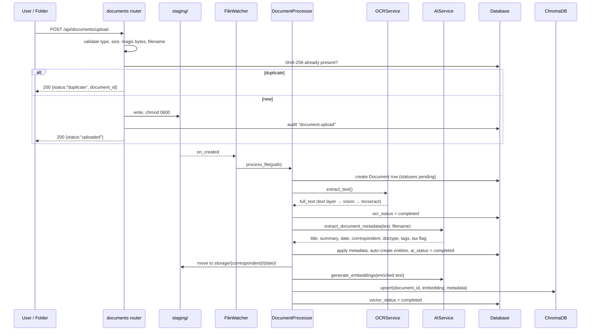
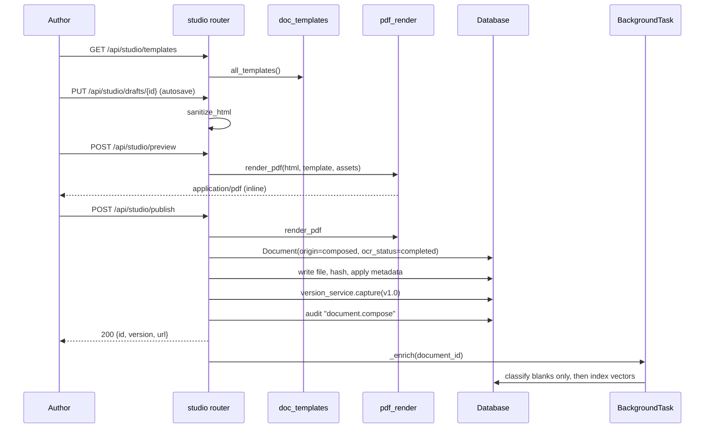
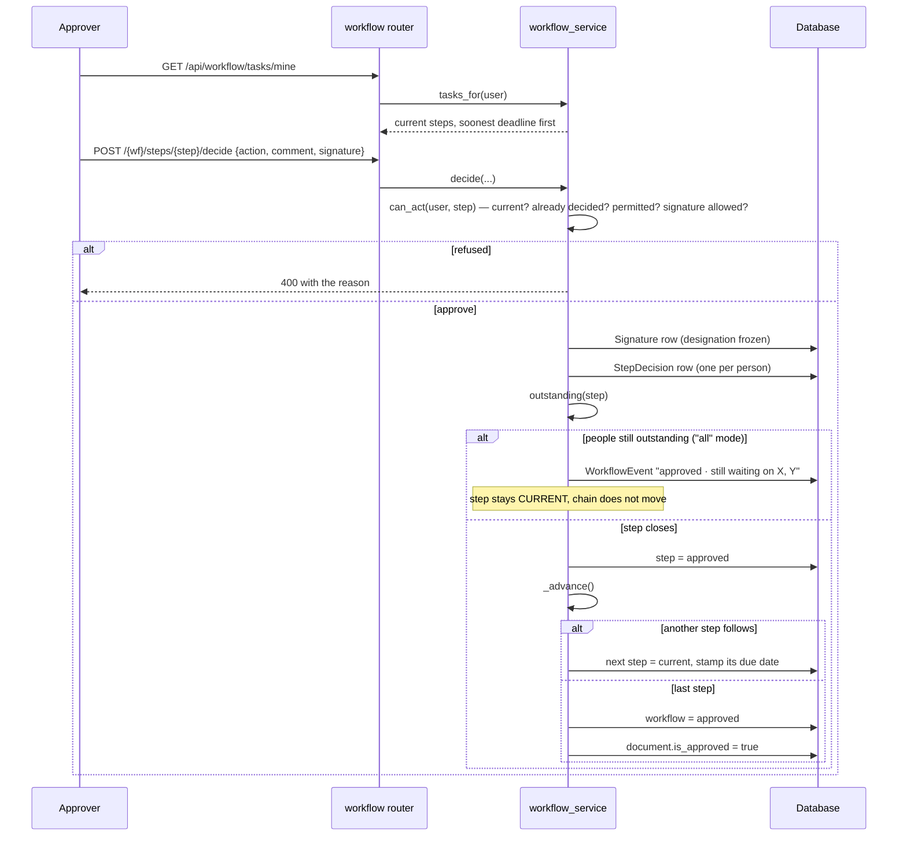
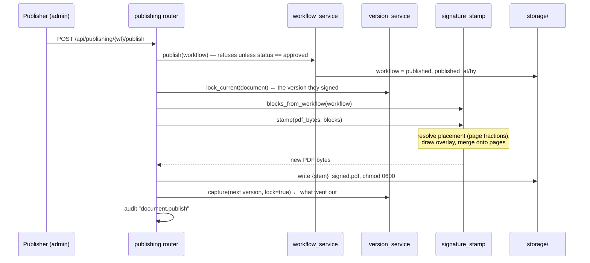
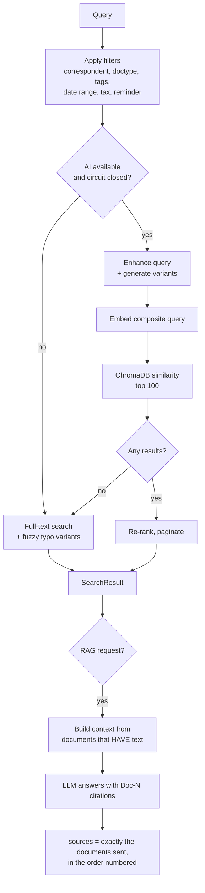

# 04 · High-Level Design

> **Audience:** architects, senior developers, technical leads. This is the
> system's shape: its layers, its components, how a request travels, and how it
> is deployed. Detail below the component level is in [doc 06](06-low-level-design.md).

---

## 1. Architectural style

A **modular monolith**: one deployable FastAPI process, internally divided into
strict layers with one-way dependencies.

```
        ┌──────────────────────────────────────────────────────────┐
        │  Browser — vanilla JS, no build step, no CDN             │
        │  16 HTML pages · shell.js · studio.js · viewer.js        │
        └───────────────────────────┬──────────────────────────────┘
                                    │ HTTPS · JSON + multipart
                                    │ session cookie or JWT · X-CSRF-Token
        ┌───────────────────────────▼──────────────────────────────┐
        │  MIDDLEWARE            CORS → CSRF → RateLimit → Errors   │
        ├──────────────────────────────────────────────────────────┤
        │  ROUTERS (16)          validate · authorise · serialise   │
        │  auth documents studio workflow publishing signatures     │
        │  search audit settings tags doctypes correspondents       │
        │  backup health security admin_fix                         │
        ├──────────────────────────────────────────────────────────┤
        │  SERVICES (24)         ALL business rules live here       │
        │  workflow · document_processor · ai · ocr · vision_ocr    │
        │  search · embedding · vector_db · pdf_render · docx_render│
        │  signature_stamp · version · role · media · doc_templates │
        │  authoring_ai · auth · audit · file_watcher · thumbnails  │
        │  backup_scheduler · doctype_manager · fuzzy · model_config│
        ├──────────────────────────────────────────────────────────┤
        │  DATA ACCESS           SQLAlchemy ORM · Pydantic schemas  │
        └───┬──────────────┬──────────────┬───────────────┬────────┘
            │              │              │               │
     ┌──────▼─────┐ ┌──────▼──────┐ ┌─────▼──────┐ ┌──────▼───────┐
     │  SQLite /  │ │  ChromaDB   │ │ Filesystem │ │  AI provider │
     │ PostgreSQL │ │  vectors    │ │ storage/   │ │  Groq/OpenAI │
     │ 22 tables  │ │  384-dim    │ │ staging/   │ │  /Azure      │
     └────────────┘ └─────────────┘ └────────────┘ └──────────────┘
```

### 1.1 Layer rules

| Layer | May depend on | Must never |
|---|---|---|
| Routers | Services, schemas, models | Contain a business rule |
| Services | Models, other services, config | Import a router, or touch `Request`/`Response` |
| Models | `database.Base` only | Contain business logic beyond password hashing and permission lookup |
| Middleware | Config | Import a service |

**The rule that matters most:** *routers validate input and shape output; the
rules live in the services, once.* Nothing outside
`app/services/workflow_service.py` moves an approval step.

### 1.2 Why a monolith

- One process, one database, one deployment — a team of any size can run it.
- The five-step spine is a single transactional story; splitting it across
  services would buy distributed-transaction problems and no benefit at this
  scale.
- Every seam that would become a service boundary (AI provider, vector store,
  storage) is already behind an interface, so extraction later is mechanical.

---

## 2. Component catalogue

### 2.1 Routers — `app/routers/` (16 modules)

| Router | Prefix | Owns |
|---|---|---|
| `auth` | `/api/auth` | Login, logout, session check, users CRUD, first-run setup, CSRF token |
| `documents` | `/api/documents` | Upload, list, read, update, delete, download, preview, thumbnail, text, versions, tags, relations, similar, reprocess, stats |
| `studio` | `/api/studio` | Templates, assets, AI actions, drafts, editable source, preview, publish |
| `workflow` | `/api/workflow` | Create, list, stats, my tasks, by-document, decide, resubmit, remind, cancel, approvers |
| `publishing` | `/api/publishing` | Publish queue, publish, unpublish, export, available formats |
| `signatures` | `/api/signatures` | Placement layout get/put/reset, designation, preview, page image |
| `search` | `/api/search` | Search, suggestions, RAG, vector stats, rebuild embeddings |
| `audit` | `/api/audit` | Activity log, summary |
| `settings` | `/api/settings` | All runtime configuration, AI provider status/test/switch, export/import, backup, logs |
| `tags`, `doctypes`, `correspondents` | `/api/…` | Metadata CRUD with counts |
| `backup` | `/api/backup` | Status, configure, start/stop, create, list, restore, delete, health |
| `health` | `/api/health` | Full health, simple, metrics, readiness, liveness, startup, security |
| `security` | `/api/security` | Directory scan, permission check, recent uploads, access logs, quarantine |
| `admin_fix` | `/api/admin` | Permission repair utilities (admin-gated) |

### 2.2 Services — `app/services/` (24 modules)

Grouped by concern:

**Approval and lifecycle**
| Module | Responsibility |
|---|---|
| `workflow_service.py` | **The approval engine.** Every state change, `can_act`, quorum, advance, resubmit, publish gate |
| `version_service.py` | Append-only version history, lock, forward-only restore |
| `signature_stamp.py` | Page geometry, block layout resolution, PDF overlay merge, page→PNG rendering |
| `role_service.py` | Standard roles kept in step with approve/sign authority |

**Capture and understanding**
| Module | Responsibility |
|---|---|
| `document_processor.py` | The capture pipeline: validate → dedupe → OCR → classify → store → index |
| `file_watcher.py` | Watchdog observer on the staging folder + recovery scan |
| `ocr_service.py` | Engine chain: text layer → vision → Tesseract |
| `vision_ocr.py` | Vision-model transcription, page and byte caps |
| `ai_service.py` | Chat/analysis calls, capability negotiation, key failover, extraction, RAG answers |
| `ai_client_factory.py` | Builds the provider client; owns the Groq key list |
| `embedding_service.py` | Local ONNX MiniLM (default) or hosted embeddings |
| `vector_db_service.py` | ChromaDB singleton: upsert, delete, similarity query, stats, reset |
| `doctype_manager.py` | Default document types, fallback type |

**Authoring and rendering**
| Module | Responsibility |
|---|---|
| `doc_templates.py` | The single template specification both renderers read |
| `pdf_render.py` | Sanitised HTML → letterheaded PDF (ReportLab), plus `sanitize_html`, `html_to_text`, `page_estimate` |
| `docx_render.py` | The same HTML → `.docx` via stdlib `zipfile`, plus `html_to_plain` |
| `authoring_ai.py` | The "Edit with AI" action set and its HTML normalisation |
| `media_service.py` | Image library: built-ins, uploads, id-based resolution |
| `thumbnails.py` | Cached first-page thumbnails |

**Retrieval**
| Module | Responsibility |
|---|---|
| `search_service.py` | Search orchestration, filters, date ranges, circuit breaker, RAG |
| `fuzzy_search.py` | Typo variant generation |

**Platform**
| Module | Responsibility |
|---|---|
| `auth_service.py` | JWT, sessions, authentication, audit events, role defaults |
| `audit_service.py` | `log_audit_event` |
| `model_config.py` | Reads `config/models.json`, exposes settings overrides |
| `sdk_compat.py` | Adapts parameters across OpenAI SDK versions; strips reasoning blocks |
| `backup_scheduler.py` | Optional scheduled backups |
| `folder_setup.py` | Creates the folder tree |

### 2.3 Middleware — `app/middleware/`

| Order | Middleware | Active? | Purpose |
|---|---|---|---|
| 1 | `CORSMiddleware` | ✅ | Origin allow-list, credentialed, restricted methods and headers |
| 2 | `CSRFMiddleware` | ✅ | Signed double-submit cookie |
| 3 | `RateLimitMiddleware` | ✅ | Sliding-window per IP per endpoint |
| — | `ErrorHandler` | ✅ | Exception handlers (not middleware) — JSON for API, HTML page otherwise |
| — | `AuthMiddleware` | ❌ disabled | Authentication is done per-endpoint via `Depends` |
| — | `LoggingMiddleware` | ❌ disabled | Commented out for startup speed |

> ⚠️ Starlette applies middleware in reverse registration order, so the
> *outermost* is the last added (`RateLimit`), then `CSRF`, then `CORS`.
> Practical effect: rate limiting runs before CSRF validation.

### 2.4 Utilities — `app/utils/`

`backup.py` · `database_optimization.py` · `file_security.py` ·
`init_settings.py` · `ist.py` (IST formatting) · `logging_config.py` ·
`schema_migrations.py` (additive DDL) · `validators.py`

---

## 3. Runtime flows

### 3.1 Capture — a file arrives



**Note:** the upload endpoint deliberately does *not* kick off a sweep — the
watcher's `on_created` already has the file, and a second worker racing it
produces a rolled-back transaction (`app/routers/documents.py:445`).

### 3.2 Authoring — a document is written



### 3.3 Approval — a decision is made



### 3.4 Publishing — release with signatures



### 3.5 Search and RAG



---

## 4. Data architecture

Four stores, each with a distinct job. Full detail in [doc 05](05-data-model.md).

| Store | Holds | Consistency |
|---|---|---|
| **Relational DB** (SQLite/PostgreSQL) | 22 tables (18 entity + 4 association): documents, workflows, users, versions, audit… | Source of truth |
| **ChromaDB** | One 384-dimension embedding per document, plus filter metadata | Derived — rebuildable with `reindex-vectors` |
| **Filesystem** | `staging/` (inbox) · `storage/{correspondent}/{date}/` (permanent) · `versions/` · `thumbnails/` · `assets/` · `logs/` · `backups/` | Source of truth for bytes |
| **In-process memory** | Rate-limit counters, AI capability cache, embedder, Chroma client | Ephemeral — the reason multi-worker needs work first |

### 4.1 Storage tree

```
data/
├── documents.db                  relational database
├── chroma/                       vector store
├── staging/                      watched inbox
│   └── duplicates/               quarantined duplicate copies
├── storage/
│   └── {Correspondent}/
│       └── {YYYY-MM-DD}/
│           ├── {doc_id}_{name}.pdf
│           ├── {doc_id}_{name}_signed.pdf
│           └── versions/
│               └── {doc_id}_v1.2.pdf
├── thumbnails/
├── assets/                       Studio image library
├── logs/
└── backups/
```

---

## 5. Key architectural decisions

| # | Decision | Rationale | Consequence |
|---|---|---|---|
| AD-1 | Modular monolith, not microservices | One transactional story; a team of any size can run it | Horizontal scaling needs shared state first |
| AD-2 | SQLite by default | Zero-setup; runs from a folder | Write serialisation; Postgres for production concurrency |
| AD-3 | Local ONNX embeddings by default | Groq has **no** embeddings endpoint; forcing OpenAI would make semantic search require a second vendor | 384 dimensions, CPU-bound; changing the model requires a forced re-index |
| AD-4 | OpenAI SDK for all three providers | Groq and Azure are OpenAI-compatible; one client, one code path | Differences handled in `sdk_compat` + capability negotiation |
| AD-5 | Vanilla JS, no build step | No bundler, no CDN, no framework churn; the whole UI is readable in a browser | Manual DOM work; discipline instead of a framework |
| AD-6 | ReportLab for PDF | Pure-Python wheels — no wkhtmltopdf, no headless Chrome, no system libraries | HTML support is what the renderer implements, not full CSS |
| AD-7 | pypdfium2 over PyMuPDF | PyMuPDF is AGPL; this is a commercial deployment | — |
| AD-8 | Signature placement as page fractions | Survives A4, Letter and arbitrary scans | Callers must convert to points at render time |
| AD-9 | Append-only versions, forward-only restore | A history that can be rewritten is not a history | Storage grows; no compaction exists yet |
| AD-10 | `can_approve` and `can_sign` as separate flags | Verifying an invoice ≠ binding the company | Two checks everywhere, validated at design time |
| AD-11 | Signature-step validation at **design** time | Prevents an unworkable process, rather than discovering it three days later | The route designer must know assignees up front |
| AD-12 | Additive-only schema migrations | An older build must still run against a migrated database | No column is ever dropped or retyped; cruft accumulates |
| AD-13 | Two trails: `workflow_events` (business) and `audit_logs` (security) | They have different readers and different languages | Two tables to query for a full picture |
| AD-14 | Enrichment in a background task | The author must not wait on a model call | A just-published document may briefly show no summary |
| AD-15 | Retired screens redirect rather than 404 | No bookmark, demo script or shared link breaks | The redirect table must be maintained |

---

## 6. Deployment topology

### 6.1 Single-node (current, and what the Dockerfile builds)

```
┌──────────────────────── Host / Container ────────────────────────┐
│                                                                  │
│  uvicorn ─ app.main:app ─ :8000                                  │
│    ├── FastAPI (routers + services)                              │
│    ├── FileWatcher thread        → data/staging                  │
│    ├── BackgroundTasks           → enrichment                    │
│    ├── ThreadPoolExecutor(8)     → AI requests                   │
│    ├── BackupScheduler (off)                                     │
│    └── ChromaDB persistent client → data/chroma                  │
│                                                                  │
│  Volume: /app/data  (db, storage, staging, logs, backups, cache) │
│  Volume: /app/config (models.json — change models, no rebuild)   │
└──────────────────────────────────┬───────────────────────────────┘
                                   │ HTTPS
                         ┌─────────▼─────────┐
                         │  AI provider API  │
                         └───────────────────┘
```

### 6.2 Enterprise target (not yet built)

```
        ┌─────────────┐
        │  TLS proxy  │  ← set TRUSTED_PROXY_IPS to this host
        └──────┬──────┘
               │
      ┌────────▼────────┐   ┌──────────────┐
      │  App × N        │──▶│  PostgreSQL  │
      │  (stateless)    │   └──────────────┘
      └────┬───────┬────┘   ┌──────────────┐
           │       └───────▶│ Chroma server│
           │                └──────────────┘
      ┌────▼──────────┐     ┌──────────────┐
      │ Shared storage│     │ Redis        │  ← rate limits, sessions, cache
      │ (NFS / S3)    │     └──────────────┘
      └───────────────┘
```

**Prerequisites for that topology** (all currently missing — see doc 11):
1. Move rate-limit counters to Redis.
2. Move the AI capability cache to a shared store, or accept per-process caching.
3. Point ChromaDB at a server rather than the embedded client.
4. Introduce a proper migration chain (Alembic) for PostgreSQL.
5. Replace the local filesystem storage adapter with shared or object storage.

---

## 7. Startup and shutdown sequence

**Startup** — `app/main.py:122`

| t | Action |
|---|---|
| 0 s | FastAPI app object built; middleware and routers registered; static mount |
| 0 s | Backup scheduler configured **disabled** |
| 0 s | Two asyncio tasks scheduled; **the server is already answering requests** |
| +2 s | `init_db()` → `create_all` → additive migrations → default settings → default doctypes |
| +2 s | `setup_folders` → `ensure_default_document_types` → `media_service.seed_builtins` → `ensure_standard_roles` → `role_service.backfill` |
| +3 s | FileWatcher started on a worker thread (`asyncio.to_thread`, because the initial scan can be CPU-heavy) and recovers any files already sitting in staging |

**Shutdown** — file watcher stopped and joined (5 s timeout); backup scheduler
stopped.

> ⚠️ The deferred initialisation means a request arriving in the first ~2 seconds
> can hit an uninitialised database. Acceptable for a single-node deployment;
> a readiness probe (`/api/health/readiness`) exists precisely to gate traffic.

---

## 8. Cross-cutting concerns

| Concern | Where it lives | Note |
|---|---|---|
| **Configuration** | `app/config.py` + `services/model_config.py` | Four-layer precedence; `get_settings(db)` builds a fresh instance per request when a session is supplied |
| **Error handling** | `middleware/error_handler.py` | Four handlers: `HTTPException`, `RequestValidationError`, Starlette, generic. API paths → JSON; others → an HTML error page |
| **Logging** | `utils/logging_config.py` (loguru) | Application, security and per-document processing logs |
| **Auditing** | `services/audit_service.py` | Called from routers; never allowed to fail an operation |
| **Time** | `utils/ist.py` | Store UTC, display IST `DD-MM-YYYY` |
| **Sanitising** | `services/pdf_render.sanitize_html` | Applied on input and again at render |
| **File safety** | `utils/file_security.py` | Path traversal, magic bytes, `0600` permissions, hashing |
| **Serialisation** | `app/schemas.py` + per-router `_*_json` helpers | One shape per entity, everywhere |
