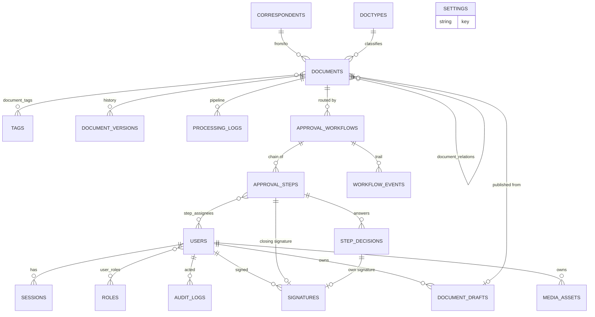

# 05 · Data Model

> **Audience:** developers, DBAs, architects.
> Source of truth: [app/models.py](../../app/models.py).
> **22 tables** — 18 entity tables and 4 association tables.

---

## 1. Conventions

| Convention | Detail |
|---|---|
| Primary keys | `String`, a UUID4 generated in Python (`default=lambda: str(uuid4())`) — not a database sequence |
| Timestamps | `DateTime(timezone=True)`; `created_at` uses `server_default=func.now()`, `updated_at` uses `onupdate=func.now()` |
| Time zone | **Stored UTC, displayed IST.** Correct even if the server moves. |
| Deletes | Mostly hard deletes. Cascades are declared only on workflow → steps → decisions/events. |
| Enumerations | Plain strings, not database enums, so a new value needs no migration |
| Foreign keys | Declared in SQLAlchemy. ⚠️ SQLite does **not** enforce them unless `PRAGMA foreign_keys=ON`, which is not set — integrity relies on application code. |

---

## 2. Entity–relationship overview



### 2.1 The three clusters

| Cluster | Tables | Purpose |
|---|---|---|
| **Content** | `documents`, `correspondents`, `doctypes`, `tags`, `document_tags`, `document_relations`, `document_versions`, `document_drafts`, `media_assets`, `processing_logs` | What is filed and what is known about it |
| **Process** | `approval_workflows`, `approval_steps`, `step_assignees`, `step_decisions`, `signatures`, `workflow_events` | How it gets approved |
| **Platform** | `users`, `roles`, `user_roles`, `sessions`, `audit_logs`, `settings` | Who may do it and how the system is configured |

---

## 3. Content cluster

### 3.1 `documents` — the central table

| Column | Type | Notes |
|---|---|---|
| `id` | String PK | UUID |
| `filename` | String NOT NULL | Name in storage |
| `original_filename` | String NOT NULL | Name as supplied |
| `file_hash` | String **UNIQUE** NOT NULL, indexed | SHA-256 — the deduplication key |
| `file_path` | String NOT NULL | Absolute path in the storage tree |
| `file_size` | Integer NOT NULL | Bytes |
| `mime_type` | String NOT NULL | From libmagic, else extension |
| `title` | String | AI-extracted or author-supplied |
| `summary` | Text | AI-extracted |
| `full_text` | Text | OCR / extracted text — the RAG and full-text corpus |
| `document_date` | DateTime | The date **on** the document, not the upload date. Also the storage folder. |
| `is_tax_relevant` | Boolean NOT NULL | AI signal |
| `reminder_date` | DateTime | Used by the reminder filter |
| `notes` | Text | Free-text; Studio writes department/sensitivity here |
| `origin` | String | `uploaded` \| `composed` |
| `template_id` | String | Letterhead id, composed documents only |
| `source_html` | Text | The sanitised editable body — **the reason re-opening a composed document is lossless** |
| `version` | String | `"1.0"`, `"1.1"`, `"2.0"` |
| `revision_of` | String | `documents.id` of the document this revises |
| `created_by` | String | `users.id` |
| `view_count` | Integer NOT NULL | Incremented by `POST /{id}/view` |
| `last_viewed` | DateTime | |
| `correspondent_id` | FK → `correspondents.id` | |
| `doctype_id` | FK → `doctypes.id` | |
| `created_at` / `updated_at` / `processed_at` | DateTime | |
| `ocr_status` | String | `pending\|processing\|completed\|failed\|skipped` |
| `ai_status` | String | same set |
| `vector_status` | String | same set |
| `is_approved` | Boolean NOT NULL | Denormalised from the workflow **on purpose** — lists and search then need no join |
| `approved_at` | DateTime | |
| `approved_by` | FK → `users.id` | |

**Relationships:** `correspondent`, `doctype`, `tags` (M2M), `approved_by_user`,
`children` / `parents` (self-referential M2M through `document_relations`).

> **Why three independent statuses.** A scan whose OCR succeeded but whose
> classification failed is a real, useful state: the text is searchable, only the
> title is missing. One combined status would have to lie about it.

> ⚠️ `source_html` is deliberately **absent** from the `Document` response schema
> (`app/schemas.py:151`) — it can be large and only the Studio needs it, via
> `GET /api/studio/source/{id}`.

### 3.2 `correspondents`

`id` · `name` (UNIQUE, indexed) · `email` · `address` · `created_at` · `updated_at`

Doubles as the first level of the storage folder tree. Auto-created by the
classifier and by Studio publish when a new name is typed.

### 3.3 `doctypes`

`id` · `name` (UNIQUE, indexed) · `description` · timestamps.
A default set is ensured at startup; unknown types met by the classifier are
created.

### 3.4 `tags`

`id` · `name` (UNIQUE, indexed) · `color` (hex, for the UI) · timestamps.

### 3.5 `document_tags` (association)

`document_id` PK/FK · `tag_id` PK/FK

### 3.6 `document_relations` (association, self-referential)

`parent_document_id` PK/FK · `child_document_id` PK/FK
Used for main/sub document links and for revision chains.

### 3.7 `document_versions`

| Column | Type | Notes |
|---|---|---|
| `id` | String PK | |
| `document_id` | FK, indexed | |
| `version` | String NOT NULL | `"1.0"` |
| `file_path` | String NOT NULL | Points into `…/versions/` — **a copy**, so the live file being overwritten cannot destroy history |
| `file_size`, `mime_type`, `file_hash` | | As at capture |
| `source_html` | Text | The editable body at that version |
| `template_id` | String | |
| `note` | String | "Initial capture", "Reviewer edits", "Published with 3 signatures stamped on" |
| `is_current` | Boolean NOT NULL | Exactly one true per document |
| `is_locked` | Boolean NOT NULL | Approved: may be superseded, never overwritten |
| `created_by` | FK → users | |
| `created_at` | DateTime | |

**Append-only.** Restoring an old version writes a *new* row.

### 3.8 `document_drafts`

`id` · `owner_id` (FK, indexed) · `title` · `template_id` · `html` ·
`meta` (JSON string: doctype, correspondent, department, tags) ·
`document_id` (FK, set on publish) · `source_document_id` (when editing an
existing document) · `status` (`draft` \| `published`) · timestamps.

Private to its owner (admins excepted). The autosave target.

### 3.9 `media_assets`

`id` · `key` (UNIQUE, set for built-ins) · `name` · `kind`
(`logo\|stamp\|signature\|image`) · `file_path` · `mime_type` · `file_size` ·
`is_builtin` · `is_shared` · `owner_id` (FK) · `created_at`

> **Bodies reference assets by id, never by path.** The PDF renderer resolves
> the id against this table, so a body can only ever embed a file the server
> already knows about — a body cannot be crafted to read an arbitrary path.

### 3.10 `processing_logs`

`id` · `document_id` (FK) · `operation` (`ocr`, `ai_extraction`, `embeddings`,
`reprocess`, `duplicate_check`, `cleanup`…) · `status` (`success\|error\|info`) ·
`message` · `execution_time` (ms) · `created_at`

---

## 4. Process cluster

### 4.1 `approval_workflows`

| Column | Notes |
|---|---|
| `id` | PK |
| `document_id` | FK, indexed |
| `name` | Default `"Approval"` |
| `template_id` | The route it was built from |
| `status` | `draft \| active \| approved \| rejected \| changes_requested \| cancelled \| published`, indexed |
| `priority` | `low \| normal \| high \| urgent` |
| `created_by` | FK → users |
| `created_at`, `started_at`, `completed_at`, `due_date` | |
| `department` | |
| `retention_policy` | ⚠️ Stored, **never acted upon** |
| `after_approval` | ⚠️ Stored, never acted upon |
| `notes` | |
| `published_at`, `published_by` | |

**Cascades:** `steps` and `events` are `all, delete-orphan`, ordered by
`order_index` and `created_at` respectively.

### 4.2 `approval_steps`

| Column | Notes |
|---|---|
| `id` | PK |
| `workflow_id` | FK, indexed |
| `order_index` | Integer, 0-based; the chain order |
| `name` | e.g. "Legal review" |
| `department`, `role` | The standing address when nobody is named |
| `requires_signature` | Boolean NOT NULL |
| `approval_mode` | `any` (default) \| `all` |
| `sla_hours` | |
| `due_date` | Stamped when the step becomes current |
| `status` | `pending \| current \| approved \| rejected \| changes_requested \| skipped` |
| `decided_at`, `decided_by`, `comment`, `reason` | The decision that **closed** the step |
| `signature_id` | FK → signatures — the closing signature |

**Relationships:** `assignees` (M2M via `step_assignees`), `decisions`
(one row per person), `decider`, `signature`.

> **Why `approval_mode` defaults to `any`.** Steps created before this feature
> existed — including approvals already in flight — must keep behaving exactly as
> the people on them were told they would. A migration must never change what
> somebody already agreed to (`app/utils/schema_migrations.py:49`).

### 4.3 `step_assignees` (association)

`step_id` PK/FK · `user_id` PK/FK. Empty means "whoever holds the role".

### 4.4 `step_decisions`

`id` · `step_id` (FK, indexed) · `user_id` (FK) · `action`
(`approved\|rejected\|changes`) · `comment` · `reason` · `signature_id` (FK) ·
`decided_at`

> **Why this table exists.** The step's own `decided_by` / `signature_id` hold
> the decision that *closed* it — enough when one person decides. A step that
> requires everybody needs **one row per person**: three approvers means three
> comments and three signatures, and a single set of columns cannot hold them.
> A row is written for *every* decision, including on `any` steps, so the trail
> has one shape everywhere.

### 4.5 `signatures`

| Column | Notes |
|---|---|
| `id` | PK |
| `user_id` | FK → users |
| `name` | As it should appear |
| `designation` | **Frozen at signing** — not read from the user later |
| `method` | `draw \| type \| upload` |
| `data_url` | Text — PNG data URL, ≤ 2 MB |
| `signed_at` | |
| `ip_address` | |
| `page_number` | 1-based; NULL = automatic layout |
| `x_pct`, `y_pct`, `width_pct` | Float 0..1 — **fractions of the page**, not millimetres |
| `placed_by`, `placed_at` | Who moved it and when |

> **Stored per use, not per user.** A document approved last March keeps exactly
> the mark applied then, even if the person later draws a new one. An audit trail
> that mutates is not an audit trail.

### 4.6 `workflow_events`

`id` · `workflow_id` (FK, indexed) · `step_id` (FK) · `actor_id` (FK) ·
`kind` (`started \| approved \| rejected \| changes \| reminded \| published \|
cancelled \| restarted`) · `summary` (≤400 chars, business language) ·
`detail` · `created_at`

Deliberately separate from `audit_logs`: this one is shown to users and written
in their language; the audit log is the security record and is written in the
system's.

---

## 5. Platform cluster

### 5.1 `users`

| Column | Notes |
|---|---|
| `id` | PK |
| `username` | UNIQUE, indexed |
| `email` | UNIQUE, indexed |
| `full_name` | |
| `hashed_password` | bcrypt |
| `is_active` | Inactive users cannot sign in |
| `is_admin` | Full authority |
| `must_change_password` | Honoured at login, cleared on change |
| `department`, `job_title` | So a step addressed to "AP Manager in Finance" finds them without a second directory |
| `can_approve` | May act on an approval step at all |
| `can_sign` | May apply a signature to that approval |
| `last_login` | |
| `password_reset_token`, `password_reset_expires` | ⚠️ Columns exist; **no endpoint uses them** |
| `created_at`, `updated_at` | |

**Methods:** `set_password`, `verify_password`, `has_permission(perm)` —
admins short-circuit to true; otherwise the JSON permission lists of the user's
roles are searched.

### 5.2 `roles` and `user_roles`

`roles`: `id` · `name` (UNIQUE, indexed) · `description` · `permissions`
(a JSON array stored as text) · timestamps.

Two sets of roles exist, from two eras:

| Set | Names | Created by |
|---|---|---|
| **Standard** (current) | `reader`, `contributor`, `approver`, `signatory` | `role_service.ensure_standard_roles`, at startup |
| **Legacy** | `admin`, `editor`, `viewer` | `auth_service.create_default_roles`, at first-run setup, and `admin_fix` |

⚠️ Both sets coexist in a live database. `apply_role` only ever swaps between
the **standard** four and deliberately leaves anything else alone. See doc 11.

**Permission strings:** `documents.read/create/update/delete/approve/sign`,
`correspondents.*`, `doctypes.*`, `tags.*`, `settings.read`, `search.read`,
and `*` (admin).

### 5.3 `sessions`

`id` · `user_id` (FK) · `session_token` (UNIQUE, indexed, 32-byte URL-safe
random) · `expires_at` · `ip_address` · `user_agent` · `created_at`

24-hour lifetime. Deleted on logout. `cleanup_expired_sessions` exists but is
⚠️ **not scheduled** — expired rows accumulate (they are inert, since every
lookup filters on `expires_at > now`).

### 5.4 `audit_logs`

`id` · `user_id` (FK, nullable — a failed login has no user) · `action` ·
`resource_type` · `resource_id` · `details` (JSON string) · `ip_address` ·
`user_agent` · `created_at`

### 5.5 `settings`

`id` · `key` (UNIQUE, indexed) · `value` (Text) · `description` · timestamps.

A simple key/value store. **The highest-precedence configuration layer** — a
value here overrides `.env`, which overrides `config/models.json`, which
overrides the code default. Keys mirror `Settings` field names in
`app/config.py`; type is preserved by inspecting the current attribute's type
(`app/config.py:222`).

---

## 6. Lifecycle state machines

### 6.1 Document processing

```
             ┌──────────┐
  created →  │ pending  │  (ocr / ai / vector, independently)
             └────┬─────┘
                  ▼
            ┌────────────┐        ┌──────────┐
            │ processing │───────▶│  failed  │──┐
            └─────┬──────┘        └──────────┘  │ reprocess
                  ▼                             │
            ┌───────────┐                       │
            │ completed │◀──────────────────────┘
            └───────────┘
      (or `skipped` when the stage does not apply —
       e.g. ai_status when no AI service is configured)
```

### 6.2 Approval workflow

```
                    create
                      │
                      ▼
                  ┌───────┐   start()   ┌────────┐
                  │ draft │────────────▶│ active │
                  └───────┘             └───┬────┘
                                            │
        ┌─────────────────┬─────────────────┼──────────────────┐
        │ last step        │ any step        │ any step         │ admin
        │ approves         │ rejects         │ requests changes │ cancels
        ▼                  ▼                 ▼                  ▼
   ┌──────────┐      ┌──────────┐   ┌────────────────────┐ ┌───────────┐
   │ approved │      │ rejected │   │ changes_requested  │ │ cancelled │
   └────┬─────┘      └──────────┘   └─────────┬──────────┘ └───────────┘
        │ publish()     terminal              │ resubmit() — ALL decisions cleared
        ▼                                     └──────────▶ draft → active
   ┌───────────┐   unpublish()
   │ published │──────────────▶ approved
   └───────────┘
```

### 6.3 Approval step

```
   pending ──(becomes head of chain)──▶ current
                                          │
          ┌───────────────┬───────────────┼──────────────┐
          │ approve, all  │ approve, none │ reject       │ changes
          │ satisfied     │ outstanding   │              │
          ▼               ▼               ▼              ▼
     (stays current)   approved       rejected     changes_requested
                                          │
                       workflow cancelled/ended → skipped
```

### 6.4 Document version

```
   capture ──▶ is_current = true (previous rows set false)
                      │
        approval ─────┴──▶ is_locked = true   (may be superseded, never overwritten)
                      │
        restore  ─────┴──▶ writes a NEW row; the old one stays exactly where it is
```

---

## 7. Schema evolution

There is **no Alembic migration chain**, despite `alembic` being a listed
dependency. Schema management is two mechanisms:

1. **`Base.metadata.create_all`** — creates missing *tables*. It never adds a
   *column* to a table that already exists.
2. **`app/utils/schema_migrations.py`** — additive, idempotent DDL run
   immediately after `create_all` (`app/database.py:46`).

### 7.1 Current additive migrations

| Table | Columns added | Default chosen because |
|---|---|---|
| `documents` | `origin`, `template_id`, `source_html`, `version`, `revision_of`, `created_by` | Existing documents are `uploaded`, `v1.0` |
| `signatures` | `designation`, `page_number`, `x_pct`, `y_pct`, `width_pct`, `placed_by`, `placed_at` | NULL = "let the automatic layout decide", which is what every existing signature wants |
| `users` | `department`, `job_title`, `can_approve DEFAULT 1`, `can_sign DEFAULT 0` | Existing users keep approval; **signature authority is granted, never inherited by a migration** |
| `approval_steps` | `approval_mode DEFAULT 'any'` | In-flight approvals must keep behaving as their participants were told |

### 7.2 Rules for adding a migration

1. **Additive only.** Never drop, rename or retype a column — an older build
   must still run against a migrated database.
2. **Choose the default that preserves existing behaviour**, not the one that
   looks tidiest.
3. A failure is logged and skipped, never fatal — a parallel worker may have
   won the race.

⚠️ **Consequence:** this works for SQLite and simple additions, but it cannot
express a data migration, a constraint change, or a rename. Moving to
PostgreSQL at scale needs a real migration chain. See doc 11.

---

## 8. Indexing

### 8.1 Declared in the model

`documents.file_hash` · `correspondents.name` · `doctypes.name` · `tags.name` ·
`users.username` · `users.email` · `roles.name` · `sessions.session_token` ·
`settings.key` · `approval_workflows.document_id` ·
`approval_workflows.status` · `approval_steps.workflow_id` ·
`step_decisions.step_id` · `workflow_events.workflow_id` ·
`document_versions.document_id` · `document_drafts.owner_id` ·
`media_assets.key`

### 8.2 Added operationally

`python cli.py db create-indexes` adds performance indexes
(`app/utils/database_optimization.py`), and `db analyze` / `db optimize` run
`ANALYZE`, `VACUUM` and `REINDEX`.

---

## 9. Vector store schema (ChromaDB)

| Aspect | Value |
|---|---|
| Collection | `documents` (configurable, `chroma_collection_name`) |
| Distance | Cosine (`hnsw:space: cosine`) |
| Id | `documents.id` — one vector per document |
| Dimensions | **384** with the default local `all-MiniLM-L6-v2`; **1536** with OpenAI `text-embedding-3-small` |
| Document text | The enriched embedding string, not the raw body |
| Metadata | `document_id`, `title`, `is_tax_relevant`, `created_at`, and `correspondent` / `doctype` when present |
| Write | `upsert` — keeps re-indexing idempotent |
| Score | `similarity = max(0, 1 − distance/2)` |

### 9.1 The enriched embedding string

Built by `DocumentProcessor._store_embeddings` (`app/services/document_processor.py:422`):

```
Title: {title}
Document: {title}                 ← repeated deliberately, to weight it
Filename: {filename}
Correspondent: {name}
From/To: {name}
Document type: {doctype}
{doctype synonyms — invoice → "bill statement billing", etc.}
Date: 2026-03-14 March 2026       ← three forms, for temporal queries
Tags: a, b, c
Topic: a
Topic: b
Tax-relevant taxes tax office     ← only when flagged
Summary: {summary}
Content: {first 4 000 chars}      ← 8 000 when there is no summary
```

> ⚠️ **Changing the embedding provider or model changes the dimension.** The
> mismatch is detected and the error names the fix:
> `python cli.py reindex-vectors --force`.

---

## 10. Filesystem as a data store

| Path | Contents | Written by |
|---|---|---|
| `data/staging/` | The watched inbox | Upload endpoint, or a person/script dropping a file |
| `data/staging/duplicates/` | Quarantined duplicate copies | `DocumentProcessor._handle_duplicate_file` |
| `data/storage/{Correspondent}/{YYYY-MM-DD}/` | Permanent document files, `0600` | Processor, Studio publish |
| `…/{stem}_signed.pdf` | The signed rendition | Publishing |
| `…/versions/{doc_id}_v{n}.{ext}` | Immutable version copies | `version_service.capture` |
| `data/thumbnails/` | Cached first-page thumbnails | `thumbnails.py` |
| `data/assets/` | Studio image library uploads | `media_service.store_upload` |
| `data/chroma/` | Vector store | ChromaDB |
| `data/logs/` | Application, security and access logs | loguru |
| `data/backups/` | Backup archives | `utils/backup.py` |
| `data/.cache/` | ONNX embedding model (`HF_HOME`) | Downloaded once |

---

## 11. Referential-integrity notes for a new team

Things that will surprise you if nobody says them:

1. **`documents.is_approved` is denormalised** from the workflow. It is written
   in `_advance` and nowhere else. If you add another path to approval, write it
   there too.
2. **Deleting a user does not cascade.** `signatures.user_id`,
   `documents.approved_by`, `audit_logs.user_id` become dangling. The demo reset
   script deletes signatures explicitly before deleting people
   (`scripts/seed_demo_data.py:676`).
3. **Deleting a document does not remove its vectors automatically** in every
   path — the delete endpoint and the cleanup routine call
   `vector_db.delete_document` explicitly. Any new delete path must too.
4. **`document_versions.file_path` points to a copy.** Deleting a document's
   live file does not affect its history; deleting the `versions/` folder does.
5. **Exactly one `is_current` version per document** is maintained by an UPDATE
   that clears the flag on all rows before inserting the new one — not by a
   constraint.
6. **`settings` overrides everything.** A value written there by the UI will
   silently win over `.env`. This is the single most common cause of "I changed
   the config and nothing happened".
